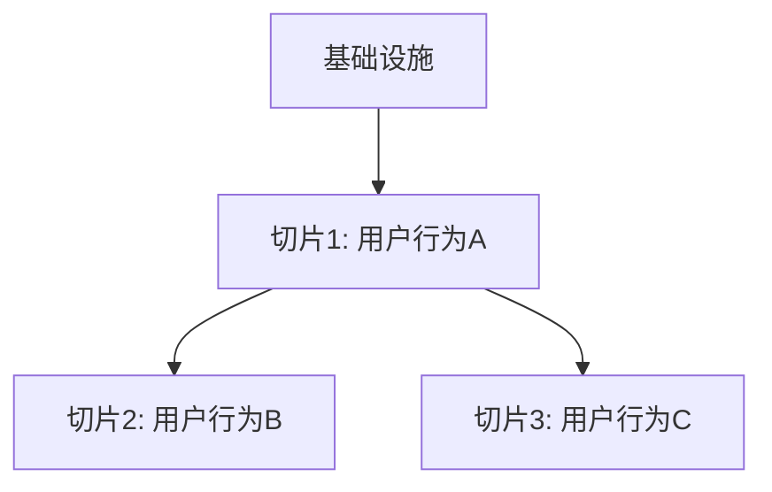

# [功能名称] 任务规划

## 依赖关系图

## 阶段划分

### 阶段 0: 基础设施（如需要）
[说明]

### 阶段 1: [用户行为名称]
[说明：做完后用户可以做什么]

### 阶段 2: [用户行为名称]
[说明]

## 任务清单

### 阶段 1 任务

#### Task-01: [任务名称]
- **所属切片**：阶段 1: [用户行为]
- **复杂度**：S/M/L
- **Depends On**：Task X, Task Y（或"None"）
- **对应 AC**：AC-001, AC-002
- **通俗解释**：[用零技术术语描述用户可见的变化]
- **Description**：[技术描述]
- **Files to Create/Modify**：[文件列表]
- **验证标准**：
  - [ ] [具体输入] → [具体预期输出]
  - [ ] [边界情况输入] → [具体预期输出]
  - [ ] [异常情况输入] → [具体预期输出]

## AC 覆盖检查

| AC 编号 | AC 描述 | 覆盖任务 | 状态 |
|---------|---------|---------|------|
| AC-001 | Given...When...Then... | Task-01, Task-02 | ✅ |
| AC-002 | ... | Task-03 | ✅ |

## 验证计划

### 阶段 1 验证
- [ ] Task-01 验证标准全部通过
- [ ] Task-02 验证标准全部通过
- [ ] 端到端验证：[描述用户操作路径]

### 阶段 2 验证
...
