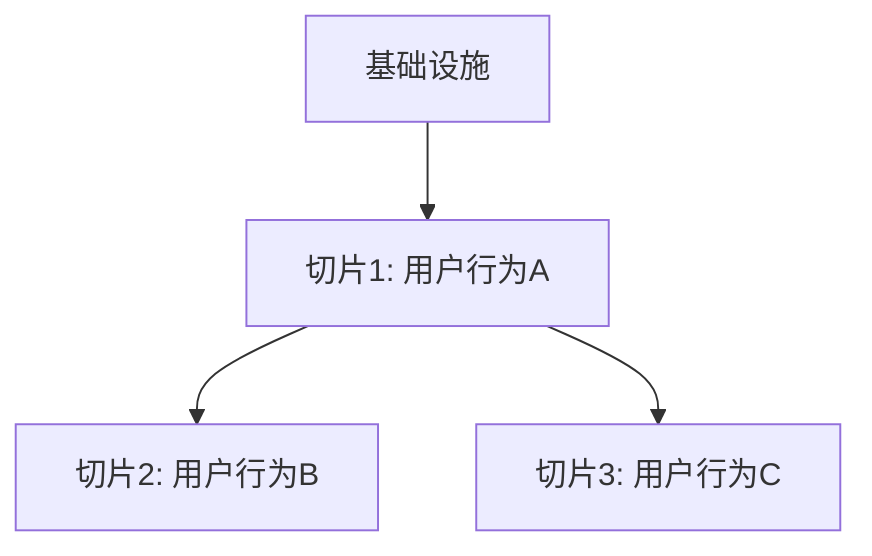

# [功能名称] 任务规划

> **版本**：v1.0
> **创建日期**：[日期]
> **需求文档**：[requirements.md](./requirements.md)
> **技术方案**：[design.md](./design.md)
> **规划策略**：垂直切片，每个切片对应一个完整的用户行为

---

## ⚠️ TDD 开发流程

**每个任务必须按 RED → GREEN → REFACTOR 循环执行，测试不是独立任务。**

```
┌─────────────────────────────────────────────────────────────┐
│  任务执行流程（每个任务内部）                                   │
├─────────────────────────────────────────────────────────────┤
│  1. RED 阶段：先写失败的测试                                   │
│     - 根据任务验证标准编写测试用例                               │
│     - 运行测试，确认失败                                        │
│                                                              │
│  2. GREEN 阶段：写最小实现让测试通过                            │
│     - 只写让测试通过的最小代码                                   │
│     - 不提前实现未请求的功能                                     │
│                                                              │
│  3. REFACTOR 阶段：重构优化                                    │
│     - 清理代码，保持测试通过                                     │
│     - 提取公共逻辑，消除重复                                     │
└─────────────────────────────────────────────────────────────┘
```

**禁止事项**：
- ❌ 禁止规划"编写单元测试"类独立任务
- ❌ 禁止先写实现代码后补测试
- ❌ 禁止跳过 RED 阶段直接写实现

**执行命令**：后续阶段必须通过 `/feature-implementation` Skill 执行，确保 TDD 流程。

---

## 依赖关系图


## 阶段划分

### 阶段 0: 基础设施（如需要）
[说明]

### 阶段 1: [用户行为名称]
[说明：做完后用户可以做什么]

### 阶段 2: [用户行为名称]
[说明]

## 任务清单

### 阶段 1 任务

#### Task-01: [任务名称]
- **所属切片**：阶段 1: [用户行为]
- **复杂度**：S/M/L
- **Depends On**：Task X, Task Y（或"None"）
- **对应 AC**：AC-001, AC-002
- **通俗解释**：[用零技术术语描述用户可见的变化]
- **Description**：[技术描述]
- **Files to Create/Modify**：[文件列表]
- **验证标准**：
  - [ ] **TDD 测试通过**：[描述测试覆盖范围，如"API 测试覆盖正常/边界/异常三种情况"]
  - [ ] [具体输入] → [具体预期输出]
  - [ ] [边界情况输入] → [具体预期输出]
  - [ ] [异常情况输入] → [具体预期输出]

## AC 覆盖检查

| AC 编号 | AC 描述 | 覆盖任务 | 状态 |
|---------|---------|---------|------|
| AC-001 | Given...When...Then... | Task-01, Task-02 | ⬜ |
| AC-002 | ... | Task-03 | ⬜ |

## 验证计划

### 阶段 1 验证
- [ ] Task-01 TDD 测试通过 + 验收标准全部通过
- [ ] Task-02 TDD 测试通过 + 验收标准全部通过
- [ ] 端到端验证：[描述用户操作路径]

### 阶段 2 验证
...
