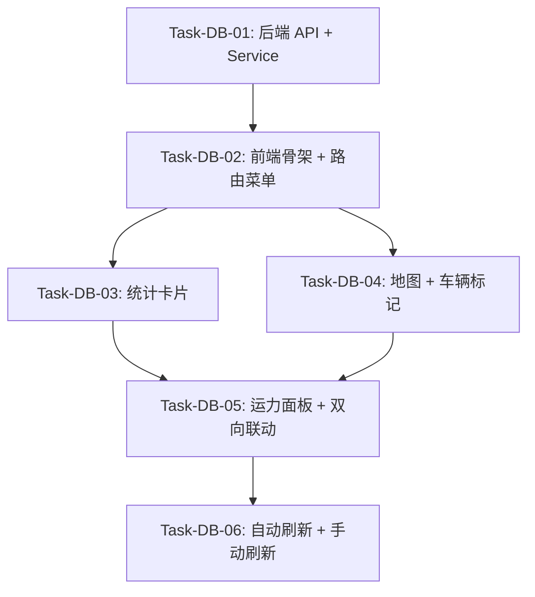

# Dashboard 运营看板 — 任务规划

> **版本**：v1.0
> **创建日期**：2026-05-28
> **技术方案**：[design.md](./design.md)
> **需求文档**：[requirements.md](./requirements.md)
> **策略**：垂直切片 — 每个任务穿透 Service/API/Store/UI 全部技术层，交付可独立验证的完整用户行为

---

## ⚠️ TDD 开发流程

**每个任务必须按 RED → GREEN → REFACTOR 循环执行，测试不是独立任务。**

```
┌─────────────────────────────────────────────────────────────┐
│  任务执行流程（每个任务内部）                                   │
├─────────────────────────────────────────────────────────────┤
│  1. RED 阶段：先写失败的测试                                   │
│     - 根据任务验证标准编写测试用例                               │
│     - 运行测试，确认失败                                        │
│                                                              │
│  2. GREEN 阶段：写最小实现让测试通过                            │
│     - 只写让测试通过的最小代码                                   │
│     - 不提前实现未请求的功能                                     │
│                                                              │
│  3. REFACTOR 阶段：重构优化                                    │
│     - 清理代码，保持测试通过                                     │
│     - 提取公共逻辑，消除重复                                     │
└─────────────────────────────────────────────────────────────┘
```

**TDD 禁止事项**：
- ❌ 禁止规划"编写单元测试"类独立任务
- ❌ 禁止先写实现代码后补测试
- ❌ 禁止跳过 RED 阶段直接写实现

**项目零容忍规则**（违反立即重写，详见 [development-standards.md](../../development-standards.md)）：

| # | 规则 | 说明 |
|---|------|------|
| 1 | 禁止 `any` 类型 | TypeScript 类型安全是底线，用具体类型或 `unknown` + 类型守卫 |
| 2 | 禁止 `console.log` | 用 `logger.debug()` 或 `if (import.meta.env.DEV)` 条件编译 |
| 3 | 文件 > 500 行必须拆分 | > 300 行 warn，> 500 行 error（测试文件豁免） |
| 4 | 函数 > 80 行必须提取子函数 | > 50 行 warn，> 80 行 error（测试文件豁免） |
| 5 | 组件必须处理 loading/empty/error 三态 | 展示数据的组件缺一不可 |
| 6 | 异步操作必须有 try-catch | catch 中给用户提示，finally 中重置 loading |
| 7 | 样式必须 `<style scoped>` | 禁止全局样式污染 |
| 8 | 模块间只通过 `index.ts` 引用 | 禁止 `@/modules/xxx/stores/...` 跨模块深引用 |
| 9 | 禁止 Store 混入 Mock 数据 | Mock 统一放 `__mocks__/`，通过 `VITE_USE_MOCK` 控制 |
| 10 | 禁止推测性功能 | 只实现任务清单要求的功能，不为"未来可能"写代码 |
| 11 | 外科手术式修改 | 每行改动必须追溯到当前任务，不"顺手"改相邻代码 |

**执行命令**：后续阶段必须通过 `/feature-implementation` Skill 执行，确保 TDD 流程。

---

## 依赖关系图



- **DB-01 → DB-02**：前端需要后端 API 可用才能联调
- **DB-02 → DB-03/DB-04**：页面骨架和路由就绪后，才能添加具体组件
- **DB-03/DB-04 → DB-05**：统计卡片和地图分别独立开发，联动需要两者都完成
- **DB-05 → DB-06**：联动完成后，添加刷新机制

---

## 阶段划分

### 阶段 0: 基础设施
后端 API + 前端骨架路由，让页面能打开、数据能加载。

### 阶段 1: 指标展示
统计卡片浮动在地图上方，4 个核心指标可见。地图占满页面。

### 阶段 2: 车辆地图
Leaflet 地图渲染天地图/OSM 瓦片，车辆 Marker 按状态着色，点击弹出信息。

### 阶段 3: 运力联动
右侧浮动面板显示车辆列表 + 状态概览，点击列表 ↔ 地图双向联动。

### 阶段 4: 自动刷新
30 秒定时刷新 + 手动刷新按钮，数据保持时效性。

---

## 任务清单

### Task-DB-01: 后端 Dashboard API + Service

- **所属切片**：阶段 0: 基础设施
- **复杂度**：M
- **Depends On**：None
- **对应 AC**：AC-001, AC-002
- **通俗解释**：后端提供一个接口，前端调用一次就能拿到今日任务数、完成率、超时数、平均转运时间、各状态计数和所有车辆位置信息。
- **对应设计章节**：design.md 四（API 设计）、六.1（数据获取流程）、六.5（平均转运时间计算）

**Files to Create**：
- `apps/server/app/schemas/dashboard.py` — DashboardStats, VehicleLocationItem, StatusCounts, DashboardResponse
- `apps/server/app/services/dashboard_service.py` — `get_dashboard(db)` 函数
- `apps/server/app/api/v1/dashboard.py` — FastAPI router，注册 GET `/api/v1/dashboard`

**Files to Modify**：
- `apps/server/app/main.py` — 注册 `dashboard_router`

**关键逻辑**：
- `get_dashboard(db)` 内部：
  1. 复用 `dispatch_service.get_order_status_counts(db)` 获取状态统计
  2. 查询今日订单聚合：`COUNT(*) WHERE DATE(created_at) = today` → today_task_count
  3. 计算完成率：今日已完成数 / 今日非待分配订单数（assigned + transiting + completed + overdue），分母为 0 时返回 0
  4. 全局超时数：`COUNT(*) WHERE status = 'overdue'`
  5. 平均转运时间：`AVG(EXTRACT(EPOCH FROM completed_at - assigned_at) / 60) WHERE DATE(created_at) = today AND completed_at IS NOT NULL AND assigned_at IS NOT NULL`
  6. 查询所有非停用车辆 + LEFT JOIN Driver（通过 bound_driver_id）→ VehicleLocationItem 列表
- 权限：`get_current_user` 依赖，admin/dispatcher 可访问

**验证标准**：
- [x] **TDD 测试通过**：后端 service 测试覆盖正常数据、空数据、边界情况
- [x] GET `/api/v1/dashboard` 返回 200，body 包含 `stats`、`status_counts`、`vehicles` 三个字段
- [x] `stats.today_task_count` = 今日创建的订单数
- [x] `stats.completion_rate` = 今日已完成 / 今日非待分配订单数（assigned + transiting + completed + overdue），分母为 0 时返回 0.0
- [x] `stats.overdue_count` = 全局 status='overdue' 的订单数
- [x] `stats.avg_transport_minutes` = 已完成订单的平均转运分钟数，无数据时为 null
- [x] `status_counts` 各字段与 `get_order_status_counts` 返回值一致
- [x] `vehicles` 列表包含所有非停用车辆，每项含 id/plate_no/status/lat/lng/location/driver_name/driver_phone
- [x] 无车辆时 `vehicles` 返回空数组 `[]`
- [x] 未登录访问返回 401

---

### Task-DB-02: 前端骨架 + 路由菜单

- **所属切片**：阶段 0: 基础设施
- **复杂度**：M
- **Depends On**：Task-DB-01（后端 API 可用）
- **对应 AC**：AC-004（首页加载后地图正常显示的前提）
- **通俗解释**：调度员登录后默认进入运营看板页面，侧边栏出现"运营看板"菜单项，页面能加载后端数据。
- **对应设计章节**：design.md 五.4（路由配置）、五.6（AppLayout 侧边栏变更）

**Files to Create**：
- `apps/frontend/src/modules/dashboard/index.ts` — 模块导出入口
- `apps/frontend/src/modules/dashboard/types/index.ts` — DashboardStats, VehicleLocation, StatusCounts, DashboardData 类型定义
- `apps/frontend/src/modules/dashboard/services/dashboardService.ts` — `getDashboard()` API 调用
- `apps/frontend/src/modules/dashboard/stores/useDashboardStore.ts` — Pinia Store（data/loading/error/fetchDashboard）
- `apps/frontend/src/modules/dashboard/pages/DashboardPage.vue` — 页面容器（骨架，仅显示 loading + 数据加载逻辑）

**Files to Modify**：
- `apps/frontend/src/router/index.ts` — 新增 `/dashboard` 路由，修改 `/` 重定向为 `/dashboard`
- `apps/frontend/src/shared/components/AppLayout.vue` — 新增"运营看板"菜单项（DataAnalysis 图标，index="/dashboard"），置于车队管理之前

**关键逻辑**：
- `dashboardService.getDashboard()` 调用 `GET /api/v1/dashboard`，返回 `DashboardData`
- `useDashboardStore` 管理 data/loading/error 状态，提供 `fetchDashboard()` action
- `DashboardPage.vue` 挂载时调用 `store.fetchDashboard()`，显示 LoadingSpinner
- 路由守卫：`/dashboard` 仅 admin/dispatcher 可访问
- `/` 重定向：调度员/管理员 → `/dashboard`，司机 → `/driver`

**验证标准**：
- [x] **TDD 测试通过**：Store 测试覆盖 loading/error/data 状态流转；Service 测试覆盖 API 调用和错误处理
- [x] 访问 `/` 时，调度员角色重定向到 `/dashboard`
- [x] 访问 `/` 时，司机角色重定向到 `/driver`
- [x] `/dashboard` 路由在侧边栏高亮"运营看板"菜单项
- [x] 侧边栏菜单顺序：运营看板 → 车队管理 → 调度中心 → 仓库总览
- [x] 页面加载时显示 LoadingSpinner
- [x] 数据加载成功后 LoadingSpinner 消失
- [x] 数据加载失败时显示错误提示
- [x] 司机角色访问 `/dashboard` 被路由守卫拦截

---

### Task-DB-03: 统计卡片浮动层

- **所属切片**：阶段 1: 指标展示
- **复杂度**：S
- **Depends On**：Task-DB-02（页面骨架就绪）
- **对应 AC**：AC-001
- **通俗解释**：页面左上角浮动显示 4 个指标卡片：今日任务数、完成率、超时数、平均转运时间，数据与后端一致。
- **对应设计章节**：design.md 五.2（StatisticsOverlay 组件）、五.3（组件职责）

**Files to Create**：
- `apps/frontend/src/modules/dashboard/components/StatisticsOverlay.vue` — 浮动统计卡片

**Files to Modify**：
- `apps/frontend/src/modules/dashboard/pages/DashboardPage.vue` — 集成 StatisticsOverlay 组件

**关键逻辑**：
- Props: `stats: DashboardStats`
- 绝对定位：`position: absolute; top: 16px; left: 16px; z-index: 1000`
- 4 个指标卡片：今日任务数（整数）、完成率（百分比，保留 0 位小数）、超时数（整数，红色高亮）、平均转运时间（分钟，null 显示 "--"）
- 半透明背景：`background: rgba(255, 255, 255, 0.92); backdrop-filter: blur(8px)`
- 卡片使用 `el-row` + `el-col` 横向排列

**验证标准**：
- [x] **TDD 测试通过**：组件测试覆盖正常数据渲染、null 值处理
- [x] 今日任务数显示为整数（如 "12"）
- [x] 完成率显示为百分比（如 "85%"），0% 时显示 "0%"
- [x] 超时数 > 0 时数字为红色，= 0 时为默认色
- [x] 平均转运时间显示为 "XX分钟"，null 时显示 "--"
- [x] 卡片浮动在页面左上角，不遮挡地图交互（pointer-events 仅限卡片自身）
- [x] 卡片在 1366×768 分辨率下不溢出

---

### Task-DB-04: 地图 + 车辆标记

- **所属切片**：阶段 2: 车辆地图
- **复杂度**：L ⚠️
- **Depends On**：Task-DB-02（页面骨架就绪）
- **对应 AC**：AC-002, AC-004
- **通俗解释**：页面中央显示地图，车辆以彩色圆点标记在地图上（绿色=空闲、蓝色=运输中、红色=超时），点击圆点弹出车牌、司机、状态信息。
- **对应设计章节**：design.md 五.2（MapArea 组件）、六.3（Marker 颜色规则）、六.6（增量更新）

**Files to Create**：
- `apps/frontend/src/modules/dashboard/components/MapArea.vue` — 地图区域组件

**Files to Modify**：
- `apps/frontend/src/modules/dashboard/pages/DashboardPage.vue` — 集成 MapArea 组件

**关键逻辑**：
- **必须导入 Leaflet CSS**：`import 'leaflet/dist/leaflet.css'`（否则地图瓦片和控件无法正确渲染）
- Props: `vehicles: VehicleLocation[]`, `selectedVehicleId: string | null`
- Emits: `select-vehicle(id: string)`
- `onMounted`：创建 `L.map()` 实例，添加瓦片层（天地图优先，降级 OSM）
  - 默认中心点：`[31.23, 121.47]`（上海港区域），默认缩放 `zoom: 12`
  - 天地图：`L.tileLayer('https://t{s}.tianditu.gov.cn/vec_w/wmts?...&tk={key}')`
  - OSM 降级：`L.tileLayer('https://{s}.tile.openstreetmap.org/{z}/{x}/{y}.png')`
  - 环境变量控制：`import.meta.env.VITE_TIANDITU_KEY` 存在时用天地图
- `watch(vehicles)`：增量更新 Marker（新增/移除/移动/状态变更），使用 `Map<string, L.Marker>` 缓存
  - 位置变更：`existing.setLatLng([v.lat, v.lng])`
  - 状态变更：`existing.setIcon(getStatusIcon(v.status))`（颜色跟随状态更新）
  - 首次加载有坐标的车辆后：`map.fitBounds(L.featureGroup(markers).getBounds().pad(0.1))`（自适应所有 Marker 范围）
- `watch(selectedVehicleId)`：高亮对应 Marker + `flyTo(lat, lng, 15)`
- Marker 使用 `L.divIcon` 自定义 HTML，显示为带颜色圆点（16×16px）
- 点击 Marker → `emit('select-vehicle', vehicleId)` + 弹出 Popup 显示车牌/司机/状态
- 无坐标车辆（lat/lng=null）不渲染 Marker
- `onUnmounted`：`map.remove()` 销毁实例
- 地图容器占满父元素：`width: 100%; height: 100%`

**验证标准**：
- [x] **TDD 测试通过**：组件测试覆盖地图初始化、Marker 渲染、点击事件
- [x] 页面加载后地图渲染瓦片（天地图或 OSM），默认中心为上海港区域
- [x] 有坐标的车辆显示为彩色圆点 Marker
- [x] 空闲车辆绿色 `#67c23a`，运输中蓝色 `#409eff`，超时红色 `#f56c6c`
- [x] 车辆状态变更后 Marker 颜色同步更新（如 idle→transiting 时绿色变蓝色）
- [x] 点击 Marker 弹出 Popup，显示车牌号、司机姓名、当前状态
- [x] 无坐标车辆不显示 Marker
- [x] 车辆数据更新后 Marker 位置同步更新（增量更新，不全量重建）
- [x] 首次加载车辆数据后，地图自动 fitBounds 到所有 Marker 可见范围
- [x] 地图可拖拽、可缩放，不受浮动面板遮挡
- [x] 组件卸载时地图实例被销毁（无内存泄漏）

---

### Task-DB-05: 运力面板 + 双向联动

- **所属切片**：阶段 3: 运力联动
- **复杂度**：M
- **Depends On**：Task-DB-03（统计卡片就绪）, Task-DB-04（地图和 Marker 就绪）
- **对应 AC**：AC-003
- **通俗解释**：页面右侧浮动一个面板，显示车辆列表和状态统计。点击列表中的车辆，地图飞过去并高亮；点击地图上的车辆标记，列表中对应行高亮并滚动到可见位置。
- **对应设计章节**：design.md 五.2（FleetPanel + StatusOverview 组件）、六.2（双向联动流程）

**Files to Create**：
- `apps/frontend/src/modules/dashboard/components/FleetPanel.vue` — 浮动右侧面板（搜索框 + 车辆列表 + StatusOverview）
- `apps/frontend/src/modules/dashboard/components/StatusOverview.vue` — 状态统计组件

**Files to Modify**：
- `apps/frontend/src/modules/dashboard/pages/DashboardPage.vue` — 集成 FleetPanel，管理 `selectedVehicleId` 状态，实现双向联动逻辑

**关键逻辑**：
- **FleetPanel**：
  - Props: `vehicles: VehicleLocation[]`, `statusCounts: StatusCounts`, `selectedVehicleId: string | null`
  - Emits: `select-vehicle(id: string)`
  - 绝对定位：`position: absolute; top: 16px; right: 16px; z-index: 1000; width: 280px; max-height: calc(100% - 32px); overflow-y: auto`
  - 搜索框：`el-input` 按车牌号或司机姓名过滤列表
  - 车辆列表：简化行（车牌 + 司机名 + 状态 Tag），点击 → `emit('select-vehicle', id)`
  - 选中行高亮：`selectedVehicleId` 匹配时添加高亮 class + `scrollIntoView({ behavior: 'smooth' })`
  - 半透明背景：`background: rgba(255, 255, 255, 0.92); backdrop-filter: blur(8px)`

- **StatusOverview**：
  - Props: `statusCounts: StatusCounts`
  - 5 行状态统计：待分配(pending)/已分配(assigned)/运输中(transiting)/已完成(completed)/超时(overdue)，使用 `el-tag` + 数字

- **DashboardPage 联动逻辑**：
  - 维护 `selectedVehicleId: ref<string | null>(null)`
  - MapArea emit `select-vehicle` → 设置 selectedVehicleId → FleetPanel 高亮 + 滚动
  - FleetPanel emit `select-vehicle` → 设置 selectedVehicleId → MapArea flyTo + 高亮 Marker
  - 点击空白区域 → 清除 selectedVehicleId

**验证标准**：
- [x] **TDD 测试通过**：组件测试覆盖列表渲染、搜索过滤、选中高亮、事件触发
- [x] 右侧面板浮动显示，包含搜索框、车辆列表、状态统计
- [x] 搜索框输入车牌号或司机姓名，列表实时过滤
- [x] 搜索无结果时显示 EmptyState（"未找到匹配车辆"）
- [x] 车辆列表为空时显示 EmptyState（"暂无车辆信息"）
- [x] 车辆列表每行显示：车牌号、司机姓名、状态 Tag（颜色与地图一致）
- [x] 状态统计显示 5 行：待分配/已分配/运输中/已完成/超时，数字与后端一致
- [x] **点击列表项** → 地图 flyTo 对应车辆位置 + Marker 高亮 + Popup 弹出
- [x] **点击地图 Marker** → 列表对应行高亮 + 自动滚动到可见区域
- [x] 面板在 1366×768 分辨率下不溢出，可滚动
- [x] 面板不遮挡地图拖拽和缩放操作

---

### Task-DB-06: 自动刷新 + 手动刷新

- **所属切片**：阶段 4: 自动刷新
- **复杂度**：S
- **Depends On**：Task-DB-05（全部功能就绪）
- **对应 AC**：AC-004
- **通俗解释**：页面每 30 秒自动刷新数据，地图和列表自动更新；右上角有手动刷新按钮，点击立即刷新。
- **对应设计章节**：design.md 六.4（30 秒自动刷新）

**Files to Modify**：
- `apps/frontend/src/modules/dashboard/pages/DashboardPage.vue` — 添加 30s 定时器 + 手动刷新按钮 + 刷新状态指示

**关键逻辑**：
- `onMounted`：启动 `setInterval(() => store.fetchDashboard(), 30_000)`
- `onUnmounted`：`clearInterval(refreshTimer)`
- 手动刷新按钮：点击 → `store.fetchDashboard()` + 重置定时器
- 刷新期间不显示全屏 loading，保持当前数据显示（仅 loading ref 控制按钮禁用状态）
- 首次加载（`data === null`）时显示 LoadingSpinner
- 右上角浮动刷新按钮：`el-button` + 刷新图标，loading 时显示旋转动画

**验证标准**：
- [x] **TDD 测试通过**：Store 测试覆盖定时器逻辑、手动刷新、错误恢复
- [x] 页面挂载后 30 秒自动调用 `fetchDashboard()`
- [x] 手动刷新按钮点击后立即调用 `fetchDashboard()`，按钮显示 loading 状态
- [x] 刷新期间页面数据不闪烁（保持上次数据显示）
- [x] 刷新失败时显示错误提示，不覆盖已有数据
- [x] 页面卸载时定时器被清理（无内存泄漏）
- [x] 手动刷新后定时器重置（不会在手动刷新后立即又自动刷新）

---

## AC 覆盖检查

| AC 编号 | AC 描述 | 覆盖任务 | 状态 |
|---------|---------|---------|------|
| AC-001 | 核心指标数据与实际任务数据一致（任务数、完成率、超时数） | Task-DB-01（后端聚合查询）✅, Task-DB-03（前端卡片展示）✅ | ✅ 完成 |
| AC-002 | 点击地图车辆标记弹出基本信息（车牌、司机、状态） | Task-DB-04（MapArea Marker + Popup） | ✅ 完成 |
| AC-003 | 地图与运力列表双向联动 | Task-DB-05（FleetPanel + DashboardPage 联动逻辑） | ✅ 完成 |
| AC-004 | 首页加载后地图正常显示天地图瓦片，车辆标记出现在对应坐标位置 | Task-DB-02（路由骨架）, Task-DB-04（地图渲染）, Task-DB-06（自动刷新） | ✅ 完成 |

---

## 验证计划

### 阶段 0 验证（Task-DB-01 + Task-DB-02）
- [x] Task-DB-01 TDD 测试通过 + API 验收标准全部通过
- [x] Task-DB-02 TDD 测试通过 + 路由/菜单验收标准全部通过
- [x] 端到端验证：调度员登录 → 自动跳转到 `/dashboard` → 页面加载后端数据成功 → 侧边栏"运营看板"高亮

### 阶段 1 验证（Task-DB-03）
- [x] Task-DB-03 TDD 测试通过 + 统计卡片验收标准全部通过
- [x] 端到端验证：页面左上角浮动 4 个指标卡片，数字与后端返回一致

### 阶段 2 验证（Task-DB-04）
- [x] Task-DB-04 TDD 测试通过 + 地图验收标准全部通过
- [x] 端到端验证：地图显示瓦片 + 车辆 Marker 着色正确 + 点击弹出信息

### 阶段 3 验证（Task-DB-05）
- [x] Task-DB-05 TDD 测试通过 + 联动验收标准全部通过
- [x] 端到端验证：点击列表项 → 地图飞到对应位置；点击地图 Marker → 列表高亮滚动

### 阶段 4 验证（Task-DB-06）
- [x] Task-DB-06 TDD 测试通过 + 刷新验收标准全部通过
- [x] 端到端验证：点击手动刷新按钮观察即时刷新

### 全量验证
- [x] `pnpm type-check` 通过
- [x] `pnpm lint` 通过
- [x] `pnpm test` 通过
- [x] 页面在 1920×1080 和 1366×768 分辨率下布局正常