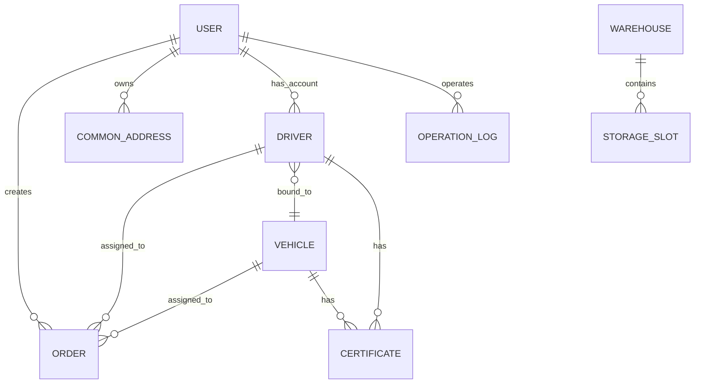

# 数据库模型技术方案

> **版本**：v1.1
> **创建日期**：2026-05-03
> **最后更新**：2026-05-04
> **需求文档**：[requirements.md](./requirements.md)
> **设计目标**：基于 SQLite + SQLAlchemy 2.0 构建完整的数据模型，支持 Alembic 迁移，为后续所有业务功能提供数据基础

---

## 一、功能概述

- **功能名称**：数据库模型与迁移
- **需求文档**：[requirements.md](./requirements.md)
- **设计目标**：创建 11 张核心数据表，建立完整的外键关系和索引，配置 Alembic 迁移工具，确保数据库结构可版本化管理

---

## 二、现有代码分析

- **涉及模块**：`apps/server/app/models/`、`apps/server/requirements.txt`
- **可复用抽象**：无（当前模型目录为空）
- **影响范围**：所有后续业务功能（auth、dispatch、fleet、warehouse 等）都依赖此设计

---

## 三、数据模型设计

### 3.1 文件组织

每个模型独立一个文件，避免单文件过大：

```
app/models/
├── __init__.py          # 导出所有模型
├── base.py              # Base 基类 + 时间戳混入
├── user.py              # 用户表
├── order.py             # 订单表
├── common_address.py    # 常用地址表
├── vehicle.py           # 车辆表
├── driver.py            # 司机表
├── certificate.py       # 证照表
├── warehouse.py         # 仓库表
├── storage_slot.py      # 库位表
├── operation_log.py     # 操作日志表
├── system_config.py     # 系统配置表
└── help_article.py      # 帮助文章表
```

### 3.2 基类设计

所有模型继承 `BaseModel`，自动包含 `created_at` 和 `updated_at`：

```python
# base.py
class Base(DeclarativeBase):
    pass

class BaseModel(Base):
    __abstract__ = True
    created_at: Mapped[datetime] = mapped_column(DateTime, server_default=func.now())
    updated_at: Mapped[datetime] = mapped_column(
        DateTime, server_default=func.now(), onupdate=func.now()
    )
```

### 3.3 用户表（User）

| 字段名 | 类型 | 约束 | 说明 |
|--------|------|------|------|
| id | UUID | PK | 主键，server_default=gen_random_uuid() |
| username | VARCHAR(50) | UNIQUE, NOT NULL | 登录用户名 |
| password | VARCHAR(255) | NOT NULL | bcrypt 加密后的密码 |
| name | VARCHAR(50) | NOT NULL | 真实姓名 |
| phone | VARCHAR(20) | NULL | 手机号 |
| avatar | VARCHAR(255) | NULL | 头像 URL |
| role | VARCHAR(20) | NOT NULL | admin/dispatcher/driver |
| status | VARCHAR(20) | NOT NULL, DEFAULT 'active' | active/disabled |
| last_login_at | DateTime | NULL | 最后登录时间 |

**索引**：
- 主键：id
- 唯一：username
- 普通：role, status

**SQLAlchemy 代码**：
```python
class UserRole(enum.Enum):
    ADMIN = "admin"
    DISPATCHER = "dispatcher"
    DRIVER = "driver"

class UserStatus(enum.Enum):
    ACTIVE = "active"
    DISABLED = "disabled"

class User(BaseModel):
    __tablename__ = "users"

    id: Mapped[uuid.UUID] = mapped_column(
        UUID(as_uuid=True), primary_key=True, default=uuid.uuid4
    )
    username: Mapped[str] = mapped_column(String(50), unique=True, nullable=False)
    password: Mapped[str] = mapped_column(String(255), nullable=False)
    name: Mapped[str] = mapped_column(String(50), nullable=False)
    phone: Mapped[str | None] = mapped_column(String(20), nullable=True)
    avatar: Mapped[str | None] = mapped_column(String(255), nullable=True)
    role: Mapped[str] = mapped_column(
        String(20), nullable=False, default=UserRole.DISPATCHER.value
    )
    status: Mapped[str] = mapped_column(
        String(20), nullable=False, default=UserStatus.ACTIVE.value
    )
    last_login_at: Mapped[datetime | None] = mapped_column(DateTime, nullable=True)
```

→ AC-001: 用户表支持三种角色（管理员/调度员/司机）和两种状态（启用/禁用）

### 3.4 订单表（Order）

| 字段名 | 类型 | 约束 | 说明 |
|--------|------|------|------|
| id | UUID | PK | 主键 |
| order_no | VARCHAR(50) | UNIQUE, NOT NULL | 显示编号，如 ORD20260503001 |
| status | VARCHAR(20) | NOT NULL, DEFAULT 'pending' | pending/assigned/transiting/completed/overdue |
| priority | VARCHAR(20) | NOT NULL, DEFAULT 'normal' | normal/urgent |
| customer_name | VARCHAR(100) | NOT NULL | 客户名称 |
| customer_phone | VARCHAR(20) | NULL | 客户电话 |
| origin_name | VARCHAR(200) | NOT NULL | 起运地名称 |
| dest_name | VARCHAR(200) | NOT NULL | 目的地名称 |
| container_no | VARCHAR(20) | NULL | 箱号 |
| container_type | VARCHAR(10) | NULL | 20GP/40GP/40HQ/45HQ |
| seal_no | VARCHAR(20) | NULL | 封号 |
| driver_id | UUID | FK → drivers.id, NULL | 分配司机 |
| vehicle_id | UUID | FK → vehicles.id, NULL | 分配车辆 |
| dispatcher_id | UUID | FK → users.id, NOT NULL | 创建调度员 |
| remark | TEXT | NULL | 备注 |
| ocr_image | VARCHAR(255) | NULL | OCR 识别图片 |
| assigned_at | DateTime | NULL | 分配时间 |
| started_at | DateTime | NULL | 开始时间 |
| completed_at | DateTime | NULL | 完成时间 |

**索引**：
- 主键：id
- 唯一：order_no
- 普通：status, driver_id, vehicle_id, dispatcher_id, created_at

→ AC-002: 订单支持 5 种状态流转（待分配→已分配→运输中→已完成/已超时）
→ AC-003: 订单关联司机、车辆、调度员

### 3.5 常用地址表（CommonAddress）

| 字段名 | 类型 | 约束 | 说明 |
|--------|------|------|------|
| id | UUID | PK | 主键 |
| user_id | UUID | FK → users.id, NOT NULL | 所属调度员 |
| name | VARCHAR(200) | NOT NULL | 地点名称 |
| address | VARCHAR(500) | NOT NULL | 详细地址 |
| lat | DECIMAL(10,8) | NULL | 纬度 |
| lng | DECIMAL(11,8) | NULL | 经度 |
| type | VARCHAR(20) | NOT NULL, DEFAULT 'other' | port/warehouse/yard/factory/other |
| sort_order | INT | NOT NULL, DEFAULT 0 | 排序 |

**索引**：
- 主键：id
- 普通：user_id, type

→ AC-004: 常用地址支持按类型分类和排序

### 3.6 车辆表（Vehicle）

| 字段名 | 类型 | 约束 | 说明 |
|--------|------|------|------|
| id | UUID | PK | 主键 |
| plate_no | VARCHAR(20) | UNIQUE, NOT NULL | 车牌号 |
| vehicle_type | VARCHAR(50) | NULL | 车辆类型 |
| ownership | VARCHAR(20) | NOT NULL, DEFAULT 'own' | own/external |
| status | VARCHAR(20) | NOT NULL, DEFAULT 'idle' | idle/transiting/overdue |
| current_lat | DECIMAL(10,8) | NULL | 当前纬度 |
| current_lng | DECIMAL(11,8) | NULL | 当前经度 |
| current_location | VARCHAR(200) | NULL | 位置描述 |
| total_mileage | DECIMAL(10,2) | NOT NULL, DEFAULT 0 | 总里程 |
| today_mileage | DECIMAL(10,2) | NOT NULL, DEFAULT 0 | 今日里程 |
| month_mileage | DECIMAL(10,2) | NOT NULL, DEFAULT 0 | 本月里程 |
| remark | TEXT | NULL | 备注 |

**索引**：
- 主键：id
- 唯一：plate_no
- 普通：status

→ AC-005: 车辆支持自有/外协两种归属性质
→ AC-006: 车辆状态跟踪（空闲/运输中/超时）

### 3.7 司机表（Driver）

| 字段名 | 类型 | 约束 | 说明 |
|--------|------|------|------|
| id | UUID | PK | 主键 |
| user_id | UUID | FK → users.id, NOT NULL | 关联用户 |
| name | VARCHAR(50) | NOT NULL | 司机姓名 |
| phone | VARCHAR(20) | NULL | 电话 |
| bound_vehicle_id | UUID | FK → vehicles.id, NULL | 绑定车辆 |
| status | VARCHAR(20) | NOT NULL, DEFAULT 'idle' | idle/transiting/rest |

**索引**：
- 主键：id
- 普通：user_id, bound_vehicle_id, status

→ AC-007: 司机极简设计，关联用户账号

### 3.8 证照表（Certificate）

| 字段名 | 类型 | 约束 | 说明 |
|--------|------|------|------|
| id | UUID | PK | 主键 |
| owner_id | UUID | NOT NULL | 所属编号（车辆或司机） |
| owner_type | VARCHAR(20) | NOT NULL | vehicle/driver |
| cert_type | VARCHAR(30) | NOT NULL | 证照类型 |
| cert_name | VARCHAR(100) | NOT NULL | 证照名称 |
| issue_date | Date | NOT NULL | 签发日期 |
| expiry_date | Date | NOT NULL | 到期日期 |
| attachment | VARCHAR(255) | NULL | 附件地址 |
| remark | TEXT | NULL | 备注 |

**索引**：
- 主键：id
- 普通：owner_id + owner_type, expiry_date

→ AC-008: 证照到期预警支持

### 3.9 仓库表（Warehouse）

| 字段名 | 类型 | 约束 | 说明 |
|--------|------|------|------|
| id | UUID | PK | 主键 |
| name | VARCHAR(100) | NOT NULL | 仓库名称 |
| code | VARCHAR(50) | UNIQUE, NOT NULL | 仓库编码 |
| customer_name | VARCHAR(100) | NOT NULL | 客户名称 |
| total_slots | INT | NOT NULL, DEFAULT 0 | 总库位数 |
| remark | TEXT | NULL | 备注 |

**索引**：
- 主键：id
- 唯一：code

→ AC-009: 仓库基本信息管理

### 3.10 库位表（StorageSlot）

| 字段名 | 类型 | 约束 | 说明 |
|--------|------|------|------|
| id | UUID | PK | 主键 |
| warehouse_id | UUID | FK → warehouses.id, NOT NULL | 所属仓库 |
| slot_no | VARCHAR(20) | NOT NULL | 库位编号（仓库-区-排-层） |
| status | VARCHAR(20) | NOT NULL, DEFAULT 'empty' | empty/loaded/empty_container |
| container_no | VARCHAR(20) | NULL | 当前箱号 |
| stored_at | DateTime | NULL | 入库时间 |
| remark | TEXT | NULL | 备注 |

**索引**：
- 主键：id
- 普通：warehouse_id, status

→ AC-010: 库位可视化支持（空闲/重箱/空箱）

### 3.11 操作日志表（OperationLog）

| 字段名 | 类型 | 约束 | 说明 |
|--------|------|------|------|
| id | UUID | PK | 主键 |
| op_type | VARCHAR(30) | NOT NULL | login/create/update/delete/system |
| action | VARCHAR(100) | NOT NULL | 操作描述 |
| operator_id | UUID | FK → users.id, NOT NULL | 操作人 |
| operator_name | VARCHAR(50) | NOT NULL | 操作人姓名 |
| ip_address | VARCHAR(50) | NULL | IP 地址 |
| detail | TEXT | NULL | 详情 |
| created_at | DateTime | NOT NULL, DEFAULT now() | 操作时间 |

**索引**：
- 主键：id
- 普通：operator_id, op_type, created_at

→ AC-011: 操作日志审计支持

### 3.12 系统配置表（SystemConfig）

| 字段名 | 类型 | 约束 | 说明 |
|--------|------|------|------|
| id | UUID | PK | 主键 |
| config_key | VARCHAR(100) | UNIQUE, NOT NULL | 配置键 |
| config_value | TEXT | NOT NULL | 配置值 |
| description | VARCHAR(255) | NULL | 描述 |

**索引**：
- 主键：id
- 唯一：config_key

→ AC-012: 系统参数可配置

### 3.13 帮助文章表（HelpArticle）

| 字段名 | 类型 | 约束 | 说明 |
|--------|------|------|------|
| id | UUID | PK | 主键 |
| title | VARCHAR(200) | NOT NULL | 标题 |
| category | VARCHAR(50) | NOT NULL | 分类 |
| content | TEXT | NOT NULL | Markdown 内容 |
| sort_order | INT | NOT NULL, DEFAULT 0 | 排序 |
| is_published | BOOLEAN | NOT NULL, DEFAULT True | 是否发布 |

**索引**：
- 主键：id
- 普通：category, sort_order

→ AC-013: 帮助中心后台可编辑

---

## 四、外键关系图



---

## 五、核心逻辑

### 5.1 订单编号生成

```python
def generate_order_no() -> str:
    """生成订单编号：ORD + 年月日 + 3位序号"""
    today = datetime.now().strftime("%Y%m%d")
    # 查询当天最大序号
    # ORD20260503001, ORD20260503002, ...
```

→ AC-002: 订单编号唯一且有序

### 5.2 级联删除约束

| 父表操作 | 子表处理 | 实现方式 |
|---------|---------|---------|
| 删除用户 | 禁止删除 | 检查关联订单/司机/日志 |
| 删除司机 | 禁止删除 | 检查关联订单/车辆 |
| 删除车辆 | 禁止删除 | 检查关联订单 |
| 删除仓库 | 级联删除库位 | `CASCADE DELETE` |
| 删除订单 | 禁止删除 | 业务数据不允许删除 |

→ AC-014: 数据完整性保护

### 5.3 软删除策略

| 实体 | 策略 |
|------|------|
| 用户 | status = 'disabled' |
| 司机 | 物理删除（用户确认） |
| 车辆 | status = 'disabled'（新增状态） |
| 仓库 | 物理删除 |
| 订单 | 禁止删除 |

→ AC-015: 软删除与物理删除策略

---

## 六、Alembic 迁移配置

### 6.1 目录结构

```
apps/server/
├── alembic/
│   ├── versions/          # 迁移脚本
│   ├── env.py             # 环境配置
│   ├── script.py.mako     # 脚本模板
│   └── alembic.ini        # 配置文件
```

### 6.2 初始迁移

```bash
cd apps/server
alembic init alembic
# 修改 env.py 导入 Base
alembic revision --autogenerate -m "init_database"
alembic upgrade head
```

---

## 七、AC 覆盖汇总表

| AC 编号 | AC 描述 | 技术实现点 | 状态 |
|---------|---------|-----------|------|
| AC-001 | 用户表支持三种角色和两种状态 | User 模型 role/status 字段 + CheckConstraint | ✅ 已覆盖 |
| AC-002 | 订单支持 5 种状态流转 | Order 模型 status 字段 + 状态转换校验 | ✅ 已覆盖 |
| AC-003 | 订单关联司机、车辆、调度员 | Order 模型外键字段 driver_id/vehicle_id/dispatcher_id | ✅ 已覆盖 |
| AC-004 | 常用地址支持按类型分类和排序 | CommonAddress 模型 type/sort_order 字段 | ✅ 已覆盖 |
| AC-005 | 车辆支持自有/外协两种归属性质 | Vehicle 模型 ownership 字段 | ✅ 已覆盖 |
| AC-006 | 车辆状态跟踪 | Vehicle 模型 status 字段 | ✅ 已覆盖 |
| AC-007 | 司机极简设计，关联用户账号 | Driver 模型 user_id 外键 | ✅ 已覆盖 |
| AC-008 | 证照到期预警支持 | Certificate 模型 expiry_date 字段 + 索引 | ✅ 已覆盖 |
| AC-009 | 仓库基本信息管理 | Warehouse 模型 | ✅ 已覆盖 |
| AC-010 | 库位可视化支持 | StorageSlot 模型 status 字段 | ✅ 已覆盖 |
| AC-011 | 操作日志审计支持 | OperationLog 模型 | ✅ 已覆盖 |
| AC-012 | 系统参数可配置 | SystemConfig 模型 | ✅ 已覆盖 |
| AC-013 | 帮助中心后台可编辑 | HelpArticle 模型 | ✅ 已覆盖 |
| AC-014 | 数据完整性保护 | 外键约束 + 级联规则 | ✅ 已覆盖 |
| AC-015 | 软删除与物理删除策略 | status 标记 / 物理删除 / 禁止删除 | ✅ 已覆盖 |

---

## 八、设计决策记录

### 决策1：ENUM 实现方式
- **选项 A**：PostgreSQL 原生 ENUM 类型 → 优点：数据库层面约束，类型安全；缺点：修改 ENUM 值需要 ALTER TYPE，迁移复杂
- **选项 B**：VARCHAR + CheckConstraint → 优点：灵活，易于迁移；缺点：应用层需要额外校验
- **选择**：B（VARCHAR + CheckConstraint）
- **理由**：V6 处于快速迭代期，状态值可能调整。VARCHAR 更灵活，配合 SQLAlchemy 的 validates 装饰器在应用层校验即可。

### 决策2：司机删除策略
- **选项 A**：软删除（添加 disabled 状态）→ 保留历史数据
- **选项 B**：物理删除 → 彻底清理
- **选择**：B（物理删除）
- **理由**：用户明确确认物理删除司机。司机数据量小，且删除前需要检查关联订单/车辆，确保数据完整性。

### 决策3：时间戳实现
- **选项 A**：应用层设置（Python datetime.now()）→ 依赖服务器时间
- **选项 B**：数据库层设置（server_default=func.now()）→ 依赖数据库时间
- **选择**：B（数据库层）
- **理由**：避免应用服务器与数据库服务器时间不一致的问题，更可靠。

---

## 九、SQLite 特定说明

1. **UUID 生成**：使用 Python `uuid.uuid4()` 在应用层生成，不依赖数据库函数
2. **索引类型**：SQLite 自动为索引选择合适类型
3. **字符集**：UTF-8（SQLite 默认）
4. **时区**：使用 `DateTime` 类型，应用层处理时区转换
5. **并发**：SQLite 使用库级锁，适合小团队（3-5 调度员）并发场景

---

*本文档基于 [requirements.md](./requirements.md) 生成，所有 AC 已覆盖。*
