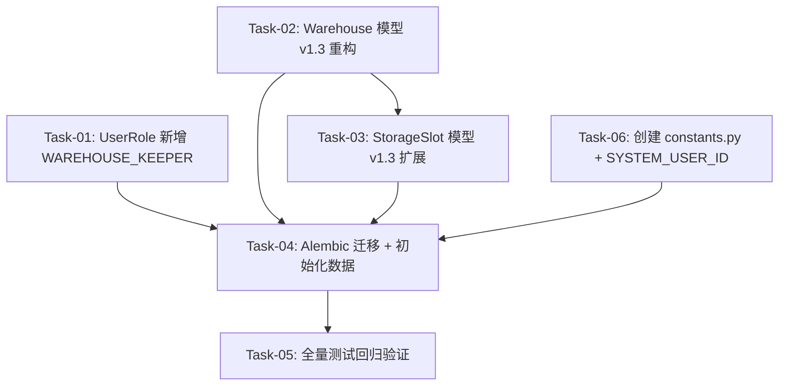

# 数据库模型 v1.3 变更 — 任务规划

> **版本**：v1.1
> **创建日期**：2026-05-25
> **设计文档**：[design.md](./design.md)
> **需求文档**：[requirements.md](./requirements.md)
> **关联设计**：[warehouse/design.md](../warehouse/design.md)（3.4 节 — 初始化数据 + 系统用户）
> **变更范围**：User/Warehouse/StorageSlot 三个模型的 v1.3 更新 + Alembic 迁移 + 初始化数据

---

## 依赖关系图



## 阶段划分

本次为 **纯数据模型重构 + 初始化数据**，无用户可见行为变更，按技术依赖自然分阶段。

### 阶段 1: User 模型 — 新增库管角色
仅新增一个枚举值，独立无依赖，可最先完成。

### 阶段 2: Warehouse + StorageSlot 模型 v1.3 重构 + 基础设施常量
Warehouse 和 StorageSlot 共享 `zone_code` 概念，StorageSlot 变更依赖 Warehouse 先行。
Task-06（constants.py）独立，可与 Task-02 并行。

### 阶段 3: 数据库迁移 + 初始化数据 + 验证
生成 Alembic 迁移脚本（DDL + 系统用户 + 12 区域 144 库位 seed data），执行迁移，运行全量测试确认无回归。

---

## 任务清单

### 阶段 1: User 模型 — 新增库管角色

#### Task-01: UserRole 枚举新增 WAREHOUSE_KEEPER
- **所属切片**：阶段 1: User 模型 v1.3 变更
- **复杂度**：XS
- **Depends On**：None
- **对应 AC**：AC-001
- **通俗解释**：系统可以创建"库管"角色的账号，为后续仓库管理功能做准备。
- **对应设计章节**：design.md 3.3 用户表 / warehouse/design.md 3.3
- **Description**：
  在 `UserRole` 枚举中新增 `WAREHOUSE_KEEPER = "warehouse_keeper"`。
  设计文档 v1.3 将用户角色从 3 种扩展为 4 种（管理员/调度员/司机/库管）。
  现有 `validates("role")` 校验函数基于 `UserRole` 枚举值自动覆盖新角色，无需额外修改。
- **Files to Modify**：
  - `apps/server/app/models/user.py` — 在 UserRole 枚举中新增一行
- **验证标准**：
  - [ ] `UserRole.WAREHOUSE_KEEPER.value` 等于 `"warehouse_keeper"`
  - [ ] 创建 `User(role="warehouse_keeper")` 不触发 `ValueError`
  - [ ] 创建 `User(role="invalid")` 仍触发 `ValueError`
  - [ ] `UserRole` 枚举成员总数 = 4（admin/dispatcher/driver/warehouse_keeper）

---

### 阶段 2: Warehouse + StorageSlot 模型 v1.3 重构 + 基础设施

#### Task-02: Warehouse 模型字段替换
- **所属切片**：阶段 2: Warehouse 模型 v1.3 重构
- **复杂度**：M
- **Depends On**：None（可与 Task-01、Task-06 并行）
- **对应 AC**：AC-009
- **通俗解释**：仓库不再存"客户名称"和"总库位数"，改用"区域编号"来唯一标识仓库区域，用"排列顺序"控制页面展示次序。
- **对应设计章节**：design.md 3.9 仓库表 / warehouse/design.md 3.1
- **Description**：
  v1.3 设计变更：
  - **删除** `code`（VARCHAR(50), unique）→ 与 zone_code 功能重复
  - **删除** `customer_name`（VARCHAR(100)）→ 客户概念移到库位层面
  - **删除** `total_slots`（INT）→ 改为计算字段，由 storage_slots 关联查询得出
  - **新增** `zone_code`（VARCHAR(20), unique, NOT NULL）→ 区域编号，如 "3-5"
  - **新增** `sort_order`（INT, NOT NULL, DEFAULT 0）→ 区域排列顺序（1-12）
  - **新增** 索引 `ix_warehouses_zone_code` on `zone_code`
  - **新增** 索引 `ix_warehouses_sort_order` on `sort_order`

  Warehouse 表当前为空（无业务数据），Alembic 迁移直接删列加列即可，无需数据迁移。
- **Files to Modify**：
  - `apps/server/app/models/warehouse.py`
- **验证标准**：
  - [ ] `Warehouse` 表定义中不存在 `code`、`customer_name`、`total_slots` 字段
  - [ ] `zone_code` 字段类型为 `String(20)`，`unique=True`，`nullable=False`
  - [ ] `sort_order` 字段类型为 `Integer`，`nullable=False`，`default=0`
  - [ ] 表中存在 `ix_warehouses_zone_code` 索引
  - [ ] 表中存在 `ix_warehouses_sort_order` 索引
  - [ ] `name`、`remark` 字段保持不变
  - [ ] `Warehouse.__tablename__` 仍为 `"warehouses"`

#### Task-06: 创建 `app/core/constants.py` + SYSTEM_USER_ID
- **所属切片**：阶段 2: 基础设施常量
- **复杂度**：XS
- **Depends On**：None（可与 Task-01、Task-02 并行）
- **对应 AC**：无（warehouse 功能的前置依赖）
- **通俗解释**：定义一个常量，让后续的出库功能知道"系统自动创建的任务该用哪个用户身份"。
- **对应设计章节**：warehouse/design.md 3.4
- **Description**：
  创建 `apps/server/app/core/constants.py`，定义 `SYSTEM_USER_ID` 常量。
  出库时调用 `dispatch_service.create_order` 需要 `dispatcher_id` 参数，出库任务是系统自动生成的，不是某个库管手动调度的，因此通过该常量引用迁移脚本中创建的系统用户 ID。

  常量值在迁移脚本执行后确定——迁移脚本创建系统用户时使用固定 UUID（`uuid.UUID("00000000-0000-0000-0000-000000000001")`），
  constants.py 中直接使用同一个 UUID。

  ```python
  import uuid

  # 系统用户 ID，由数据库迁移脚本创建（username="system", status="disabled"）
  # 用于出库自动创建调度任务等系统级操作
  SYSTEM_USER_ID = uuid.UUID("00000000-0000-0000-0000-000000000001")
  ```
- **Files to Create**：
  - `apps/server/app/core/constants.py`（新建）
- **验证标准**：
  - [ ] 文件 `apps/server/app/core/constants.py` 存在
  - [ ] `SYSTEM_USER_ID` 常量值为 `uuid.UUID("00000000-0000-0000-0000-000000000001")`
  - [ ] `from app.core.constants import SYSTEM_USER_ID` 可正常导入

#### Task-03: StorageSlot 模型字段扩展 + 部分索引
- **所属切片**：阶段 2: StorageSlot 模型 v1.3 扩展
- **复杂度**：M
- **Depends On**：Task-02（zone_code 概念来自 Warehouse）
- **对应 AC**：AC-010
- **通俗解释**：库位记录更丰富了——知道自己在哪个区域、第几行第几列、放的是重箱还是空箱、属于哪个客户。
- **对应设计章节**：design.md 3.10 库位表 / warehouse/design.md 3.2
- **Description**：
  在现有字段基础上新增：
  - **新增** `zone_code`（VARCHAR(20), NOT NULL）→ 区域编号冗余字段，避免 JOIN
  - **新增** `row`（INT, NOT NULL）→ 行号 1-3
  - **新增** `col`（INT, NOT NULL）→ 列号 1-4
  - **新增** `container_status`（VARCHAR(10), NULLABLE）→ heavy/empty
  - **新增** `customer_name`（VARCHAR(100), NULLABLE）→ 货主名称
  - **新增** `container_type`（VARCHAR(10), NULLABLE）→ 20GP/40GP/40HQ/45HQ
  - **新增** `seal_no`（VARCHAR(20), NULLABLE）→ 封号
  - **新增** 普通索引 `ix_slots_zone_code` on `zone_code`
  - **新增** 普通索引 `ix_slots_customer_name` on `customer_name`
  - **新增** 部分唯一索引 `uq_container_no` on `container_no` WHERE `container_no IS NOT NULL`（`sa.Index` + `postgresql_where`）
  - **新增** 部分普通索引 `ix_slots_container_no` on `container_no` WHERE `container_no IS NOT NULL`

  现有字段保持不变（`id`/`warehouse_id`/`slot_no`/`status`/`container_no`/`stored_at`/`remark`/`created_at`/`updated_at`）。

- **Files to Modify**：
  - `apps/server/app/models/storage_slot.py`
- **验证标准**：
  - [ ] 表中存在 `zone_code`、`row`、`col`、`container_status`、`customer_name`、`container_type`、`seal_no` 字段
  - [ ] `row` 和 `col` 均为 INT 类型，`nullable=False`
  - [ ] `zone_code` 有普通索引 `ix_slots_zone_code`
  - [ ] `customer_name` 有普通索引 `ix_slots_customer_name`
  - [ ] `container_no` 有部分唯一索引 `uq_container_no`（WHERE container_no IS NOT NULL）
  - [ ] `container_no` 有部分普通索引 `ix_slots_container_no`（WHERE container_no IS NOT NULL）
  - [ ] 现有字段（`slot_no`/`status`/`container_no`/`stored_at`/`remark`）保持不变且约束不变
  - [ ] `SlotStatus` 枚举值仍为 `empty`/`loaded`/`empty_container`
  - [ ] `ContainerStatus(str, Enum)` 枚举新增，值为 `heavy`/`empty`
  - [ ] `ContainerType(str, Enum)` 枚举新增，值为 `20GP`/`40GP`/`40HQ`/`45HQ`

---

### 阶段 3: 数据库迁移 + 初始化数据 + 验证

#### Task-04: 生成 Alembic 迁移（含 DDL + 系统用户 + 12 区域 144 库位 seed data）
- **所属切片**：阶段 3: 数据库迁移 + 初始化数据
- **复杂度**：L
- **Depends On**：Task-01, Task-02, Task-03, Task-06
- **对应 AC**：AC-009, AC-010
- **通俗解释**：数据库里一次性建好 12 个区域和 144 个库位格子，同时创建系统用户供后续出库功能使用。
- **对应设计章节**：design.md 六 / warehouse/design.md 3.4
- **Description**：

  **步骤 1 — 生成迁移骨架**：
  ```bash
  cd apps/server && alembic revision --autogenerate -m "v1_3_warehouse_storage_slot_refactor"
  ```
  自动生成的 `upgrade()` 包含 Warehouse 和 StorageSlot 的 DDL 变更（删列/加列/加索引）。

  **步骤 2 — 手动补充 seed data**（在 upgrade() 末尾追加）：

  **2a. 创建系统用户**（固定 UUID = `00000000-0000-0000-0000-000000000001`）：
  ```python
  import uuid
  from datetime import datetime

  SYSTEM_USER_ID = "00000000-0000-0000-0000-000000000001"

  op.execute(f"""
      INSERT INTO users (id, username, password, name, role, status, created_at, updated_at)
      VALUES (
          '{SYSTEM_USER_ID}',
          'system',
          '$2b$12$invalid_hash_placeholder_no_login_possible_00000000000000000000000000',
          '系统',
          'admin',
          'disabled',
          '{datetime.utcnow().isoformat()}',
          '{datetime.utcnow().isoformat()}'
      )
  """)
  ```
  - `password` 用无效 bcrypt hash 占位，确保无法登录
  - `status = 'disabled'` 双重保险

  **2b. 写入 12 个 Warehouse 记录**（zone_code 作为唯一标识）：
  ```python
  zones = [
      (1,  "3-5",  "3-5 区"),
      (2,  "3-7",  "3-7 区"),
      (3,  "3-20", "3-20 区"),
      (4,  "2-13", "2-13 区"),
      (5,  "1-1",  "1-1 区"),
      (6,  "1-20", "1-20 区"),
      (7,  "6-1",  "6-1 区"),
      (8,  "6-2",  "6-2 区"),
      (9,  "6-3",  "6-3 区"),
      (10, "6-4",  "6-4 区"),
      (11, "6-5",  "6-5 区"),
      (12, "6-6",  "6-6 区"),
  ]
  for sort_order, zone_code, name in zones:
      op.execute(f"""
          INSERT INTO warehouses (id, name, zone_code, sort_order, created_at, updated_at)
          VALUES (
              '{uuid.uuid4()}', '{name}', '{zone_code}', {sort_order},
              '{datetime.utcnow().isoformat()}', '{datetime.utcnow().isoformat()}'
          )
      """)
  ```

  **2c. 写入 144 个 StorageSlot 记录**（每个区域 3 行 x 4 列 = 12 个库位）：
  ```python
  # 查询 warehouse_id → zone_code 映射
  result = op.get_bind().execute(
      sa.text("SELECT id, zone_code FROM warehouses ORDER BY sort_order")
  )
  warehouse_map = {row[1]: row[0] for row in result}

  for zone_code in [z[1] for z in zones]:
      warehouse_id = str(warehouse_map[zone_code])
      for row in range(1, 4):      # 行 1-3
          for col in range(1, 5):  # 列 1-4
              slot_no = f"{zone_code}-{row}-{col}"
              op.execute(f"""
                  INSERT INTO storage_slots
                      (id, warehouse_id, zone_code, slot_no, row, col, status, created_at, updated_at)
                  VALUES (
                      '{uuid.uuid4()}', '{warehouse_id}', '{zone_code}', '{slot_no}',
                      {row}, {col}, 'empty',
                      '{datetime.utcnow().isoformat()}', '{datetime.utcnow().isoformat()}'
                  )
              """)
  ```

  **步骤 3 — downgrade() 补充**：
  - 删除 seed data：`DELETE FROM storage_slots` → `DELETE FROM warehouses` → `DELETE FROM users WHERE id = SYSTEM_USER_ID`
  - 后续由 autogenerate 的 DDL 回滚处理表结构

  **步骤 4 — 执行迁移**：
  ```bash
  alembic upgrade head
  alembic downgrade -1   # 验证回滚
  alembic upgrade head   # 恢复
  ```

- **Files to Create/Modify**：
  - `apps/server/alembic/versions/<hash>_v1_3_warehouse_storage_slot_refactor.py`（新建）
- **验证标准**：
  - [ ] `alembic upgrade head` 执行成功，无错误
  - [ ] `alembic downgrade -1` 回滚成功，seed data 被清理，表结构恢复到迁移前
  - [ ] `alembic upgrade head` 再次执行成功
  - [ ] PostgreSQL `warehouses` 表包含 12 条记录，zone_code 分别为 3-5/3-7/3-20/2-13/1-1/1-20/6-1~6-6
  - [ ] PostgreSQL `storage_slots` 表包含 144 条记录，每个 zone_code 有 12 个 slot（行 1-3 x 列 1-4）
  - [ ] `warehouses` 表列：id, name, zone_code, sort_order, remark, created_at, updated_at（不含 code/customer_name/total_slots）
  - [ ] `storage_slots` 表包含所有新字段 + 部分索引 `uq_container_no`
  - [ ] `users` 表中存在 username="system"、status="disabled" 的记录，UUID 为 `00000000-0000-0000-0000-000000000001`

#### Task-05: 全量测试回归验证
- **所属切片**：阶段 3: 验证
- **复杂度**：S
- **Depends On**：Task-04
- **对应 AC**：AC-001, AC-009, AC-010
- **通俗解释**：确认模型变更和初始化数据没有搞坏已有的任何功能。
- **对应设计章节**：design.md 七、AC 覆盖汇总表
- **Description**：
  运行后端全量 pytest 测试套件，确认所有已有功能不受影响。
  - 当前无 Warehouse/StorageSlot 相关测试（已验证），主要关注 User 模型枚举变更不破坏现有 auth 测试
  - 若有测试直接引用 `UserRole` 枚举值，确认 WAREHOUSE_KEEPER 的加入不导致测试失败
  - 验证 `app.core.constants` 模块可正常导入
- **Files**：无需修改，仅运行验证
- **验证标准**：
  - [ ] `pytest` 全量测试通过，无新增失败
  - [ ] 数据库健康检查 `GET /api/health` 返回正常
  - [ ] `from app.core.constants import SYSTEM_USER_ID` 导入成功，类型为 `uuid.UUID`

---

## AC 覆盖检查

| AC 编号 | AC 描述 | 覆盖任务 | 状态 |
|---------|---------|---------|------|
| AC-001 | 用户表支持四种角色（含库管）和两种状态 | Task-01 | ✅ |
| AC-009 | 仓库基本信息管理（v1.3 重构：zone_code 替代 code） | Task-02, Task-04 | ✅ |
| AC-010 | 库位可视化支持（v1.3 扩展：新增 row/col 等字段） | Task-03, Task-04 | ✅ |

> 其余 AC（AC-002~AC-008, AC-011~AC-015）已在 Phase 1.2 实现完成，本次不涉及。
> 系统用户 + 初始化数据 来自 warehouse/design.md AC-002/AC-008/AC-017，在此作为基础设施前置完成。

---

## 验证计划

### 阶段 3 端到端验证
- [ ] Task-01~06 所有验证标准全部通过
- [ ] `alembic upgrade head` + `alembic downgrade -1` + `alembic upgrade head` 完整迁移/回滚/再迁移流程正常
- [ ] `pytest` 全量通过
- [ ] `GET /api/health` 返回 200
- [ ] `SELECT count(*) FROM warehouses` = 12
- [ ] `SELECT count(*) FROM storage_slots` = 144
- [ ] `SELECT id FROM users WHERE username='system' AND status='disabled'` 返回 `00000000-0000-0000-0000-000000000001`
- [ ] Python REPL 中 `from app.core.constants import SYSTEM_USER_ID` 导入成功