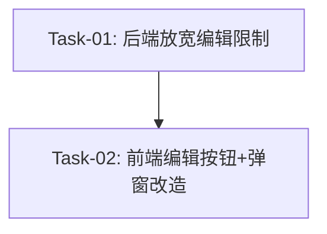

# 任务箱号封号补充编辑 任务规划

> **版本**：v1.0
> **创建日期**：2026-05-23
> **需求文档**：[requirements.md](./requirements.md)
> **技术方案**：[design.md](./design.md)
> **规划策略**：垂直切片，一个切片覆盖完整用户行为

---

## 依赖关系图

## 阶段划分

### 阶段 1: 补充箱号封号
做完后：调度员可以对已分配/运输中/已超时状态的任务点击编辑，弹窗中仅箱号和封号可编辑，保存后箱号封号更新到任务中。

---

## 任务清单

### 阶段 1 任务

#### Task-01: 后端 — update_order 放宽编辑限制
- **所属切片**：阶段 1: 补充箱号封号
- **复杂度**：S
- **Depends On**：None
- **对应 AC**：AC-002, AC-003, AC-004, AC-005, AC-006, AC-007, AC-008
- **通俗解释**：调度员可以编辑已分配/运输中/已超时任务的箱号和封号了，但只能改这两个字段，其他字段改不了
- **Description**：
  1. 在 `dispatch_service.py` 中定义 `EDITABLE_STATUSES` 常量集合（PENDING / ASSIGNED / TRANSITING / OVERDUE）
  2. 修改 `update_order` 函数：将状态校验从 `!= PENDING` 改为 `not in EDITABLE_STATUSES`，错误消息改为"该状态的任务不可编辑"
  3. 新增分支逻辑：待分配状态走现有 `updatable_fields` 全字段更新；其他可编辑状态仅处理 `container_no` 和 `seal_no`，忽略其他字段
  4. 箱号唯一性校验、格式校验、自动转大写逻辑保持不变，在所有可编辑状态下均生效
- **Files to Create/Modify**：
  - `apps/server/app/services/dispatch_service.py` — 修改 `update_order` 函数
- **验证标准**：
  - [ ] `PUT /api/v1/dispatch/orders/{id}`（待分配任务）传入 `container_no="ABCU1234567"` + `customer_name="新客户"` → 更新成功，两个字段都更新
  - [ ] `PUT /api/v1/dispatch/orders/{id}`（已分配任务）传入 `container_no="ABCU1234567"` → 更新成功，`container_no` 为 `"ABCU1234567"`（自动转大写）
  - [ ] `PUT /api/v1/dispatch/orders/{id}`（运输中任务）传入 `seal_no="seal123"` → 更新成功，`seal_no` 为 `"SEAL123"`（自动转大写）
  - [ ] `PUT /api/v1/dispatch/orders/{id}`（已超时任务）传入 `container_no="ABCU1234567"` → 更新成功
  - [ ] `PUT /api/v1/dispatch/orders/{id}`（已分配任务）传入 `customer_name="新客户"` → 更新成功但 `customer_name` 不变（字段被忽略）
  - [ ] `PUT /api/v1/dispatch/orders/{id}`（已完成任务）→ 返回 422 "该状态的任务不可编辑"
  - [ ] `PUT /api/v1/dispatch/orders/{id}`（已分配任务）传入 `container_no` 与另一进行中任务重复 → 返回 409 "该箱号已有进行中的任务，请检查"
  - [ ] `PUT /api/v1/dispatch/orders/{id}`（已分配任务）传入 `container_no="invalid"` → 返回 422（Schema pattern 校验失败）

#### Task-02: 前端 — 编辑按钮 + 弹窗字段禁用
- **所属切片**：阶段 1: 补充箱号封号
- **复杂度**：M
- **Depends On**：Task-01
- **对应 AC**：AC-001, AC-004, AC-007, AC-008
- **通俗解释**：已分配/运输中/已超时的任务也显示编辑按钮了，点击后弹窗标题变成"补充箱号封号"，只有箱号和封号能改，其他字段灰了点不了
- **Description**：
  1. `useOrderTable.ts`：修改 `canEdit` 函数，从 `status === PENDING` 改为 `status !== COMPLETED`
  2. `useOrderForm.ts`：新增 `isLimitedEdit` 计算属性（edit 模式 + order.status !== PENDING）；修改 `dialogTitle`，有限编辑时返回"补充箱号封号"；导出 `isLimitedEdit`
  3. `OrderFormDialog.vue`：将 `isLimitedEdit` 传递给各 Section 组件作为 `disabled` prop
  4. `ContainerSection.vue`：新增 `disabled` prop，箱型和空重箱下拉框绑定 `:disabled="disabled"`，箱号和封号输入框不受影响
  5. `BusinessSection.vue`：新增 `disabled` prop，内部所有表单控件绑定 `:disabled="disabled"`
  6. `RouteSection.vue`：新增 `disabled` prop，内部所有表单控件绑定 `:disabled="disabled"`
  7. `CustomerSection.vue`：新增 `disabled` prop，内部所有表单控件绑定 `:disabled="disabled"`
  8. `OrderFormDialog.vue`：备注输入框在 `isLimitedEdit` 时也设置 `:disabled="isLimitedEdit"`
- **Files to Create/Modify**：
  - `apps/frontend/src/modules/dispatch/components/useOrderTable.ts` — 修改 `canEdit`
  - `apps/frontend/src/modules/dispatch/composables/useOrderForm.ts` — 新增 `isLimitedEdit`，修改 `dialogTitle`
  - `apps/frontend/src/modules/dispatch/components/OrderFormDialog.vue` — 传递 `disabled`，备注禁用
  - `apps/frontend/src/modules/dispatch/components/sections/ContainerSection.vue` — 新增 `disabled` prop
  - `apps/frontend/src/modules/dispatch/components/sections/BusinessSection.vue` — 新增 `disabled` prop
  - `apps/frontend/src/modules/dispatch/components/sections/RouteSection.vue` — 新增 `disabled` prop
  - `apps/frontend/src/modules/dispatch/components/sections/CustomerSection.vue` — 新增 `disabled` prop
- **验证标准**：
  - [ ] 已分配状态的任务在列表中显示"编辑"按钮
  - [ ] 运输中状态的任务在列表中显示"编辑"按钮
  - [ ] 已超时状态的任务在列表中显示"编辑"按钮
  - [ ] 已完成状态的任务在列表中不显示"编辑"按钮
  - [ ] 点击已分配任务的"编辑"按钮 → 弹窗标题为"补充箱号封号"
  - [ ] 弹窗中箱号和封号输入框可正常输入
  - [ ] 弹窗中箱型、空重箱、业务类型、单证、起运地、目的地、途径点、客户名称、联系电话、备注均为禁用状态
  - [ ] 点击待分配任务的"编辑"按钮 → 弹窗标题为"编辑任务"，所有字段均可编辑
  - [ ] 在有限编辑模式下修改箱号和封号后点击保存 → 保存成功，列表中箱号/封号更新

---

## AC 覆盖检查

| AC 编号 | AC 描述 | 覆盖任务 | 状态 |
|---------|---------|---------|------|
| AC-001 | 已分配/运输中/已超时点击编辑→弹窗仅箱号封号可编辑 | Task-02 | ✅ |
| AC-002 | 编辑箱号→自动转大写保存 | Task-01 | ✅ |
| AC-003 | 编辑封号→自动转大写保存 | Task-01 | ✅ |
| AC-004 | 已完成不显示编辑按钮 | Task-02 | ✅ |
| AC-005 | 箱号重复→提示错误 | Task-01 | ✅ |
| AC-006 | 箱号格式错误→提示错误 | Task-01 | ✅ |
| AC-007 | 非待分配仅允许编辑箱号封号 | Task-01, Task-02 | ✅ |
| AC-008 | 待分配编辑行为不变 | Task-01, Task-02 | ✅ |

---

## 验证计划

### 阶段 1 验证
- [x] Task-01 验证标准全部通过
- [x] Task-02 验证标准全部通过
- [x] 端到端验证：创建提空箱任务（箱号留空）→ 分配司机 → 司机开始运输 → 调度员点击编辑 → 弹窗标题"补充箱号封号" → 填写箱号和封号 → 保存成功 → 列表中箱号和封号显示更新后的值
