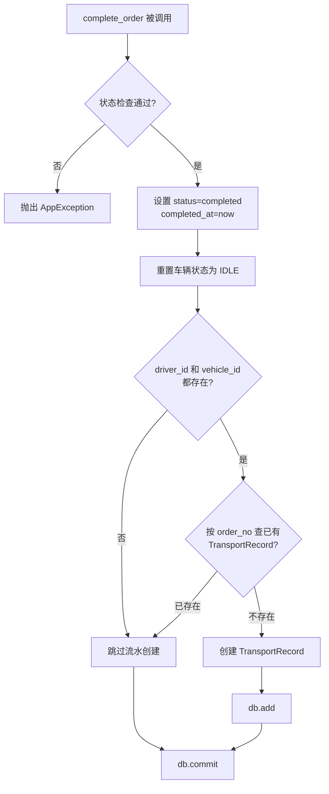

# Dispatch-Fleet 联动 & 司机端 技术方案

> **版本**：v1.5（审查修正版）
> **创建日期**：2026-05-19
> **修正日期**：2026-05-19（第四轮审查修正）
> **需求文档**：[requirements.md](./requirements.md)
> **设计目标**：打通调度任务与运输流水的数据壁垒（完成→写入、删除→同步删除），为司机提供极简手机端工作台，运输流水字段扩展空重箱状态

---

## 目录

- [一、功能概述](#一功能概述)
- [二、现有代码分析](#二现有代码分析)
- [三、数据模型设计](#三数据模型设计)
- [四、API 设计](#四api-设计)
- [五、前端设计](#五前端设计)
- [六、核心逻辑](#六核心逻辑)
- [七、AC 覆盖汇总表](#七ac-覆盖汇总表)
- [八、设计决策记录](#八设计决策记录)
- [九、关联文档](#九关联文档)

---

## 一、功能概述

- **功能名称**：Dispatch-Fleet 联动 & 司机端
- **需求文档**：[requirements.md](./requirements.md)（24 条 AC）
- **设计目标**：实现调度任务与运输流水的自动联动（完成→写入、删除→同步删除），为司机提供极简手机端工作台，运输流水字段扩展空重箱状态

---

## 二、现有代码分析

### 技术栈合规检查（必做，逐项确认）

- [x] 已读取 `specs/tech-stack.md`，确认本设计所有技术选型在批准范围内
- [x] UI 组件：仅使用 Element Plus（`el-button`、`el-input`、`el-table`、`el-tag`、`el-select` 等），不引入其他 UI 库
- [x] 样式方案：仅使用 `<style scoped>`，不使用 Tailwind CSS
- [x] 日期处理：仅使用 dayjs，不使用 moment.js
- [x] 已用 Glob 工具审计 `shared/components/` 目录，确认引用的公共组件真实存在

### 涉及模块

| 模块 | 路径 | 改动类型 |
|------|------|---------|
| Order 模型 | `apps/server/app/models/order.py` | 加字段 |
| TransportRecord 模型 | `apps/server/app/models/transport_record.py` | 加字段 |
| dispatch_service | `apps/server/app/services/dispatch_service.py` | 改 complete_order / delete_order / create_order / update_order |
| fleet_service | `apps/server/app/services/fleet_service.py` | 改导入逻辑（7→8兼容） |
| fleet_drivers API | `apps/server/app/api/v1/fleet_drivers.py` | create/update/delete/disable 同步 User |
| fleet_transport_records API | `apps/server/app/api/v1/fleet_transport_records.py` | `_record_to_response` + 模板更新 |
| dispatch Schema | `apps/server/app/schemas/dispatch.py` | OrderCreate 等加 container_status |
| fleet Schema | `apps/server/app/schemas/fleet.py` | TransportRecordResponse 加字段 |
| main.py | `apps/server/app/main.py` | 注册 driver_router |
| 前端 Router | `apps/frontend/src/router/index.ts` | 注册 /driver 路由 |
| 前端 LoginForm | `apps/frontend/src/modules/auth/components/LoginForm.vue` | 按 role 跳转 |
| dispatch BusinessSection | `apps/frontend/src/modules/dispatch/components/sections/BusinessSection.vue` | 加 container_status 下拉框 |
| dispatch useOrderForm | `apps/frontend/src/modules/dispatch/composables/useOrderForm.ts` | OrderFormState 加 containerStatus |
| dispatch useOrderFormHelpers | `apps/frontend/src/modules/dispatch/composables/useOrderFormHelpers.ts` | createInitialFormState + buildRequest 加 containerStatus |
| dispatch useOrderFormOptions | `apps/frontend/src/modules/dispatch/composables/useOrderFormOptions.ts` | 新增 containerStatusOptions |
| dispatch order types | `apps/frontend/src/modules/dispatch/types/order.ts` | Order/CreateOrderRequest/UpdateOrderRequest 加 containerStatus |
| fleet transport-record types | `apps/frontend/src/modules/fleet/types/transport-record.ts` | TransportRecord 加 containerStatus |
| fleet TransportRecordManagement | `apps/frontend/src/modules/fleet/components/TransportRecordManagement.vue` | 加列 |

### 新建模块

| 模块 | 路径 |
|------|------|
| 司机端 API | `apps/server/app/api/v1/driver.py` |
| 司机端前端模块 | `apps/frontend/src/modules/driver/` |

### 可复用抽象（已审计，逐项标注验证状态）

| 组件/工具 | 文件路径 | 验证状态 |
|-----------|---------|---------|
| hash_password() | `apps/server/app/core/security.py` | ✅ |
| User 模型 + UserRole.DRIVER | `apps/server/app/models/user.py` | ✅ |
| UserStatus.DISABLED | `apps/server/app/models/user.py` | ✅ |
| auth/login API | `apps/server/app/api/v1/auth.py` | ✅ |
| get_current_user 依赖 | `apps/server/app/api/v1/auth.py` | ✅ |
| complete_order() | `apps/server/app/services/dispatch_service.py` | ✅ |
| delete_order() | `apps/server/app/services/dispatch_service.py` | ✅ |
| import_transport_records_from_content() | `apps/server/app/services/fleet_service.py` | ✅ |
| HTTP 客户端 (Axios) | `apps/frontend/src/shared/api/client.ts` | ✅ |
| EmptyState 组件 | `apps/frontend/src/shared/components/EmptyState.vue` | ✅ |
| 路由守卫（role 检查） | `apps/frontend/src/router/index.ts` | ✅ |
| Element Plus 组件库 | 全局注册 | ✅ |

### 影响范围

- **Order 模型**：新增 `container_status` 字段，创建/编辑任务表单增加下拉框
- **TransportRecord 模型**：新增 `container_status` 字段，导入兼容新格式
- **fleet_drivers**：创建/修改/删除/停用司机时需同步维护 User 表
- **Router**：新增 `/driver` 路由（独立于 AppLayout）
- **LoginForm**：按 role 分发跳转目标

---

## 三、数据模型设计

### 3.1 Order 模型 — 新增 container_status

`container_status` 是**独立于 `business_type` 的新维度**：

```
business_type    → 业务流程维度（模板匹配、调度规则）
container_status → 统计维度（空箱/重箱），直接映射到运输流水
```

```python
# apps/server/app/models/order.py 新增

class ContainerStatus(str, enum.Enum):
    HEAVY = "heavy"    # 重箱
    EMPTY = "empty"    # 空箱


# Order 类中新增字段
container_status: Mapped[str | None] = mapped_column(
    String(10), nullable=True
)

    @validates("container_status")
    def validate_container_status(self, _: str, value: str | None) -> str | None:
        if value is not None and value not in {"heavy", "empty"}:
            raise ValueError(f"Invalid container status: {value}")
        return value
```

→ AC-022

### 3.2 TransportRecord 模型 — 新增 container_status

```python
# apps/server/app/models/transport_record.py

class TransportRecord(BaseModel):
    __tablename__ = "transport_records"
    __table_args__ = (
        sa.Index("ix_transport_records_imported_at", "imported_at"),
        sa.Index("ix_transport_records_vehicle", "vehicle_id"),
        sa.Index("ix_transport_records_driver", "driver_id"),
    )

    id: Mapped[uuid.UUID] = mapped_column(Uuid, primary_key=True, default=uuid.uuid4)
    order_no: Mapped[str] = mapped_column(String(50), unique=True, nullable=False)
    customer_info: Mapped[str] = mapped_column(String(200), nullable=False)
    container_status: Mapped[str | None] = mapped_column(        # 新增
        String(10), nullable=True
    )
    origin: Mapped[str] = mapped_column(String(200), nullable=False)
    destination: Mapped[str] = mapped_column(String(200), nullable=False)
    container_no: Mapped[str] = mapped_column(String(20), nullable=False)
    vehicle_id: Mapped[uuid.UUID] = mapped_column(
        Uuid, ForeignKey("vehicles.id"), nullable=False
    )
    driver_id: Mapped[uuid.UUID] = mapped_column(
        Uuid, ForeignKey("drivers.id"), nullable=False
    )
    imported_at: Mapped[datetime] = mapped_column(
        sa.DateTime, nullable=False, default=datetime.now
    )
```

→ AC-021

### 3.3 Order → TransportRecord 字段映射

| Order 字段 | TransportRecord 字段 | 映射规则 |
|-----------|---------------------|---------|
| `order_no` | `order_no` | 直接复制 |
| `customer_name` | `customer_info` | 直接复制 |
| **`container_status`** | **`container_status`** | 直接复制 |
| `origin_name` | `origin` | 直接复制 |
| `dest_name` | `destination` | 直接复制 |
| `container_no` | `container_no` | 直接复制 |
| `vehicle_id` | `vehicle_id` | 直接复制 |
| `driver_id` | `driver_id` | 直接复制 |
| `completed_at` | `imported_at` | 用 `datetime.now()`（事务提交时刻） |

### 3.4 数据库迁移

一次 Alembic 迁移包含：

1. `orders` 表：`ADD COLUMN container_status VARCHAR(10)`
2. `transport_records` 表：`ADD COLUMN container_status VARCHAR(10)`

```bash
alembic revision --autogenerate -m "add_container_status"
alembic upgrade head
```

---

## 四、API 设计

### 4.1 新增司机端 API

所有接口挂载在 `/api/v1/driver`，需要 `DRIVER` 角色。

| 方法 | 路径 | 描述 | 对应 AC |
|------|------|------|---------|
| GET | `/driver/orders` | 获取当前司机的任务列表 | → AC-005 |
| POST | `/driver/orders/{id}/start` | 开始运输（ASSIGNED→TRANSITING） | → AC-006 |
| POST | `/driver/orders/{id}/complete` | 标记完成（TRANSITING→COMPLETED） | → AC-007, AC-002 |

**司机身份校验逻辑**：

```python
# apps/server/app/api/v1/driver.py

router = APIRouter(prefix="/driver", tags=["司机端"])


async def get_current_driver(
    current_user: User = Depends(get_current_user),
    db: AsyncSession = Depends(get_db),
) -> Driver:
    if current_user.role != UserRole.DRIVER.value:
        raise AppException(code=403, message="仅司机可访问")

    if not current_user.phone:
        raise AppException(code=404, message="司机账号信息不完整，缺少手机号")

    result = await db.execute(
        select(Driver).where(Driver.phone == current_user.phone)
    )
    driver = result.scalar_one_or_none()
    if not driver:
        raise AppException(code=404, message="司机信息不存在")
    return driver
```

**GET /driver/orders** — 只返回当前司机的任务（分页）：

```python
@router.get("/orders")
async def list_my_orders(
    page: int = Query(1, ge=1),
    page_size: int = Query(20, ge=1, le=100),
    driver: Driver = Depends(get_current_driver),
    db: AsyncSession = Depends(get_db),
):
    count_query = select(func.count(Order.id)).where(Order.driver_id == driver.id)
    total_result = await db.execute(count_query)
    total = total_result.scalar() or 0

    offset = (page - 1) * page_size
    result = await db.execute(
        select(Order)
        .where(Order.driver_id == driver.id)
        .order_by(Order.created_at.desc())
        .offset(offset)
        .limit(page_size)
    )
    orders = result.scalars().all()

    items = [DriverOrderResponse.model_validate(order) for order in orders]
    return {"items": items, "total": total, "page": page, "page_size": page_size}
```

**DriverOrderResponse Schema** — 司机端精简字段：

```python
class DriverOrderResponse(BaseModel):
    id: str
    order_no: str
    status: str
    customer_name: str | None = None
    origin_name: str | None = None
    dest_name: str | None = None
    container_no: str | None = None
    created_at: datetime

    model_config = {"from_attributes": True}
```

**POST /driver/orders/{id}/start** — 开始运输：

```python
@router.post("/orders/{order_id}/start")
async def start_order(
    order_id: uuid.UUID,
    driver: Driver = Depends(get_current_driver),
    db: AsyncSession = Depends(get_db),
):
    result = await db.execute(select(Order).where(Order.id == order_id))
    order = result.scalar_one_or_none()
    if not order:
        raise AppException(code=404, message="任务不存在")
    if order.driver_id != driver.id:
        raise AppException(code=403, message="这不是您的任务")      # → AC-019
    if order.status != OrderStatus.ASSIGNED.value:
        raise AppException(code=422, message="仅已分配状态的任务可开始运输")  # → AC-020

    order.status = OrderStatus.TRANSITING.value
    order.started_at = datetime.now(timezone.utc)
    await db.commit()
    return {"code": 200, "message": "已开始运输"}
```

**POST /driver/orders/{id}/complete** — 标记完成（复用 dispatch_service）：

> ⚠️ **事务边界**：`complete_my_order` 本身不持有事务，所有写操作（状态变更 + 流水创建）委托给 `complete_order()` 内部事务统一 commit。此端点仅做权限校验后调用 `complete_order(db, order_id)`，不可在调用前后添加额外的写操作，否则会脱离 `complete_order()` 的事务边界导致部分提交。
>
> **二次查询说明**：`complete_my_order` 先查 Order 做权限校验，再调用 `complete_order(db, order_id)` 会二次查询 Order。由于 SQLAlchemy session 缓存机制，第二次查询会拿到同一对象（不会产生脏读），因此无需额外处理。但如果未来 `complete_order` 内部逻辑变化（如加了 `await db.refresh(order)`），则需改为直接传入 order 对象。

```python
@router.post("/orders/{order_id}/complete")
async def complete_my_order(
    order_id: uuid.UUID,
    driver: Driver = Depends(get_current_driver),
    db: AsyncSession = Depends(get_db),
):
    from app.services.dispatch_service import complete_order

    result = await db.execute(select(Order).where(Order.id == order_id))
    order = result.scalar_one_or_none()
    if not order:
        raise AppException(code=404, message="任务不存在")
    if order.driver_id != driver.id:
        raise AppException(code=403, message="这不是您的任务")
    if order.status != OrderStatus.TRANSITING.value:
        raise AppException(code=422, message="仅运输中的任务可标记完成")  # → AC-007

    await complete_order(db, order_id)
    return {"code": 200, "message": "任务已完成"}
```

→ AC-006, AC-007, AC-019, AC-020

### 4.1.1 路由注册

在 `apps/server/app/main.py` 中注册司机端路由：

```python
# main.py 新增
from app.api.v1.driver import router as driver_router
app.include_router(driver_router, prefix="/api/v1")
```

当前注册方式见 `main.py`：`auth_router`、`dispatch_router`、`fleet_router` 均以 `prefix="/api/v1"` 注册，司机端路由同理。

### 4.2 已有接口修改

| 方法 | 路径 | 改动 | 对应 AC |
|------|------|------|---------|
| POST | `/fleet/drivers` | 创建 Driver 时同步创建 User（role=driver） | → AC-004, AC-024 |
| PUT | `/fleet/drivers/{id}` | 修改手机号时同步更新 User.username/phone | → AC-016 |
| DELETE | `/fleet/drivers/{id}` | 删除时同步删除 User（或标记停用） | → AC-017 |
| PUT | `/fleet/drivers/{id}/disable` | 停用时同步禁用 User | → AC-018 |
| POST | `/dispatch/orders/{id}/complete` | 不改接口，改 service 层 | → AC-001 |
| DELETE | `/dispatch/orders/{id}` | 不改接口，改 service 层 | → AC-003 |
| POST | `/fleet/transport-records/import` | 7/8 列兼容 + container_status 校验 | → AC-008, AC-015 |
| GET | `/fleet/transport-records/template` | 模板更新为 8 列 | → AC-008 |
| GET | `/fleet/transport-records` | `_record_to_response` 增加 container_status | — |
| POST/PUT | `/dispatch/orders` | OrderCreate/OrderUpdate schema 增加 container_status | → AC-022 |

> ⚠️ **Service 层联动**：仅修改 Schema 不够——`create_order()` 中 Order 构造函数需增加 `container_status=data.get("container_status")`，`update_order()` 的 `updatable_fields` 列表需增加 `"container_status"`。否则 Schema 校验通过但数据不落库。

### 4.3 Schema 变更

**dispatch.py** — OrderCreate / OrderUpdate / OrderResponse 加字段：

```python
class OrderCreate(BaseModel):
    # ... 现有字段不变 ...
    container_status: str = Field(
        ..., pattern="^(heavy|empty)$"
    )  # Schema 必填而模型 nullable 是有意为之——新数据必须指定，但历史数据可能为空

# OrderUpdate 和 OrderResponse 同样加 container_status 字段
# OrderUpdate: Optional[str] = Field(None, pattern="^(heavy|empty)$")（部分更新语义，与现有字段风格一致）
# OrderResponse: str | None = None（返回历史数据兼容）
```

**fleet.py** — TransportRecordResponse 加字段：

```python
class TransportRecordResponse(BaseModel):
    # ... 现有字段不变 ...
    container_status: str | None = None
```

**fleet_transport_records.py** — `_record_to_response` 加映射：

```python
def _record_to_response(
    record: TransportRecord,
    vehicle_plate_no: str | None = None,
    driver_name: str | None = None,
) -> TransportRecordResponse:
    return TransportRecordResponse(
        # ... 现有字段不变 ...
        container_status=record.container_status,  # 新增
    )
```

---

## 五、前端设计

### 5.1 路由配置

**司机端使用独立路由（不挂在 AppLayout 下）**，避免司机看到车队管理/调度中心侧边栏菜单。

> ⚠️ **路由守卫完整性**：现有 `/fleet` 路由无 roles 限制，司机登录后可进入车队管理页面，违反 AC-004。需同时修改 `/fleet` 的 roles 限制和根路由 redirect 逻辑。

**1. 新增司机端路由**：

```typescript
// apps/frontend/src/router/index.ts 新增

{
  path: '/driver',
  name: 'Driver',
  component: () => import('@/modules/driver/pages/DriverWorkbench.vue'),
  meta: { requiresAuth: true, roles: ['driver'] },
},
```

**2. 修改 /fleet 路由加 roles 限制**：

```typescript
// 现有 /fleet 路由加 roles，防止司机进入管理页面
{
  path: 'fleet',
  name: 'Fleet',
  component: FleetPage,
  meta: { requiresAuth: true, roles: ['admin', 'dispatcher'] },  // 新增 roles
},
```

**3. 修改根路由 redirect 为动态判断**：

```typescript
// 根路由 '/' 不再硬编码 redirect 到 '/fleet'
// 改为在路由守卫中按 role 动态跳转
{
  path: '/',
  component: AppLayout,
  meta: { requiresAuth: true },
  children: [
    {
      path: '',
      name: 'Home',
      component: () => import('@/shared/components/EmptyState.vue'),  // 占位，不会停留
    },
    // ... fleet, dispatch 子路由不变
  ],
},
```

**4. 修改路由守卫，按 role 动态 redirect**：

```typescript
router.beforeEach((to, _from, next) => {
  const authStore = useAuthStore()
  const isLoggedIn = authStore.isLoggedIn

  if (isLoggedIn && to.path === '/login') {
    next('/')
    return
  }

  if (to.meta.requiresAuth !== false && !isLoggedIn) {
    next('/login')
    return
  }

  // 根路径按 role 动态跳转
  if (to.name === 'Home') {
    if (authStore.userRole === 'driver') {
      next('/driver')
    } else {
      next('/fleet')
    }
    return
  }

  const allowedRoles = to.meta.roles as string[] | undefined
  if (allowedRoles && allowedRoles.length > 0 && !allowedRoles.includes(authStore.userRole)) {
    // 角色不匹配时，按 role 跳转到对应首页
    if (authStore.userRole === 'driver') {
      next('/driver')
    } else {
      next('/fleet')
    }
    return
  }

  next()
})
```

**5. 登录后按 role 跳转**：`LoginForm.vue` — `handleLogin()` 函数修改：

```typescript
// LoginForm.vue handleLogin() 中：
await authStore.login(form.value.username, form.value.password)
if (authStore.userRole === 'driver') {
  router.push('/driver')
} else {
  router.push('/fleet')  // 保持现有行为：管理员/调度员默认跳车队管理
}
```

→ AC-004

### 5.2 司机端页面结构

```
司机工作台（路由：/driver，独立布局，无侧边栏）
├── 顶部栏
│   ├── 标题"司机工作台"
│   ├── 司机姓名 + 手机号
│   └── 退出登录按钮
├── 任务列表（el-table）
│   ├── 任务编号
│   ├── 客户名称
│   ├── 路线（起运地 → 目的地）
│   ├── 箱号
│   ├── 状态（el-tag 颜色区分）
│   └── 操作
│       ├── [开始运输] 按钮（仅"已分配"状态显示）
│       └── [标记完成] 按钮（仅"运输中"状态显示）
└── 空状态（无任务时显示 EmptyState 组件）
```

### 5.3 司机端模块目录结构

```
apps/frontend/src/modules/driver/
├── components/
│   └── DriverOrderList.vue       # 任务列表组件
├── pages/
│   └── DriverWorkbench.vue       # 司机工作台页面（含顶部栏+列表+退出）
├── services/
│   └── driverService.ts          # API 调用
├── stores/
│   └── useDriverStore.ts         # 状态管理
└── index.ts                      # 导出
```

### 5.4 调度端改动

- **创建/编辑任务弹窗**：在 `BusinessSection.vue` 的"业务类型"下拉框下方新增"空重箱状态"下拉框（重箱/空箱，必选）
- **前端类型文件** `dispatch/types/order.ts`：
  - `Order` 接口加 `containerStatus: string | null`
  - `CreateOrderRequest` 接口加 `containerStatus?: string`
  - `UpdateOrderRequest` 接口加 `containerStatus?: string`
- **表单状态** `useOrderForm.ts`：`OrderFormState` 加 `containerStatus: 'heavy' | 'empty' | ''`
- **表单辅助函数** `useOrderFormHelpers.ts`：`createInitialFormState()` 加 `containerStatus: ''`；`buildRequest()` 加 `containerStatus` 映射
- **表单选项** `useOrderFormOptions.ts`：新增 `containerStatusOptions`（`[{value:'heavy', label:'重箱'}, {value:'empty', label:'空箱'}]`）

### 5.5 运输流水管理页改动

- **前端类型文件** `fleet/types/transport-record.ts`：`TransportRecord` 接口加 `containerStatus?: string`
- 列表增加"空重箱"列
- 导入模板下载端点自动返回 8 列格式

---

## 六、核心逻辑

### 6.1 完成任务 → 自动创建运输流水

**钩子点**：`dispatch_service.py` — `complete_order()` 函数



**实现位置**：在 `complete_order()` 中，车辆状态重置逻辑之后、**原有 `await db.commit()` 之前**插入。⚠️ **关键**：现有 `complete_order()` 末尾的 `await db.commit()` 必须移到流水创建代码之后，确保任务完成和流水创建在同一事务中提交。若流水创建在 commit 之后，则流水记录不会随任务完成一起持久化，可能出现任务完成但流水丢失的数据不一致。

```python
# ⚠️ 以下代码必须插入在现有 complete_order() 的
#     vehicle.status = VehicleStatus.IDLE.value
# 之后、await db.commit() 之前
# （即把原有的 await db.commit() 移到此处之后）

# 自动创建运输流水记录
# ⚠️ 关键：TransportRecord 的 customer_info/origin/destination/container_no 为 NOT NULL，
# 但 Order 中对应字段为 nullable。当关键字段为空时跳过流水创建，
# 避免写入空字符串的无意义记录。
if order.driver_id and order.vehicle_id:
    existing = await db.execute(
        select(TransportRecord).where(
            TransportRecord.order_no == order.order_no
        )
    )
    if not existing.scalar_one_or_none():
        record = TransportRecord(
            id=uuid.uuid4(),
            order_no=order.order_no,
            customer_info=order.customer_name or "",
            container_status=order.container_status,
            origin=order.origin_name or "",
            destination=order.dest_name or "",
            container_no=order.container_no or "",
            vehicle_id=order.vehicle_id,
            driver_id=order.driver_id,
        )
        db.add(record)
```

→ AC-001, AC-002, AC-007, AC-011, AC-013

### 6.2 删除任务 → 同步删除运输流水

**钩子点**：`dispatch_service.py` — `delete_order()` 函数

**实现位置**：在 `await db.delete(order)` 之前插入：

```python
# 同步删除关联的运输流水记录
tr_result = await db.execute(
    select(TransportRecord).where(
        TransportRecord.order_no == order.order_no
    )
)
tr = tr_result.scalar_one_or_none()
if tr:
    await db.delete(tr)
```

→ AC-003, AC-012

### 6.3 创建司机 → 同步创建 User 登录账号

**钩子点**：`fleet_drivers.py` — `create_driver()` 函数

**实现位置**：在 `db.add(driver)` 之后、`await db.commit()` 之前：

> ⚠️ **事务一致性**：User 创建必须在 `await db.commit()` 之前，与 Driver 在同一事务中提交。若 User 创建失败（如 username 冲突），Driver 也会回滚，避免出现"司机存在但无登录账号"的数据不一致。

```python
# 同步创建司机登录账号
from app.core.security import hash_password
from app.models.user import User, UserRole

existing_user = await db.execute(
    select(User).where(
        User.username == data.phone,
        User.role == UserRole.DRIVER.value,
    )
)
if not existing_user.scalar_one_or_none():
    user = User(
        id=uuid.uuid4(),
        username=data.phone,
        password=hash_password(data.phone),
        name=data.name,
        phone=data.phone,
        role=UserRole.DRIVER.value,
    )
    db.add(user)

# ⚠️ 以下 await db.commit() 必须在 User 创建之后
# 确保 Driver 和 User 在同一事务中提交
```

→ AC-004, AC-024

> ⚠️ **存量司机迁移**：上述逻辑仅对「新建司机」生效。部署前已存在的司机在 User 表中无对应记录，需在 Alembic 迁移中增加一次性数据修补，或由 DBA 手动执行：`INSERT INTO users (id, username, password, name, phone, role) SELECT gen_random_uuid(), phone, <hashed_phone>, name, phone, 'driver' FROM drivers WHERE phone NOT IN (SELECT username FROM users WHERE role='driver')`。

### 6.4 修改司机手机号 → 同步更新 User

**钩子点**：`fleet_drivers.py` — `update_driver()` 函数

**实现位置**：在现有 `driver.phone = data.phone` **之前**插入 User 同步逻辑。

> ⚠️ **执行顺序关键**：现有 `update_driver()` 中 `driver.phone = data.phone` 会立即修改 session 中的 driver 对象。必须在修改 driver.phone **之前**保存旧 phone 并完成 User 查询，否则用旧 phone 查 User 会查不到（因为 driver.phone 已是新值，SQLAlchemy session 缓存已更新）。

```python
# ⚠️ 以下代码必须插入在现有 update_driver() 的
#     if data.phone is not None:
#         ...（手机号查重逻辑）...
#         driver.phone = data.phone    ← 这行之前
# 否则 old_phone 拿到的是新值

if data.phone is not None and data.phone != driver.phone:
    old_phone = driver.phone          # 先保存旧 phone（此时 driver.phone 还是旧值）

    # 同步更新 User 登录账号
    user_result = await db.execute(
        select(User).where(
            User.phone == old_phone,
            User.role == UserRole.DRIVER.value,
        )
    )
    user = user_result.scalar_one_or_none()
    if user:
        user.username = data.phone
        user.phone = data.phone

    # 然后再更新 driver.phone
    driver.phone = data.phone
```

→ AC-016

### 6.5 删除司机 → 同步删除 User

**钩子点**：`fleet_drivers.py` — `delete_driver()` 函数

> ⚠️ **保留历史记录保护**：现有 `delete_driver()` 已有历史记录保护逻辑（`TransportRecord` 中有记录则返回 409 禁止删除）。User 同步删除仅需在「无历史记录」的正常删除分支中执行，不可移除该保护。

```python
# ⚠️ 关键：以下代码必须放在历史记录守卫检查之后、
#     await db.delete(driver) 之前
# 否则当司机有历史记录时，Driver 删除被守卫拦截（409），
# 但 User 已被提前删除，导致司机登录账号丢失

# 同步删除司机的登录账号
user_result = await db.execute(
    select(User).where(
        User.phone == driver.phone,
        User.role == UserRole.DRIVER.value,
    )
)
user = user_result.scalar_one_or_none()
if user:
    await db.delete(user)
```

→ AC-017

### 6.6 停用司机 → 同步禁用 User

`PUT /fleet/drivers/{id}/disable` 端点中：

```python
# ⚠️ 以下代码必须插入在 driver.is_disabled = True 之后、await db.commit() 之前
# 确保 Driver 停用和 User 禁用在同一事务中提交

user_result = await db.execute(
    select(User).where(
        User.phone == driver.phone,
        User.role == UserRole.DRIVER.value,
    )
)
user = user_result.scalar_one_or_none()
if user:
    user.status = UserStatus.DISABLED.value
```

→ AC-018

### 6.7 导入格式 7/8 列兼容

**修改**：`fleet_service.py` — `IMPORT_EXPECTED_COLUMNS` 常量及 `import_transport_records_from_content()` 函数

```python
# 删除旧常量：IMPORT_EXPECTED_COLUMNS = 7
# 替换为：
IMPORT_EXPECTED_COLUMNS_MIN = 7
IMPORT_EXPECTED_COLUMNS = 8

# 列数校验逻辑同步修改：
# 旧：if len(columns) != IMPORT_EXPECTED_COLUMNS:
# 新：if len(columns) < IMPORT_EXPECTED_COLUMNS_MIN or len(columns) > IMPORT_EXPECTED_COLUMNS:

# 解析行改为向下兼容：
columns = line.split("\t")
if len(columns) == 7:
    order_no, customer_info, origin, destination, container_no, plate_no, phone = columns
    container_status = None
elif len(columns) == 8:
    order_no, customer_info, container_status, origin, destination, container_no, plate_no, phone = columns
else:
    error_count += 1
    errors.append({"row": row_idx, "message": f"列数不正确，期望 7 或 8 列，实际 {len(columns)} 列"})
    continue

# 值域校验
if container_status and container_status not in ('heavy', 'empty'):
    error_count += 1
    errors.append({"row": row_idx, "message": f"空重箱状态值无效：{container_status}，应为 heavy 或 empty"})
    continue

# 创建 TransportRecord 时包含 container_status
record = TransportRecord(
    id=uuid.uuid4(),
    order_no=order_no,
    customer_info=customer_info,
    container_status=container_status,    # 新增
    origin=origin,
    destination=destination,
    container_no=container_no,
    vehicle_id=vehicle.id,
    driver_id=driver.id,
)
db.add(record)
success_count += 1
```

**模板下载端点** `fleet_transport_records.py` — `download_template()` 函数更新为：

```python
template_content = "任务编号\t客户信息\t空重箱状态\t起运地\t目的地\t箱号\t执行车辆(车牌号)\t执行司机(手机号)\n"
```

→ AC-008, AC-009, AC-010, AC-014, AC-015

### 6.8 创建任务 — 存储 container_status

**钩子点**：`dispatch_service.py` — `create_order()` 函数

**实现位置**：在 Order 构造函数中，`business_type` 字段之后插入 `container_status`：

```python
order = Order(
    id=uuid.uuid4(),
    order_no=order_no,
    status=OrderStatus.PENDING.value,
    dispatcher_id=dispatcher_id,
    customer_name=data.get("customer_name"),
    customer_phone=data.get("customer_phone"),
    origin_name=origin_name,
    dest_name=dest_name,
    waypoints=json.dumps(data["waypoints"], ensure_ascii=False) if data.get("waypoints") else None,
    container_no=container_no,
    container_type=data.get("container_type"),
    seal_no=seal_no,
    business_type=data.get("business_type"),
    container_status=data.get("container_status"),    # 新增：紧跟 business_type
    documents=json.dumps(data["documents"], ensure_ascii=False) if data.get("documents") else None,
    remark=data.get("remark"),
)
```

→ AC-022

### 6.9 编辑任务 — 更新 container_status

**钩子点**：`dispatch_service.py` — `update_order()` 函数

在 `updatable_fields` 列表中加入 `container_status`：

```python
updatable_fields = [
    "customer_name", "customer_phone", "origin_name",
    "dest_name", "container_type", "business_type",
    "container_status",    # 新增
    "remark",
]
```

> **注意**：`update_order()` 已有状态守卫 (`order.status != PENDING → 422`)，container_status 仅可在待分配状态下修改，与其他业务字段一致。

→ AC-022

---

## 七、AC 覆盖汇总表

| AC | 描述 | 实现位置 | 状态 |
|----|------|---------|------|
| AC-001 | 调度端完成→流水 | `dispatch_service.complete_order()` 中插入 TransportRecord | ✅ |
| AC-002 | 司机端完成→流水 | `driver.py` → 复用 `complete_order()` | ✅ |
| AC-003 | 删除任务→同步删流水 | `dispatch_service.delete_order()` 中按 order_no 删 TransportRecord | ✅ |
| AC-004 | 司机登录→独立工作台 | `fleet_drivers.create_driver()` 同步 User + Router 独立 /driver + LoginForm role 跳转 | ✅ |
| AC-005 | 司机查看任务列表 | `GET /driver/orders`（分页） | ✅ |
| AC-006 | 司机开始运输 | `POST /driver/orders/{id}/start` | ✅ |
| AC-007 | 司机标记完成 | `POST /driver/orders/{id}/complete` → `complete_order()` | ✅ |
| AC-008 | 导入兼容 8 列/7 列格式 | `fleet_service` 7/8 列兼容 + 模板 8 列 | ✅ |
| AC-009 | 导入车牌号不存在报错 | `fleet_service` 已有逻辑（vehicle not found） | ✅ |
| AC-010 | 导入司机手机号不存在报错 | `fleet_service` 已有逻辑（driver not found） | ✅ |
| AC-011 | driver_id/vehicle_id 为空时跳过 | `complete_order()` 中 `if order.driver_id and order.vehicle_id:` 守卫 | ✅ |
| AC-012 | 删除时流水不存在静默跳过 | `scalar_one_or_none()` + `if tr:` | ✅ |
| AC-013 | 重复完成防重复 | complete_order 状态检查 + order_no unique 约束 | ✅ |
| AC-014 | 导入重复 order_no 跳过 | 已有逻辑 | ✅ |
| AC-015 | 导入 container_status 值域校验 | 新增 heavy/empty 校验 | ✅ |
| AC-016 | 改手机号→同步 User | `update_driver()` 中按旧 phone 更新 User | ✅ |
| AC-017 | 删司机→同步删 User | `delete_driver()` 中按 phone 删 User | ✅ |
| AC-018 | 停用司机→同步停用 User | disable driver 端点 | ✅ |
| AC-019 | 司机操作他人任务被拒 | `order.driver_id != driver.id` → 403 | ✅ |
| AC-020 | 非已分配状态不可开始 | `order.status != ASSIGNED` → 422 | ✅ |
| AC-021 | order_no 一一对应 | order_no unique 约束 | ✅ |
| AC-022 | 调度员指定空重箱 | OrderCreate/OrderUpdate schema + create_order / update_order | ✅ |
| AC-023 | 司机只看自己任务 | `Order.driver_id == driver.id` 过滤 | ✅ |
| AC-024 | 司机 User 生命周期同步 | create/update/delete/disable 全链路 | ✅ |

---

## 八、设计决策记录

### 决策1：container_status 独立于 business_type

- **选项 A**：TransportRecord 直接复制 Order.business_type（三值：heavy_transport / empty_transport / short_haul）
- **选项 B**：新增独立的 container_status 字段（二值：heavy / empty）
- **选择**：B
- **理由**：短驳既可以拉空箱也可以拉重箱，business_type 无法自动映射。由调度员在创建任务时显式选择空重箱状态，准确且不增加复杂度。

### 决策2：司机 User 通过 phone 关联 Driver

- **选项 A**：User 表加 driver_id FK 关联 Driver
- **选项 B**：通过 phone 字段匹配（User.phone === Driver.phone）
- **选择**：B
- **理由**：Driver.phone 有 unique 约束，User.phone 虽无 unique 约束但通过 `role='driver'` 过滤可精确定位，不存在歧义。不改 User 表结构，零迁移成本。

### 决策3：司机端使用独立路由（不挂 AppLayout）

- **选项 A**：挂在 AppLayout 下，按角色过滤菜单
- **选项 B**：独立路由，独立布局
- **选择**：B
- **理由**：选项 A 需要改 AppLayout 增加角色过滤逻辑，且菜单过滤逻辑分散。选项 B 改动最小（只加一条 route），司机端完全自治，不会因 AppLayout 修改引入回归风险。

### 决策4：导入格式 7→8 列向下兼容

- **选项 A**：直接改成 8 列，旧文件报错
- **选项 B**：7/8 列兼容，8 列为新标准
- **选择**：B
- **理由**：用户手头可能有旧格式文件，直接断兼容会导致导入全部失败。兼容成本极低（一个 if/elif 分支），不增加复杂度。

### 决策5：imported_at 不重命名

- **选项 A**：重命名为 recorded_at
- **选项 B**：保留原名
- **选择**：B
- **理由**：数据库迁移有风险且无功能收益，语义差异仅在展示层解决（前端列名改为"记录时间"即可）。

---

## 九、改动量汇总

| 层 | 文件 | 改动 | 行数 |
|----|------|------|------|
| 模型 | `order.py` | 加 ContainerStatus 枚举 + container_status 字段 | ~8 |
| 模型 | `transport_record.py` | 加 container_status 字段 | ~3 |
| Schema | `dispatch.py` (server) | OrderCreate/OrderUpdate/OrderResponse 加 container_status | ~6 |
| Schema | `fleet.py` (server) | TransportRecordResponse 加 container_status | ~1 |
| Service | `dispatch_service.py` | complete_order 加流水创建 + delete_order 加流水删除 + create_order/update_order 加 container_status | ~35 |
| Service | `fleet_service.py` | 7/8 列兼容 + container_status 校验 | ~20 |
| API | `fleet_drivers.py` | create/update/delete/disable 同步 User | ~35 |
| API | `fleet_transport_records.py` | `_record_to_response` + 模板下载更新 | ~5 |
| API | `driver.py`（新建） | 3 个端点 + get_current_driver | ~65 |
| 入口 | `main.py` | 注册 driver_router | ~2 |
| 前端类型 | `dispatch/types/order.ts` | Order/CreateOrderRequest/UpdateOrderRequest 加 containerStatus | ~4 |
| 前端类型 | `fleet/types/transport-record.ts` | TransportRecord 加 containerStatus | ~1 |
| 前端表单 | `dispatch/composables/useOrderForm.ts` | OrderFormState 加 containerStatus | ~2 |
| 前端表单 | `dispatch/composables/useOrderFormHelpers.ts` | createInitialFormState + buildRequest 加 containerStatus | ~4 |
| 前端表单 | `dispatch/composables/useOrderFormOptions.ts` | 新增 containerStatusOptions | ~5 |
| 前端组件 | `dispatch/components/sections/BusinessSection.vue` | 加 container_status 下拉框 | ~15 |
| Router | `router/index.ts` | 注册 /driver 路由 | ~8 |
| Auth | `LoginForm.vue` | 按 role 跳转 | ~5 |
| 前端 | driver 模块（新建） | DriverWorkbench + DriverOrderList + store + service | ~100 |
| 前端 | fleet TransportRecordManagement | 列表加列 | ~10 |
| 测试 | 新增集成/单元测试 | 联动逻辑 + 司机端验证 | ~80 |
| **合计** | | | **~414** |

---

## 十、关联文档

- [requirements.md](./requirements.md)
- [dispatch requirements](../dispatch/requirements.md)
- [dispatch design](../dispatch/design.md)
- [fleet requirements](../fleet/requirements.md)
- [fleet design](../fleet/design.md)
- [development-standards](../../development-standards.md)