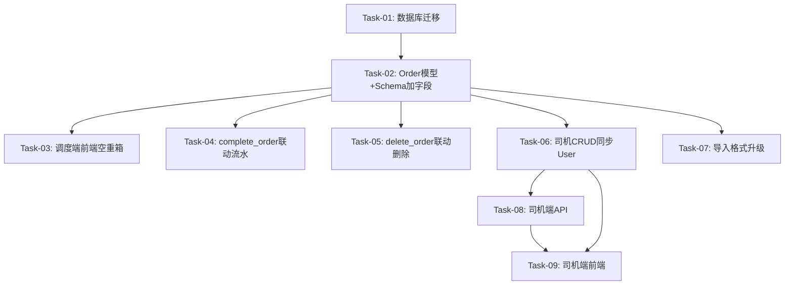

# Dispatch-Fleet 联动 & 司机端 任务规划

> **版本**：v1.0
> **创建日期**：2026-05-20
> **技术方案**：[design.md](./design.md)
> **需求文档**：[requirements.md](./requirements.md)

---

## 依赖关系图

---

## 阶段划分

### 阶段 0：基础设施

做完后：数据库 orders 和 transport_records 表新增 container_status 字段，后续所有切片可使用该字段。

### 阶段 1：调度端空重箱

做完后：调度员在创建/编辑任务时可以选择空重箱状态（heavy/empty），保存后字段落库。

### 阶段 2：完成→流水联动

做完后：调度员或司机标记任务完成时，系统自动在运输流水中创建一条记录（含空重箱状态）；无司机/车辆时跳过流水创建。

### 阶段 3：删除→流水同步删除

做完后：调度员删除任务时，关联的运输流水记录同步删除；无关联记录则静默跳过。

### 阶段 4：司机账号联动

做完后：创建司机时自动生成 User 登录账号，修改手机号同步更新 User，删除/停用司机同步处理 User。

### 阶段 5：导入格式升级

做完后：导入文件支持 8 列格式（含空重箱状态），向下兼容 7 列旧格式，空重箱状态值校验生效。

### 阶段 6：司机工作台

做完后：司机可用手机号+密码登录，进入独立工作台，查看分配给自己的任务，执行"开始运输"和"标记完成"操作。

---

## 任务清单

### 阶段 0 任务

#### Task-01: 数据库迁移 — container_status 字段
- **所属切片**：阶段 0: 基础设施
- **复杂度**：S
- **Depends On**：None
- **对应 AC**：AC-021, AC-022
- **通俗解释**：数据库表里多了一列"空重箱状态"，后续所有功能才能读写这个字段
- **Description**：
  1. 在 `Order` 模型中新增 `ContainerStatus` 枚举（heavy/empty）和 `container_status` 字段（String(10), nullable=True, validates）
  2. 在 `TransportRecord` 模型中新增 `container_status` 字段（String(10), nullable=True）
  3. 生成 Alembic 迁移脚本并验证
- **Files to Create/Modify**：
  - `apps/server/app/models/order.py` — 新增 ContainerStatus 枚举 + container_status 字段 + validates
  - `apps/server/app/models/transport_record.py` — 新增 container_status 字段
  - `alembic/versions/` — 新增迁移脚本
- **验证标准**：
  - [ ] `Order` 模型 `container_status` 字段存在，类型 `String(10)`，`nullable=True`
  - [ ] `Order.validate_container_status` 拒绝非法值：`container_status="invalid"` → 抛出 `ValueError("Invalid container status: invalid")`
  - [ ] `Order.validate_container_status` 接受合法值：`container_status="heavy"` → 返回 `"heavy"`；`container_status="empty"` → 返回 `"empty"`；`container_status=None` → 返回 `None`
  - [ ] `TransportRecord` 模型 `container_status` 字段存在，类型 `String(10)`，`nullable=True`
  - [ ] `alembic upgrade head` 执行成功，`orders` 表和 `transport_records` 表均有 `container_status` 列

---

### 阶段 1 任务

#### Task-02: 后端 Schema + Service — container_status 透传
- **所属切片**：阶段 1: 调度端空重箱
- **复杂度**：M
- **Depends On**：Task-01
- **对应 AC**：AC-022
- **通俗解释**：后端接口支持接收和返回空重箱状态，创建/编辑任务时该字段能正确落库
- **Description**：
  1. `dispatch.py` Schema：`OrderCreate` 加 `container_status: str = Field(..., pattern="^(heavy|empty)$")`；`OrderUpdate` 加 `container_status: Optional[str] = Field(None, pattern="^(heavy|empty)$")`；`OrderResponse` 加 `container_status: str | None = None`
  2. `dispatch_service.py`：`create_order()` 中 Order 构造函数加 `container_status=data.get("container_status")`；`update_order()` 的 `updatable_fields` 列表加 `"container_status"`
  3. `fleet.py` Schema：`TransportRecordResponse` 加 `container_status: str | None = None`
  4. `fleet_transport_records.py`：`_record_to_response` 加 `container_status=record.container_status`
- **Files to Create/Modify**：
  - `apps/server/app/schemas/dispatch.py` — OrderCreate/OrderUpdate/OrderResponse 加字段
  - `apps/server/app/services/dispatch_service.py` — create_order/update_order 透传字段
  - `apps/server/app/schemas/fleet.py` — TransportRecordResponse 加字段
  - `apps/server/app/api/v1/fleet_transport_records.py` — _record_to_response 加映射
- **验证标准**：
  - [ ] `POST /api/v1/dispatch/orders` 传入 `container_status="heavy"` → 创建成功，返回的 order 包含 `container_status: "heavy"`
  - [ ] `POST /api/v1/dispatch/orders` 不传 `container_status` → 422 校验失败（Schema 必填）
  - [ ] `POST /api/v1/dispatch/orders` 传入 `container_status="invalid"` → 422 校验失败
  - [ ] `PUT /api/v1/dispatch/orders/{id}` 传入 `container_status="empty"` → 更新成功，返回 `container_status: "empty"`
  - [ ] `GET /api/v1/fleet/transport-records` 返回的记录包含 `container_status` 字段（可为 null）

#### Task-03: 调度端前端 — 空重箱状态下拉框
- **所属切片**：阶段 1: 调度端空重箱
- **复杂度**：M
- **Depends On**：Task-02
- **对应 AC**：AC-022
- **通俗解释**：调度员在新建/编辑任务表单中能看到"空重箱状态"下拉框，选择后保存到后端
- **Description**：
  1. `order.ts` 类型：`Order`、`CreateOrderRequest`、`UpdateOrderRequest` 加 `containerStatus` 字段；新增 `ContainerStatus` 枚举
  2. `useOrderForm.ts`：`OrderFormState` 加 `containerStatus` 字段
  3. `useOrderFormHelpers.ts`：`createInitialFormState` 加 `containerStatus: ''`；`fillFormFromOrder` 加 `containerStatus` 映射；`resetForm` 加 `containerStatus: ''`；`buildRequest` 加 `containerStatus` 映射
  4. `useOrderFormOptions.ts`：新增 `containerStatusOptions` 数组
  5. `BusinessSection.vue`：在业务类型下方新增"空重箱状态"下拉框（el-select）
  6. `TransportRecordManagement.vue`：表格新增"空重箱状态"列
  7. `transport-record.ts`：`TransportRecord` 接口加 `containerStatus` 字段
- **Files to Create/Modify**：
  - `apps/frontend/src/modules/dispatch/types/order.ts`
  - `apps/frontend/src/modules/dispatch/composables/useOrderForm.ts`
  - `apps/frontend/src/modules/dispatch/composables/useOrderFormHelpers.ts`
  - `apps/frontend/src/modules/dispatch/composables/useOrderFormOptions.ts`
  - `apps/frontend/src/modules/dispatch/components/sections/BusinessSection.vue`
  - `apps/frontend/src/modules/fleet/types/transport-record.ts`
  - `apps/frontend/src/modules/fleet/components/TransportRecordManagement.vue`
- **验证标准**：
  - [ ] 新建任务表单中显示"空重箱状态"下拉框，选项为"重箱(heavy)"和"空箱(empty)"
  - [ ] 选择"重箱"后提交 → 后端收到 `container_status: "heavy"`
  - [ ] 编辑已有任务时，下拉框回显当前 `containerStatus` 值
  - [ ] 运输流水列表显示"空重箱状态"列，有值时显示"重箱"或"空箱"，无值时显示"-"

---

### 阶段 2 任务

#### Task-04: complete_order 联动 — 完成任务自动创建运输流水
- **所属切片**：阶段 2: 完成→流水联动
- **复杂度**：L ⚠️
- **Depends On**：Task-02
- **对应 AC**：AC-001, AC-002, AC-011, AC-013
- **通俗解释**：任务标记完成后，运输流水里自动多出一条记录；如果任务没分配司机/车辆，流水不创建也不报错
- **Description**：
  1. 修改 `dispatch_service.py` 的 `complete_order()`：在状态变更和车辆释放之后、commit 之前，检查 `order.driver_id` 和 `order.vehicle_id` 是否存在，若存在则创建 `TransportRecord`（按 design.md 3.3 字段映射），若不存在则跳过
  2. 字段映射：`order_no` → `order_no`，`customer_name` → `customer_info`，`container_status` → `container_status`，`origin_name` → `origin`，`dest_name` → `destination`，`container_no` → `container_no`，`vehicle_id` → `vehicle_id`，`driver_id` → `driver_id`，`datetime.now()` → `imported_at`
  3. 确保 `complete_order` 内所有写操作在同一事务中 commit
- **Files to Create/Modify**：
  - `apps/server/app/services/dispatch_service.py` — complete_order 中新增流水创建逻辑
- **验证标准**：
  - [ ] 调用 `complete_order(db, order_id)` 其中 order 有 driver_id + vehicle_id + container_status="heavy" → 任务状态变为 completed，同时 transport_records 表新增一条记录，`container_status="heavy"`，`customer_info=order.customer_name`，`origin=order.origin_name`，`destination=order.dest_name`
  - [ ] 调用 `complete_order(db, order_id)` 其中 order 无 driver_id/vehicle_id → 任务状态变为 completed，transport_records 表无新增记录，不报错（AC-011）
  - [ ] 对已完成的任务再次调用 `complete_order` → 抛出 AppException(code=422, message="当前状态不允许标记完成")，不会重复创建流水（AC-013）
  - [ ] 流水记录的 `order_no` 与任务的 `order_no` 一致，且 `order_no` 唯一约束生效（AC-021）

---

### 阶段 3 任务

#### Task-05: delete_order 联动 — 删除任务同步删除运输流水
- **所属切片**：阶段 3: 删除→流水同步删除
- **复杂度**：M
- **Depends On**：Task-02
- **对应 AC**：AC-003, AC-012
- **通俗解释**：删除任务时，如果运输流水里有对应记录就一起删掉，没有也不报错
- **Description**：
  1. 修改 `dispatch_service.py` 的 `delete_order()`：在删除 order 之前，按 `order_no` 查询 `TransportRecord`，若存在则删除，若不存在则静默跳过
  2. 确保删除操作在同一事务中 commit
- **Files to Create/Modify**：
  - `apps/server/app/services/dispatch_service.py` — delete_order 中新增流水删除逻辑
- **验证标准**：
  - [ ] 删除一个有关联运输流水的任务 → 任务被删除，transport_records 中 `order_no` 匹配的记录也被删除（AC-003）
  - [ ] 删除一个无关联运输流水的任务 → 任务被删除，不报错，静默跳过（AC-012）
  - [ ] 删除操作在同一个事务中：如果流水删除失败，任务也不会被删除

---

### 阶段 4 任务

#### Task-06: 司机 CRUD 同步 User 账号
- **所属切片**：阶段 4: 司机账号联动
- **复杂度**：L ⚠️
- **Depends On**：Task-02
- **对应 AC**：AC-004, AC-016, AC-017, AC-018, AC-024
- **通俗解释**：创建司机时自动给他生成一个登录账号（手机号就是用户名和初始密码），改手机号同步改账号，删除/停用司机同步处理账号
- **Description**：
  1. `fleet_drivers.py` 的 `create_driver`：创建 Driver 后，同步创建 User（`username=phone`, `password=hash_password(phone)`, `name=driver.name`, `phone=driver.phone`, `role=UserRole.DRIVER.value`）
  2. `fleet_drivers.py` 的 `update_driver`：修改手机号时，按旧 phone 查找 User 并同步更新 `username` 和 `phone`
  3. `fleet_drivers.py` 的 `delete_driver`：删除 Driver 时同步删除对应 User（按 phone 匹配）
  4. `fleet_drivers.py` 的 `disable_driver`：停用 Driver 时同步设置 `User.status = UserStatus.DISABLED.value`
  5. 需导入 `hash_password` from `app.core.security`，`User`/`UserRole`/`UserStatus` from `app.models.user`
- **Files to Create/Modify**：
  - `apps/server/app/api/v1/fleet_drivers.py` — 四个端点各加同步逻辑
- **验证标准**：
  - [ ] `POST /api/v1/fleet/drivers` 传入 `{name: "张三", phone: "13800138000"}` → Driver 创建成功，同时 users 表新增一条记录：`username="13800138000"`, `role="driver"`, `status="active"`，密码可验证 `verify_password("13800138000", user.password)` 返回 True（AC-024）
  - [ ] `PUT /api/v1/fleet/drivers/{id}` 修改 phone 为 `"13900139000"` → Driver 更新成功，对应 User 的 `username` 和 `phone` 同步更新为 `"13900139000"`（AC-016）
  - [ ] `DELETE /api/v1/fleet/drivers/{id}` 删除无历史记录的司机 → Driver 删除成功，对应 User 也被删除（AC-017）
  - [ ] `PUT /api/v1/fleet/drivers/{id}/disable` → Driver 停用成功，对应 User 的 `status` 变为 `"disabled"`（AC-018）
  - [ ] 创建司机时手机号对应的 User 已存在 → 不重复创建，Driver 正常创建

---

### 阶段 5 任务

#### Task-07: 导入格式升级 — 7/8 列兼容 + container_status 校验
- **所属切片**：阶段 5: 导入格式升级
- **复杂度**：M
- **Depends On**：Task-02
- **对应 AC**：AC-008, AC-009, AC-010, AC-014, AC-015
- **通俗解释**：导入文件新增空重箱状态列，旧格式7列也能用；空重箱状态值不对会报错提示
- **Description**：
  1. 修改 `fleet_service.py` 的 `IMPORT_EXPECTED_COLUMNS = 7` → 改为兼容 7/8 列逻辑：`len(columns) == 7 or len(columns) == 8`
  2. 解析逻辑：8 列时 `columns[2]` 为 `container_status`，7 列时 `container_status = None`
  3. 校验 `container_status`：非空时必须是 `"heavy"` 或 `"empty"`，否则报错
  4. 创建 `TransportRecord` 时传入 `container_status`
  5. 更新模板为 8 列格式
- **Files to Create/Modify**：
  - `apps/server/app/services/fleet_service.py` — import_transport_records_from_content 逻辑修改
  - `apps/server/app/api/v1/fleet_transport_records.py` — download_template 模板更新
- **验证标准**：
  - [ ] 导入 8 列文件（含 container_status="heavy"）→ 成功导入，记录的 `container_status="heavy"`（AC-008）
  - [ ] 导入 7 列旧格式文件 → 成功导入，记录的 `container_status=None`（AC-008）
  - [ ] 导入文件中车牌号不存在 → 该行报错 `"车牌号 XX 不存在"`，其他行正常导入（AC-009）
  - [ ] 导入文件中司机手机号不存在 → 该行报错 `"手机号 XX 对应的司机不存在"`，其他行正常导入（AC-010）
  - [ ] 导入文件中 order_no 已存在 → 跳过该行，统计为重复记录（AC-014）
  - [ ] 导入文件中 container_status 值为 `"invalid"` → 该行报错 `"空重箱状态值无效，应为 heavy 或 empty"`（AC-015）
  - [ ] 导入文件中 container_status 为空字符串 → 接受，`container_status=None`
  - [ ] 下载模板为 8 列格式，表头包含"空重箱状态"
  - [ ] 导入 6 列或 9 列文件 → 报错 `"列数不正确，期望 7 或 8 列"`

---

### 阶段 6 任务

#### Task-08: 司机端 API
- **所属切片**：阶段 6: 司机工作台
- **复杂度**：L ⚠️
- **Depends On**：Task-06
- **对应 AC**：AC-005, AC-006, AC-007, AC-019, AC-020, AC-023
- **通俗解释**：后端提供三个司机专用接口——查看自己的任务列表、开始运输、标记完成
- **Description**：
  1. 新建 `apps/server/app/api/v1/driver.py`
  2. 实现 `get_current_driver` 依赖：校验当前用户 role=driver，按 phone 查找 Driver
  3. `GET /driver/orders`：分页查询当前司机的任务列表（driver_id 匹配），按 created_at 倒序
  4. `POST /driver/orders/{id}/start`：校验任务属于当前司机 + 状态为 ASSIGNED → 改为 TRANSITING
  5. `POST /driver/orders/{id}/complete`：校验任务属于当前司机 + 状态为 TRANSITING → 调用 `complete_order(db, order_id)`
  6. 新建 `DriverOrderResponse` Schema（精简字段）
  7. 在 `main.py` 注册 `driver_router`
- **Files to Create/Modify**：
  - `apps/server/app/api/v1/driver.py` — 新建
  - `apps/server/app/schemas/dispatch.py` — 新增 DriverOrderResponse
  - `apps/server/app/main.py` — 注册 driver_router
- **验证标准**：
  - [ ] `GET /api/v1/driver/orders`（以 driver 角色登录）→ 返回该司机的任务列表，`items` 中每条 `driver_id` 均为当前司机 ID，按 `created_at` 倒序（AC-005, AC-023）
  - [ ] `GET /api/v1/driver/orders`（以 admin 角色登录）→ 返回 403 `"仅司机可访问"`
  - [ ] `POST /api/v1/driver/orders/{id}/start`（任务属于当前司机，状态为 ASSIGNED）→ 返回 200，任务状态变为 TRANSITING（AC-006）
  - [ ] `POST /api/v1/driver/orders/{id}/start`（任务不属于当前司机）→ 返回 403 `"这不是您的任务"`（AC-019）
  - [ ] `POST /api/v1/driver/orders/{id}/start`（任务状态为 PENDING）→ 返回 422 `"仅已分配状态的任务可开始运输"`（AC-020）
  - [ ] `POST /api/v1/driver/orders/{id}/complete`（任务属于当前司机，状态为 TRANSITING）→ 返回 200，任务状态变为 COMPLETED，运输流水自动创建（AC-007）
  - [ ] `POST /api/v1/driver/orders/{id}/complete`（任务不属于当前司机）→ 返回 403 `"这不是您的任务"`（AC-019）
  - [ ] `POST /api/v1/driver/orders/{id}/complete`（任务状态为 ASSIGNED）→ 返回 422 `"仅运输中的任务可标记完成"`

#### Task-09: 司机端前端 — 工作台页面
- **所属切片**：阶段 6: 司机工作台
- **复杂度**：L ⚠️
- **Depends On**：Task-08
- **对应 AC**：AC-004, AC-005, AC-006, AC-007, AC-019, AC-020, AC-023
- **通俗解释**：司机登录后进入一个独立的工作台页面，能看到自己的任务列表，点击按钮开始运输或标记完成
- **Description**：
  1. 新建 `apps/frontend/src/modules/driver/` 模块目录结构（components/pages/services/stores/index.ts）
  2. `driverService.ts`：封装三个 API 调用（listMyOrders, startOrder, completeOrder）
  3. `useDriverStore.ts`：管理任务列表、分页、loading 状态
  4. `DriverOrderList.vue`：任务列表组件（el-table + 状态 el-tag + 操作按钮）
  5. `DriverWorkbench.vue`：工作台页面（顶部栏 + 任务列表 + 退出按钮）
  6. 修改 `router/index.ts`：新增 `/driver` 路由（独立布局，roles=['driver']）；`/fleet` 路由加 roles=['admin','dispatcher']；根路由 redirect 改为动态判断；路由守卫按 role 动态跳转
  7. 修改 `LoginForm.vue`：登录成功后按 role 跳转（driver → /driver，其他 → /fleet）
- **Files to Create/Modify**：
  - `apps/frontend/src/modules/driver/index.ts` — 新建
  - `apps/frontend/src/modules/driver/services/driverService.ts` — 新建
  - `apps/frontend/src/modules/driver/stores/useDriverStore.ts` — 新建
  - `apps/frontend/src/modules/driver/components/DriverOrderList.vue` — 新建
  - `apps/frontend/src/modules/driver/pages/DriverWorkbench.vue` — 新建
  - `apps/frontend/src/router/index.ts` — 修改路由配置和守卫
  - `apps/frontend/src/modules/auth/components/LoginForm.vue` — 修改登录跳转
- **验证标准**：
  - [ ] 司机角色登录后自动跳转到 `/driver`，页面显示"司机工作台"标题和司机姓名（AC-004）
  - [ ] 司机工作台无侧边栏菜单，与车队管理/调度中心页面隔离（AC-004）
  - [ ] 任务列表分页显示，包含任务编号、客户、起运地→目的地、箱号、状态列（AC-005）
  - [ ] "已分配"状态的任务行显示"开始运输"按钮，点击后状态变为"运输中"（AC-006）
  - [ ] "运输中"状态的任务行显示"标记完成"按钮，点击后状态变为"已完成"（AC-007）
  - [ ] 非"已分配"状态的任务不显示"开始运输"按钮；非"运输中"状态的任务不显示"标记完成"按钮
  - [ ] 司机无法通过 URL 直接访问 `/fleet` 或 `/dispatch`，会被重定向到 `/driver`（AC-023）
  - [ ] 管理员/调度员登录后跳转到 `/fleet`，不会被路由到 `/driver`
  - [ ] 无任务时显示 EmptyState 组件"暂无任务"
  - [ ] 点击退出登录按钮 → 清除认证状态，跳转到登录页

---

## AC 覆盖检查

| AC 编号 | AC 描述 | 覆盖任务 | 状态 |
|---------|---------|---------|------|
| AC-001 | 调度员标记完成→自动创建运输流水 | Task-04 | ✅ |
| AC-002 | 司机标记完成→自动创建运输流水 | Task-04, Task-08 | ✅ |
| AC-003 | 删除任务→同步删除关联流水 | Task-05 | ✅ |
| AC-004 | 司机登录→独立工作台页面 | Task-06, Task-09 | ✅ |
| AC-005 | 司机工作台显示分配给自己的任务列表 | Task-08, Task-09 | ✅ |
| AC-006 | 司机开始运输（ASSIGNED→TRANSITING） | Task-08, Task-09 | ✅ |
| AC-007 | 司机标记完成（TRANSITING→COMPLETED） | Task-08, Task-09 | ✅ |
| AC-008 | 导入8列格式兼容7列旧格式 | Task-07 | ✅ |
| AC-009 | 导入车牌号不存在→报错 | Task-07 | ✅ |
| AC-010 | 导入司机手机号不存在→报错 | Task-07 | ✅ |
| AC-011 | 完成任务无司机/车辆→跳过流水创建 | Task-04 | ✅ |
| AC-012 | 删除任务无关联流水→静默跳过 | Task-05 | ✅ |
| AC-013 | 已完成任务再次完成→拒绝 | Task-04 | ✅ |
| AC-014 | 导入order_no已存在→跳过 | Task-07 | ✅ |
| AC-015 | 导入空重箱状态值无效→报错 | Task-07 | ✅ |
| AC-016 | 修改司机手机号→同步更新User | Task-06 | ✅ |
| AC-017 | 删除司机→同步删除User | Task-06 | ✅ |
| AC-018 | 停用司机→同步禁用User | Task-06 | ✅ |
| AC-019 | 司机操作不属于自己的任务→403 | Task-08, Task-09 | ✅ |
| AC-020 | 司机对非已分配任务开始运输→422 | Task-08, Task-09 | ✅ |
| AC-021 | order_no唯一约束保证不重复 | Task-01, Task-04 | ✅ |
| AC-022 | container_status由调度员显式指定 | Task-01, Task-02, Task-03 | ✅ |
| AC-023 | 司机只能操作自己的任务 | Task-08, Task-09 | ✅ |
| AC-024 | 创建司机时自动生成User账号 | Task-06 | ✅ |

---

## 验证计划

### 阶段 0 验证
- [x] Task-01 验证标准全部通过
- [x] 数据库迁移成功：`alembic upgrade head` 无报错

### 阶段 1 验证
- [x] Task-02 验证标准全部通过
- [x] Task-03 验证标准全部通过
- [x] 端到端验证：调度员创建任务选择"重箱" → 保存成功 → 编辑任务切换为"空箱" → 保存成功 → 运输流水列表显示空重箱状态列

### 阶段 2 验证
- [x] Task-04 验证标准全部通过
- [x] 端到端验证：调度员对有司机/车辆的任务点击"标记完成" → 任务状态变为已完成 → 运输流水自动出现对应记录（含空重箱状态）

### 阶段 3 验证
- [x] Task-05 验证标准全部通过
- [x] 端到端验证：调度员删除一个已完成的任务 → 运输流水中的对应记录同步消失

### 阶段 4 验证
- [x] Task-06 验证标准全部通过
- [x] 端到端验证：创建司机 → 用该司机手机号登录成功 → 修改手机号 → 用新手机号登录成功 → 停用司机 → 登录失败

### 阶段 5 验证
- [x] Task-07 验证标准全部通过
- [x] 端到端验证：下载8列模板 → 填写含空重箱状态的数据 → 导入成功 → 运输流水显示空重箱状态

### 阶段 6 验证
- [x] Task-08 验证标准全部通过
- [x] Task-09 验证标准全部通过
- [x] 端到端验证：司机登录 → 看到任务列表 → 点击"开始运输" → 状态变为运输中 → 点击"标记完成" → 状态变为已完成 → 运输流水自动出现记录
