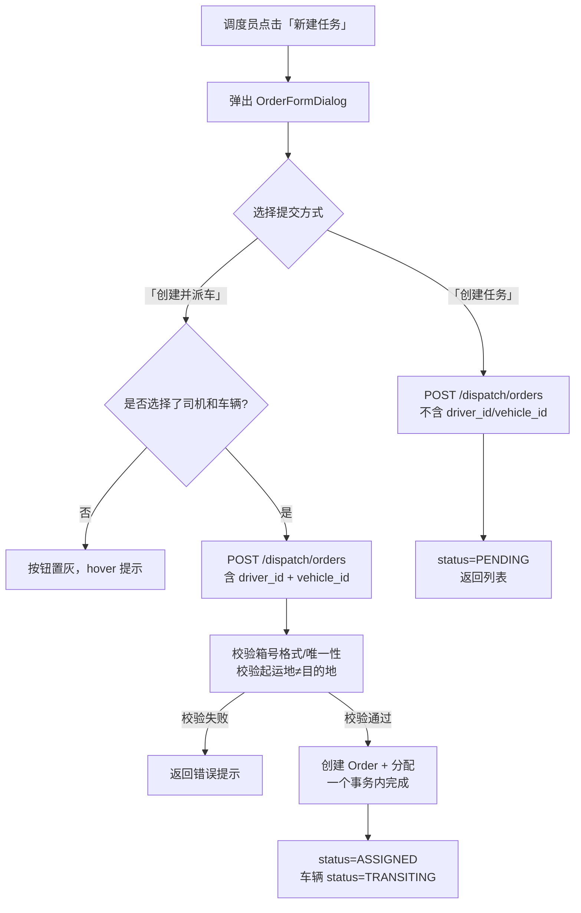

# Dispatch 调度中心 技术方案

> **版本**：v1.0
> **创建日期**：2026-05-14
> **需求文档**：[requirements.md](./requirements.md)
> **设计目标**：实现调度员核心工作台——任务创建/分配/状态流转/删除，以及常用地址管理

---

## 目录

- [一、功能概述](#一功能概述)
- [二、现有代码分析](#二现有代码分析)
- [三、数据模型设计](#三数据模型设计)
  - [3.1 Order 模型迁移](#31-order-模型迁移)
  - [3.2 新增 DispatchAddress 模型](#32-新增-dispatchaddress-模型)
  - [3.3 数据库迁移计划](#33-数据库迁移计划)
- [四、API 设计](#四api-设计)
  - [4.1 接口列表](#41-接口列表)
  - [4.2 请求/响应 Schema](#42-请求响应-schema)
- [五、前端设计](#五前端设计)
  - [5.1 组件结构](#51-组件结构)
  - [5.2 状态管理](#52-状态管理)
  - [5.3 路由配置](#53-路由配置)
- [六、核心逻辑](#六核心逻辑)
  - [6.1 任务编号生成](#61-任务编号生成)
  - [6.2 任务创建流程](#62-任务创建流程)
  - [6.3 任务分配流程（补偿事务）](#63-任务分配流程补偿事务)
  - [6.4 状态流转规则](#64-状态流转规则)
  - [6.5 超时自动判定（定时任务）](#65-超时自动判定定时任务)
  - [6.6 任务删除流程](#66-任务删除流程)
  - [6.7 业务类型快捷填充](#67-业务类型快捷填充)
  - [6.8 箱号/封号自动转大写](#68-箱号封号自动转大写)
  - [6.9 箱号唯一性校验](#69-箱号唯一性校验)
  - [6.10 司机可用性判断](#610-司机可用性判断)
- [七、AC 覆盖汇总表](#七ac-覆盖汇总表)
- [八、设计决策记录](#八设计决策记录)
- [九、关联文档](#九关联文档)

---

## 一、功能概述

- **功能名称**：Dispatch 调度中心
- **需求文档**：[requirements.md](./requirements.md)（42 条 AC）
- **设计目标**：实现调度员核心工作台——任务创建（含骨架任务）、司机车辆分配（补偿事务）、状态流转（含超时自动判定）、任务编辑/删除、常用地址管理

---

## 二、现有代码分析

### 技术栈合规检查（必做，逐项确认）

- [x] 已读取 `specs/tech-stack.md`，确认本设计所有技术选型在批准范围内
- [x] UI 组件：仅使用 Element Plus（`el-button`、`el-input`、`el-table`、`el-select`、`el-dialog`、`el-tabs`、`el-tag`、`el-checkbox-group`、`el-pagination`、`el-tooltip`、`el-popconfirm` 等），不引入其他 UI 库
- [x] 样式方案：仅使用 `<style scoped>`，不使用 Tailwind CSS
- [x] 地图：dispatch 模块不涉及地图
- [x] 日期处理：仅使用 dayjs，不使用 moment.js
- [x] 已用 Glob 工具审计 `shared/components/` 目录，确认引用的公共组件真实存在
- [x] 已用 Glob 工具审计 `shared/utils/` 目录，确认引用的工具函数真实存在

### 涉及模块

- `apps/server/app/models/order.py` — Order 模型（**需迁移**：5 字段改 NULL + 3 新字段）
- `apps/server/app/models/vehicle.py` — Vehicle 模型（已存在，用于分配时查询/更新状态）
- `apps/server/app/models/driver.py` — Driver 模型（已存在，用于分配时查询）
- `apps/server/app/models/common_address.py` — CommonAddress 模型（已存在，dispatch **不**复用，另建独立表）
- `apps/server/app/scheduler.py` — APScheduler 调度器（已集成，需新增超时检测 Job）
- `apps/server/app/services/fleet_service.py` — fleet 服务层（可复用 `check_vehicle_availability`、`update_vehicle_status`）
- `apps/frontend/src/modules/fleet/` — fleet 模块（已完成，可复用目录结构和 Store 模式）
- `apps/frontend/src/shared/` — 公共组件和工具（已完成，可复用）

### 可复用抽象（已审计，逐项标注验证状态）

| 组件/工具 | 文件路径 | 验证状态 |
|-----------|---------|---------|
| HTTP 客户端（Axios 实例） | `apps/frontend/src/shared/api/client.ts` | ✅ 已验证 |
| EmptyState 空状态组件 | `apps/frontend/src/shared/components/EmptyState.vue` | ✅ 已验证 |
| LoadingSpinner 加载组件 | `apps/frontend/src/shared/components/LoadingSpinner.vue` | ✅ 已验证 |
| AppLayout 布局组件 | `apps/frontend/src/shared/components/AppLayout.vue` | ✅ 已验证 |
| formatDate 日期格式化 | `apps/frontend/src/shared/utils/format.ts` | ✅ 已验证 |
| isPhone 手机号验证 | `apps/frontend/src/shared/utils/validate.ts` | ✅ 已验证 |
| logger 日志工具 | `apps/frontend/src/shared/utils/logger.ts` | ✅ 已验证 |
| AppException 业务异常 | `apps/server/app/core/exceptions.py` | ✅ 已验证 |
| check_vehicle_availability | `apps/server/app/services/fleet_service.py` | ✅ 已验证 |
| update_vehicle_status | `apps/server/app/services/fleet_service.py` | ✅ 已验证 |
| APScheduler 调度器 | `apps/server/app/scheduler.py` | ✅ 已验证 |
| Element Plus 组件库 | 全局注册 | ✅ 已验证 |

### 影响范围

- **Order 模型迁移**：修改现有 `orders` 表结构（5 字段改 NULL + 3 新字段），需创建 Alembic 迁移脚本
- **Vehicle 模型**：分配/删除/完成时更新 `vehicles.status`，不修改表结构
- **Driver 模型**：不修改表结构，通过查询 `orders` 表判断司机可用性
- **Scheduler**：新增超时检测 Job，不影响现有证照预警 Job
- **Router**：新增 `/dispatch` 路由

---

## 三、数据模型设计

### 3.1 Order 模型迁移

#### 迁移内容

**3 字段改 NULL**（支持骨架任务——所有字段可选）：

| 字段 | 当前 | 迁移后 | 对应 AC |
|------|------|--------|---------|
| `customer_name` | `nullable=False` | `nullable=True` | → AC-002 |
| `origin_name` | `nullable=False` | `nullable=True` | → AC-002 |
| `dest_name` | `nullable=False` | `nullable=True` | → AC-002 |

**3 新字段**：

| 字段 | 类型 | 约束 | 说明 | 对应 AC |
|------|------|------|------|---------|
| `waypoints` | `Text` | `nullable=True` | JSON 数组，存储途径点列表，如 `["天津港","唐山港"]` | → AC-005 |
| `business_type` | `String(20)` | `nullable=True` | 业务类型枚举：`heavy_transport`（重箱运输）/ `empty_transport`（空箱运输）/ `short_haul`（短驳） | → AC-007 |
| `documents` | `Text` | `nullable=True` | JSON 数组，存储单证列表，如 `["pickup_order","weighing","rectification"]` | → AC-008 |

**保留字段（不做修改）**：

| 字段 | 说明 |
|------|------|
| `priority` | 保持 `nullable=False, default=NORMAL`，dispatch 需求未涉及但保留向后兼容 |
| `ocr_image` | 保持 `nullable=True`，dispatch 需求未涉及但保留向后兼容 |

#### 新增枚举

```python
# apps/server/app/models/order.py 新增

class BusinessType(str, enum.Enum):
    HEAVY_TRANSPORT = "heavy_transport"    # 重箱运输
    EMPTY_TRANSPORT = "empty_transport"    # 空箱运输
    SHORT_HAUL = "short_haul"              # 短驳


class DocumentType(str, enum.Enum):
    PICKUP_ORDER = "pickup_order"          # 提箱单
    WEIGHING = "weighing"                  # 过磅
    RECTIFICATION = "rectification"        # 整改
```

#### 迁移后完整模型

```python
# apps/server/app/models/order.py（迁移后）

class OrderStatus(str, enum.Enum):
    PENDING = "pending"          # 待分配
    ASSIGNED = "assigned"        # 已分配
    TRANSITING = "transiting"    # 运输中
    COMPLETED = "completed"      # 已完成
    OVERDUE = "overdue"          # 已超时


class BusinessType(str, enum.Enum):
    HEAVY_TRANSPORT = "heavy_transport"
    EMPTY_TRANSPORT = "empty_transport"
    SHORT_HAUL = "short_haul"


class DocumentType(str, enum.Enum):
    PICKUP_ORDER = "pickup_order"
    WEIGHING = "weighing"
    RECTIFICATION = "rectification"


class ContainerType(str, enum.Enum):
    GP20 = "20GP"
    GP40 = "40GP"
    HQ40 = "40HQ"
    HQ45 = "45HQ"


class Order(BaseModel):
    __tablename__ = "orders"
    __table_args__ = (
        sa.Index("ix_orders_status", "status"),
        sa.Index("ix_orders_driver", "driver_id"),
        sa.Index("ix_orders_vehicle", "vehicle_id"),
        sa.Index("ix_orders_dispatcher", "dispatcher_id"),
        sa.Index("ix_orders_created", "created_at"),
        sa.Index("ix_orders_assigned", "assigned_at"),        # 新增：超时检测查询
        sa.Index("ix_orders_business_type", "business_type"),  # 新增：业务类型快捷填充查询
    )

    id: Mapped[uuid.UUID] = mapped_column(Uuid, primary_key=True, default=uuid.uuid4)
    order_no: Mapped[str] = mapped_column(String(50), unique=True, nullable=False)
    status: Mapped[str] = mapped_column(String(20), nullable=False, default=OrderStatus.PENDING.value)
    priority: Mapped[str] = mapped_column(String(20), nullable=False, default=Priority.NORMAL.value)

    # === 迁移：3 字段改 NULL ===
    customer_name: Mapped[str | None] = mapped_column(String(100), nullable=True)   # 原 nullable=False
    origin_name: Mapped[str | None] = mapped_column(String(200), nullable=True)     # 原 nullable=False
    dest_name: Mapped[str | None] = mapped_column(String(200), nullable=True)       # 原 nullable=False

    customer_phone: Mapped[str | None] = mapped_column(String(20), nullable=True)
    container_no: Mapped[str | None] = mapped_column(String(20), nullable=True)
    container_type: Mapped[str | None] = mapped_column(String(10), nullable=True)
    seal_no: Mapped[str | None] = mapped_column(String(20), nullable=True)

    # === 迁移：3 新字段 ===
    waypoints: Mapped[str | None] = mapped_column(Text, nullable=True)              # JSON: ["天津港","唐山港"]
    business_type: Mapped[str | None] = mapped_column(String(20), nullable=True)    # heavy_transport/empty_transport/short_haul
    documents: Mapped[str | None] = mapped_column(Text, nullable=True)              # JSON: ["pickup_order","weighing"]

    driver_id: Mapped[uuid.UUID | None] = mapped_column(Uuid, ForeignKey("drivers.id"), nullable=True)
    vehicle_id: Mapped[uuid.UUID | None] = mapped_column(Uuid, ForeignKey("vehicles.id"), nullable=True)
    dispatcher_id: Mapped[uuid.UUID] = mapped_column(Uuid, ForeignKey("users.id"), nullable=False)
    remark: Mapped[str | None] = mapped_column(Text, nullable=True)
    ocr_image: Mapped[str | None] = mapped_column(String(255), nullable=True)

    assigned_at: Mapped[datetime | None] = mapped_column(DateTime(timezone=True), nullable=True)
    started_at: Mapped[datetime | None] = mapped_column(DateTime(timezone=True), nullable=True)
    completed_at: Mapped[datetime | None] = mapped_column(DateTime(timezone=True), nullable=True)

    # === 关联关系 ===
    driver: Mapped["Driver | None"] = relationship(
        "Driver", foreign_keys=[driver_id], lazy="selectin"
    )
    vehicle: Mapped["Vehicle | None"] = relationship(
        "Vehicle", foreign_keys=[vehicle_id], lazy="selectin"
    )
    dispatcher: Mapped["User"] = relationship(
        "User", foreign_keys=[dispatcher_id], lazy="selectin"
    )

    @validates("status")
    def validate_status(self, _: str, value: str) -> str:
        if value not in {s.value for s in OrderStatus}:
            raise ValueError(f"Invalid order status: {value}")
        return value

    @validates("container_type")
    def validate_container_type(self, _: str, value: str | None) -> str | None:
        if value is not None and value not in {c.value for c in ContainerType}:
            raise ValueError(f"Invalid container type: {value}")
        return value

    @validates("business_type")
    def validate_business_type(self, _: str, value: str | None) -> str | None:
        if value is not None and value not in {b.value for b in BusinessType}:
            raise ValueError(f"Invalid business type: {value}")
        return value
```

→ AC-001, AC-002, AC-005, AC-006, AC-007, AC-008

### 3.2 新增 DispatchAddress 模型

dispatch 常用地址是纯文本名称，语义与 `CommonAddress`（带类型/经纬度/排序）完全不同，独立建表。

```python
# apps/server/app/models/dispatch_address.py（新建）

import uuid

import sqlalchemy as sa
from sqlalchemy import ForeignKey, String, Uuid
from sqlalchemy.orm import Mapped, mapped_column

from app.models.base import BaseModel


class DispatchAddress(BaseModel):
    __tablename__ = "dispatch_addresses"
    __table_args__ = (
        sa.Index("ix_dispatch_addresses_user", "user_id"),
    )

    id: Mapped[uuid.UUID] = mapped_column(Uuid, primary_key=True, default=uuid.uuid4)
    user_id: Mapped[uuid.UUID] = mapped_column(Uuid, ForeignKey("users.id"), nullable=False)
    name: Mapped[str] = mapped_column(String(200), nullable=False)
```

→ AC-025, AC-026, AC-027, AC-028, AC-036

### 3.3 数据库迁移计划

一次 Alembic 迁移包含：

1. **orders 表**：5 列 `ALTER COLUMN ... DROP NOT NULL`
2. **orders 表**：3 列 `ADD COLUMN`（`waypoints`、`business_type`、`documents`）
3. **orders 表**：2 索引 `CREATE INDEX`（`ix_orders_assigned`、`ix_orders_business_type`）
4. **dispatch_addresses 表**：`CREATE TABLE`

---

## 四、API 设计

### 4.1 接口列表

所有接口挂载在 `/api/v1/dispatch` 前缀下，需要登录认证（`Depends(get_current_user)`）。

> **路由注册顺序**：`GET /dispatch/orders/available-resources` 必须在 `GET /dispatch/orders/{id}` 之前注册，否则 FastAPI 会将 `"available-resources"` 当作 `{id}` 参数解析为 UUID 导致 422 错误。

| 方法 | 路径 | 描述 | 对应 AC |
|------|------|------|---------|
| `GET` | `/dispatch/orders` | 任务列表（支持 status/keyword 筛选 + 分页） | → AC-009, AC-010, AC-011, AC-012 |
| `POST` | `/dispatch/orders` | 创建任务（骨架任务，字段全可选） | → AC-001, AC-002 |
| `GET` | `/dispatch/orders/{id}` | 任务详情 | → AC-020 |
| `PUT` | `/dispatch/orders/{id}` | 编辑任务（仅待分配状态） | → AC-020 |
| `DELETE` | `/dispatch/orders/{id}` | 删除任务（非待分配需二次确认由前端处理） | → AC-022, AC-023, AC-024, AC-035, AC-039 |
| `POST` | `/dispatch/orders/{id}/assign` | 分配司机车辆（补偿事务） | → AC-014, AC-015, AC-016 |
| `POST` | `/dispatch/orders/{id}/complete` | 手动标记完成 | → AC-019 |
| `GET` | `/dispatch/orders/available-resources` | 获取可分配的司机和车辆列表 | → AC-014, AC-032, AC-033, AC-034 |
| `GET` | `/dispatch/addresses` | 常用地址列表 | → AC-025 |
| `POST` | `/dispatch/addresses` | 新增常用地址 | → AC-026, AC-036 |
| `DELETE` | `/dispatch/addresses/{id}` | 删除常用地址 | → AC-028 |

### 4.2 请求/响应 Schema

```python
# apps/server/app/schemas/dispatch.py（新建）

import uuid
from datetime import datetime
from typing import Optional

from pydantic import BaseModel, Field, model_validator


# ========== 任务 ==========

class OrderCreate(BaseModel):
    """创建任务——所有字段可选（骨架任务）"""
    customer_name: Optional[str] = Field(None, max_length=100)
    customer_phone: Optional[str] = Field(None, max_length=20)
    origin_name: Optional[str] = Field(None, max_length=200)
    dest_name: Optional[str] = Field(None, max_length=200)
    waypoints: Optional[list[str]] = None                                    # → AC-005
    container_no: Optional[str] = Field(None, max_length=20)
    container_type: Optional[str] = Field(None, pattern="^(20GP|40GP|40HQ|45HQ)$")
    seal_no: Optional[str] = Field(None, max_length=20)
    business_type: Optional[str] = Field(None, pattern="^(heavy_transport|empty_transport|short_haul)$")
    documents: Optional[list[str]] = None                                    # → AC-008
    driver_id: Optional[uuid.UUID] = None                                    # 创建并派车时使用
    vehicle_id: Optional[uuid.UUID] = None                                   # 创建并派车时使用
    remark: Optional[str] = Field(None, max_length=500)

    @model_validator(mode="after")
    def check_driver_vehicle_pair(self) -> "OrderCreate":
        has_driver = self.driver_id is not None
        has_vehicle = self.vehicle_id is not None
        if has_driver != has_vehicle:
            raise ValueError("司机和车辆必须同时选择或同时留空")
        return self


class OrderUpdate(BaseModel):
    """编辑任务——所有字段可选，传了就更新"""
    customer_name: Optional[str] = Field(None, max_length=100)
    customer_phone: Optional[str] = Field(None, max_length=20)
    origin_name: Optional[str] = Field(None, max_length=200)
    dest_name: Optional[str] = Field(None, max_length=200)
    waypoints: Optional[list[str]] = None
    container_no: Optional[str] = Field(None, max_length=20)
    container_type: Optional[str] = Field(None, pattern="^(20GP|40GP|40HQ|45HQ)$")
    seal_no: Optional[str] = Field(None, max_length=20)
    business_type: Optional[str] = Field(None, pattern="^(heavy_transport|empty_transport|short_haul)$")
    documents: Optional[list[str]] = None
    remark: Optional[str] = Field(None, max_length=500)


class OrderAssign(BaseModel):
    """分配司机车辆"""
    driver_id: uuid.UUID
    vehicle_id: uuid.UUID


class OrderResponse(BaseModel):
    """任务响应"""
    id: str
    order_no: str
    status: str
    customer_name: str | None = None
    customer_phone: str | None = None
    origin_name: str | None = None
    dest_name: str | None = None
    waypoints: list[str] | None = None
    container_no: str | None = None
    container_type: str | None = None
    seal_no: str | None = None
    business_type: str | None = None
    documents: list[str] | None = None
    driver_id: str | None = None
    driver_name: str | None = None          # 关联查询
    vehicle_id: str | None = None
    vehicle_plate_no: str | None = None     # 关联查询
    dispatcher_id: str
    dispatcher_name: str | None = None      # 关联查询
    remark: str | None = None
    assigned_at: datetime | None = None
    started_at: datetime | None = None
    completed_at: datetime | None = None
    created_at: datetime
    updated_at: datetime

    model_config = {"from_attributes": True}


class OrderStatusCounts(BaseModel):
    pending: int = 0
    assigned: int = 0
    transiting: int = 0
    completed: int = 0
    overdue: int = 0


class OrderListResponse(BaseModel):
    items: list[OrderResponse]
    total: int
    page: int
    page_size: int
    status_counts: OrderStatusCounts


# ========== 可用资源 ==========

class AvailableDriver(BaseModel):
    id: str
    name: str
    phone: str
    bound_vehicle_plate_no: str | None = None   # 关联车辆车牌


class AvailableVehicle(BaseModel):
    id: str
    plate_no: str
    bound_driver_name: str | None = None         # 关联司机姓名


class AvailableResourcesResponse(BaseModel):
    drivers: list[AvailableDriver]
    vehicles: list[AvailableVehicle]


# ========== 常用地址 ==========

class DispatchAddressCreate(BaseModel):
    name: str = Field(..., min_length=1, max_length=200)


class DispatchAddressResponse(BaseModel):
    id: str
    name: str
    created_at: datetime

    model_config = {"from_attributes": True}


class DispatchAddressListResponse(BaseModel):
    items: list[DispatchAddressResponse]
```

→ AC-001 ~ AC-036（详见 AC 覆盖汇总表）

---

## 五、前端设计

### 5.1 组件结构

```
apps/frontend/src/modules/dispatch/
├── index.ts                          # 模块统一导出
├── types/
│   ├── index.ts                      # 类型统一导出
│   └── order.ts                      # Order、枚举、请求/响应类型
├── services/
│   └── dispatchService.ts            # API 服务层（封装所有 HTTP 请求）
├── stores/
│   └── useDispatchStore.ts           # Pinia Store（状态管理）
├── components/
│   ├── OrderTable.vue                # 任务列表（el-table + 搜索 + 状态Tab + 分页）
│   ├── OrderFormDialog.vue           # 创建/编辑任务弹窗（含所有表单区域）
│   ├── AssignDialog.vue              # 分配弹窗（司机/车辆选择列表）
│   └── AddressDialog.vue             # 常用地址管理弹窗
├── pages/
│   └── DispatchPage.vue              # 主页面（组装所有组件）
└── __tests__/
    ├── order-types.test.ts
    ├── dispatchService.test.ts
    ├── useDispatchStore.test.ts
    ├── OrderTable.test.ts
    ├── OrderFormDialog.test.ts
    ├── AssignDialog.test.ts
    ├── AddressDialog.test.ts
    └── DispatchPage.test.ts
```

### 5.2 状态管理

```typescript
// stores/useDispatchStore.ts 核心设计

export const useDispatchStore = defineStore('dispatch', () => {
  // === 任务列表 ===
  const orders = ref<Order[]>([])
  const loading = ref(false)
  const error = ref<string | null>(null)

  // 筛选条件
  const activeTab = ref<OrderStatus | 'all'>('all')
  const keyword = ref('')
  const page = ref(1)
  const pageSize = ref(20)
  const total = ref(0)

  // === 计算属性 ===
  // 从后端 OrderListResponse.status_counts 获取各状态全局总数
  const statusCounts = ref<OrderStatusCounts>({ pending: 0, assigned: 0, transiting: 0, completed: 0, overdue: 0 })

  const tabCounts = computed(() => ({
    all: total.value,
    pending: statusCounts.value.pending,
    assigned: statusCounts.value.assigned,
    transiting: statusCounts.value.transiting,
    completed: statusCounts.value.completed,
    overdue: statusCounts.value.overdue,
  }))

  // === 可用资源 ===
  const availableDrivers = ref<AvailableDriver[]>([])
  const availableVehicles = ref<AvailableVehicle[]>([])

  // === 常用地址 ===
  const addresses = ref<DispatchAddress[]>([])

  // === 方法 ===
  async function fetchOrders() { ... }
  async function createOrder(data: CreateOrderRequest) { ... }
  async function updateOrder(id: string, data: UpdateOrderRequest) { ... }
  async function deleteOrder(id: string) { ... }
  async function assignOrder(id: string, data: AssignRequest) { ... }
  async function completeOrder(id: string) { ... }
  async function fetchAvailableResources() { ... }
  async function fetchAddresses() { ... }
  async function createAddress(name: string) { ... }
  async function deleteAddress(id: string) { ... }

  return { ... }
})
```

→ AC-009, AC-010, AC-011, AC-012, AC-014

### 5.3 路由配置

```typescript
// router/index.ts 新增

{
  path: 'dispatch',
  name: 'Dispatch',
  component: () => import('@/modules/dispatch/pages/DispatchPage.vue'),
  meta: { requiresAuth: true, roles: ['admin', 'dispatcher'] },  // → AC-042
}
```

→ AC-042

---

## 六、核心逻辑

### 6.1 任务编号生成

**格式**：`DD` + `YYYYMMDD` + 4 位自增序号（如 `DD202605140001`）

**实现**：后端 Service 层，查询当天最大序号 + 1，并发安全通过数据库唯一约束保证（`order_no` UNIQUE）。

```
当日第 1 个任务：DD202605140001
当日第 2 个任务：DD202605140002
```

→ AC-009（任务编号列）

### 6.2 任务创建流程



**关键点**：
- 「创建任务」不校验任何字段，空字段直接存 NULL → AC-002
- 「创建并派车」需校验：箱号格式（如有）、箱号唯一性（如有）、起运地≠目的地（如两者都填了）→ AC-003, AC-004, AC-029, AC-030, AC-031
- 业务类型选择后自动查询上次使用的起运地/目的地 → AC-007

→ AC-001, AC-002, AC-003, AC-004, AC-029, AC-030, AC-031

### 6.3 任务分配流程（补偿事务）

分配操作涉及多步写操作，需保证原子性：

```mermaid
flowchart TD
    A[POST /dispatch/orders/{id}/assign] --> B[开启数据库事务]
    B --> C[1. 检查车辆可用性\nstatus=idle AND is_disabled=false]
    C -->|不可用| C1[回滚事务，返回 409]
    C -->|可用| D[2. 检查司机可用性\n无进行中的任务]
    D -->|不可用| D1[回滚事务，返回 409]
    D -->|可用| E[3. 更新 Order:\ndriver_id, vehicle_id,\nstatus=ASSIGNED, assigned_at=now]
    E --> F[4. 更新 Vehicle:\nstatus=TRANSITING]
    F --> G[提交事务]
    G --> H[返回成功]
```

**事务边界**：整个分配过程在一个数据库事务内完成。任一步失败，SQLAlchemy 自动回滚。

→ AC-014, AC-015, AC-016, AC-032, AC-033

### 6.4 状态流转规则

```
┌──────────┐   分配     ┌──────────┐   司机端更新   ┌──────────┐   司机端/调度端   ┌──────────┐
│  PENDING │ ────────→ │ ASSIGNED │ ────────────→ │TRANSITING│ ────────────────→ │ COMPLETED│
│  待分配   │           │  已分配   │               │  运输中   │   标记完成        │  已完成   │
└──────────┘           └─────┬────┘               └─────┬────┘                  └──────────┘
                             │                          │                           ↑
                             │ 4小时超时                 │ 调度端手动标记完成          │
                             ▼                          ▼                           │
                        ┌──────────┐              ┌──────────┐                      │
                        │ OVERDUE  │              │ COMPLETED│                      │
                        │  已超时   │              │  已完成   │                      │
                        └─────┬────┘              └──────────┘                      │
                              │                          ↑                           │
                              └──────────────────────────┘                           │
                                 调度端手动标记完成                                    │
```

**规则**：
- 系统自动流转必须按路径：PENDING → ASSIGNED → TRANSITING → COMPLETED，不允许跳过 → AC-037
- 调度员手动「标记完成」不受限制：可从 ASSIGNED / TRANSITING / OVERDUE 直接标记 → AC-019, AC-037
- 标记完成时自动释放车辆：`vehicle.status = IDLE` → AC-018, AC-019

→ AC-017, AC-018, AC-019, AC-037

### 6.5 超时自动判定（定时任务）

**触发**：APScheduler，每分钟执行一次

**逻辑**：
```python
async def check_order_overdue():
    """查询所有 status=ASSIGNED 且 assigned_at < now - 4h 的任务，批量标记超时"""
    from app.core.database import AsyncSessionLocal

    four_hours_ago = datetime.now(timezone.utc) - timedelta(hours=4)

    async with AsyncSessionLocal() as db:
        result = await db.execute(
            select(Order).where(
                Order.status == OrderStatus.ASSIGNED.value,
                Order.assigned_at < four_hours_ago,
            )
        )
        overdue_orders = result.scalars().all()

        for order in overdue_orders:
            order.status = OrderStatus.OVERDUE.value
            if order.vehicle_id:
                vehicle = await db.get(Vehicle, order.vehicle_id)
                if vehicle:
                    vehicle.status = VehicleStatus.OVERDUE.value

        await db.commit()
```

**注册**：在 `scheduler.py` 中新增 Job
```python
scheduler.add_job(
    check_order_overdue,
    "interval",
    minutes=1,
    id="check_order_overdue",
)
```

→ AC-038

### 6.6 任务删除流程

```mermaid
flowchart TD
    A[DELETE /dispatch/orders/{id}] --> B{任务状态?}
    B -->|PENDING| C[直接删除 Order]
    B -->|ASSIGNED / TRANSITING| D[前端二次确认]
    B -->|COMPLETED / OVERDUE| E[前端二次确认]
    D --> F[删除 Order\n释放车辆: status=IDLE]
    E --> G[删除 Order]
    C --> H[返回成功]
    F --> H
    G --> H
```

**关键点**：
- PENDING 状态直接删除，无需确认 → AC-022
- 非 PENDING 状态需二次确认（由前端 `el-popconfirm` 实现）→ AC-023, AC-024, AC-035
- 删除时自动释放关联车辆（`vehicle.status = IDLE`）→ AC-039

→ AC-022, AC-023, AC-024, AC-035, AC-039

### 6.7 业务类型快捷填充

**逻辑**：选择业务类型后，查询当前用户最近一次使用该业务类型的任务，取起运地和目的地。

```python
async def get_last_business_address(
    db: AsyncSession, user_id: uuid.UUID, business_type: str
) -> dict:
    result = await db.execute(
        select(Order)
        .where(
            Order.dispatcher_id == user_id,
            Order.business_type == business_type,
            Order.origin_name.isnot(None),
        )
        .order_by(Order.created_at.desc())
        .limit(1)
    )
    last_order = result.scalar_one_or_none()
    if last_order:
        return {
            "origin_name": last_order.origin_name,
            "dest_name": last_order.dest_name,
        }
    return {}
```

→ AC-007

### 6.8 箱号/封号自动转大写

**实现位置**：后端 Service 层，在保存前统一转换。

```python
if data.container_no:
    data.container_no = data.container_no.upper()
if data.seal_no:
    data.seal_no = data.seal_no.upper()
```

→ AC-040, AC-041

### 6.9 箱号唯一性校验

**规则**：箱号不能同时存在于多个进行中的任务（PENDING / ASSIGNED / TRANSITING）。

```python
async def validate_container_no_unique(
    db: AsyncSession, container_no: str, exclude_order_id: uuid.UUID | None = None
) -> None:
    query = select(Order).where(
        Order.container_no == container_no,
        Order.status.in_([
            OrderStatus.PENDING.value,
            OrderStatus.ASSIGNED.value,
            OrderStatus.TRANSITING.value,
        ]),
    )
    if exclude_order_id:
        query = query.where(Order.id != exclude_order_id)
    
    result = await db.execute(query)
    if result.scalar_one_or_none():
        raise AppException(code=409, message="该箱号已有进行中的任务，请检查")
```

→ AC-030

### 6.10 司机可用性判断

Driver 模型无 `status` 字段，通过查询 `orders` 表判断：

```python
async def is_driver_available(db: AsyncSession, driver_id: uuid.UUID) -> bool:
    """司机没有进行中的任务（ASSIGNED / TRANSITING）即为可用"""
    result = await db.execute(
        select(Order).where(
            Order.driver_id == driver_id,
            Order.status.in_([
                OrderStatus.ASSIGNED.value,
                OrderStatus.TRANSITING.value,
            ]),
        )
    )
    return result.scalar_one_or_none() is None
```

→ AC-032

---

## 七、AC 覆盖汇总表

| AC 编号 | AC 描述 | 技术实现点 | 状态 |
|---------|---------|-----------|------|
| AC-001 | 新建任务弹窗包含所有区域 | OrderFormDialog.vue：客户信息 + 路线规划 + 集装箱 + 业务类型 + 单证勾选 | ✅ 已覆盖 |
| AC-002 | 空字段创建骨架任务 | OrderCreate Schema 全字段 Optional；后端不校验空值，直接存 NULL | ✅ 已覆盖 |
| AC-003 | 创建并派车 | POST /dispatch/orders 含 driver_id + vehicle_id，事务内完成创建+分配 | ✅ 已覆盖 |
| AC-004 | 未选司机/车辆时按钮置灰 | OrderFormDialog 中 computed 判断，`:disabled` + `el-tooltip` | ✅ 已覆盖 |
| AC-005 | 添加途径点 | OrderCreate.waypoints: list[str]，前端动态添加/删除输入框 | ✅ 已覆盖 |
| AC-006 | 箱型下拉选项 | ContainerType 枚举：20GP/40GP/40HQ/45HQ | ✅ 已覆盖 |
| AC-007 | 业务类型快捷填充 | 后端查询该用户该类型最近一次任务，返回起运地/目的地 | ✅ 已覆盖 |
| AC-008 | 单证勾选 | OrderCreate.documents: list[str]，前端 el-checkbox-group | ✅ 已覆盖 |
| AC-009 | 任务列表 el-table | OrderTable.vue：el-table + 所有列 + 路线格式化显示 | ✅ 已覆盖 |
| AC-010 | 搜索框 300ms 防抖 | 前端 `watch` + `debounce(300ms)`，后端 keyword 参数模糊匹配 | ✅ 已覆盖 |
| AC-011 | 状态 Tab 栏 + 数量 | OrderTable 中 el-tabs，后端返回 status_counts 全局各状态总数 | ✅ 已覆盖 |
| AC-012 | 分页控件 | el-pagination，page/pageSize 参数 | ✅ 已覆盖 |
| AC-013 | 空列表提示 | EmptyState 组件 + 新建任务按钮 | ✅ 已覆盖 |
| AC-014 | 分配弹窗显示空闲司机/车辆 | AssignDialog.vue + GET /dispatch/orders/available-resources | ✅ 已覆盖 |
| AC-015 | 确认分配后状态变更 | POST /dispatch/orders/{id}/assign，事务内更新 Order + Vehicle | ✅ 已覆盖 |
| AC-016 | 选择车辆自动填司机（双向） | AssignDialog 中 watch selectedVehicle → 自动填 bound_driver | ✅ 已覆盖 |
| AC-017 | 司机端更新运输中 | 司机端调用后更新 Order.status=TRANSITING（本次只预留接口） | ⚠️ 预留（司机端未开发） |
| AC-018 | 司机端标记完成 | 司机端调用后更新 Order.status=COMPLETED + Vehicle.status=IDLE（预留） | ⚠️ 预留（司机端未开发） |
| AC-019 | 调度端手动标记完成 | POST /dispatch/orders/{id}/complete，更新 Order + Vehicle | ✅ 已覆盖 |
| AC-020 | 待分配状态可编辑 | PUT /dispatch/orders/{id}，后端校验 status==PENDING | ✅ 已覆盖 |
| AC-021 | 非待分配不显示编辑按钮 | 前端 `v-if="order.status === 'pending'"` | ✅ 已覆盖 |
| AC-022 | 待分配直接删除 | DELETE /dispatch/orders/{id}，后端不校验状态 | ✅ 已覆盖 |
| AC-023 | 已分配/运输中删除需确认 | 前端 el-popconfirm + 后端删除时释放车辆 | ✅ 已覆盖 |
| AC-024 | 已完成/已超时删除需确认 | 前端 el-popconfirm + 后端直接删除 | ✅ 已覆盖 |
| AC-025 | 常用地址弹窗 | AddressDialog.vue + GET /dispatch/addresses | ✅ 已覆盖 |
| AC-026 | 新增常用地址 | POST /dispatch/addresses | ✅ 已覆盖 |
| AC-027 | 设为起运地/目的地 | AddressDialog 中点击按钮，emit 事件到 OrderFormDialog | ✅ 已覆盖 |
| AC-028 | 删除常用地址 | DELETE /dispatch/addresses/{id} | ✅ 已覆盖 |
| AC-029 | 起运地≠目的地校验 | 后端校验：两者都非空且相等时拒绝 | ✅ 已覆盖 |
| AC-030 | 箱号唯一性校验 | 后端查询进行中任务（PENDING/ASSIGNED/TRANSITING）是否有重复箱号 | ✅ 已覆盖 |
| AC-031 | 箱号格式校验 | 前端 el-form rules + 后端 Pydantic validator：`^[A-Z]{4}\d{7}$` | ✅ 已覆盖 |
| AC-032 | 司机有进行中任务不可选 | available-resources 接口排除已有 ASSIGNED/TRANSITING 任务的司机 | ✅ 已覆盖 |
| AC-033 | 车辆非空闲不可选 | available-resources 接口只返回 status==IDLE 且未停用的车辆 | ✅ 已覆盖 |
| AC-034 | 无可分配资源时空提示 | AssignDialog 中 EmptyState 组件 | ✅ 已覆盖 |
| AC-035 | 删除确认取消 | 前端 el-popconfirm 取消 → 不调用 API | ✅ 已覆盖 |
| AC-036 | 地址名称重复拒绝 | 后端查询同一 user_id 下是否有同名地址 | ✅ 已覆盖 |
| AC-037 | 状态流转不允许跳过 | 后端 assign/complete 接口校验当前状态是否合法 | ✅ 已覆盖 |
| AC-038 | 分配后 4 小时超时 | APScheduler interval job，每分钟检查 ASSIGNED + assigned_at < now-4h | ✅ 已覆盖 |
| AC-039 | 删除时释放车辆 | 后端删除逻辑：若 order.vehicle_id 存在，更新 vehicle.status=IDLE | ✅ 已覆盖 |
| AC-040 | 箱号自动转大写 | 后端 Service 层 `.upper()` | ✅ 已覆盖 |
| AC-041 | 封号自动转大写 | 后端 Service 层 `.upper()` | ✅ 已覆盖 |
| AC-042 | 调度员/管理员权限相同 | 路由 meta.roles: ['admin', 'dispatcher']，API 不区分角色 | ✅ 已覆盖 |

---

## 八、设计决策记录

### 决策 1：常用地址存储方案

- **选项 A**：复用现有 CommonAddress 模型（name + address + lat/lng + type）
- **选项 B**：Order 模型内嵌 JSON 字段
- **选项 C**：新建独立 DispatchAddress 表（id + user_id + name）
- **选择**：C
- **理由**：dispatch 常用地址是纯文本名称，与 CommonAddress（带类型/经纬度/排序）语义完全不同。独立表职责清晰、模型简洁、独立演化。

### 决策 2：司机可用性判断方式

- **选项 A**：给 Driver 模型加 status 字段
- **选项 B**：通过查询 orders 表判断（是否有进行中的任务）
- **选择**：B
- **理由**：Driver 模型已在 fleet 模块中明确定义（无 status 字段，司机状态由关联车辆间接体现）。加字段会引入冗余状态，且需要同步维护。查询 orders 表是准确的真相来源。

### 决策 3：分配操作的事务保证

- **选项 A**：乐观锁（先查后改，冲突时重试）
- **选项 B**：数据库事务（BEGIN → 检查 → 更新 Order → 更新 Vehicle → COMMIT）
- **选择**：B
- **理由**：SQLAlchemy + PostgreSQL 原生支持事务。分配操作涉及两张表的写操作，放在一个事务内天然保证原子性。乐观锁在低并发场景下增加复杂度而无收益。

### 决策 4：业务类型快捷填充的存储

- **选项 A**：新建表存储"每种业务类型上次使用的地址"
- **选项 B**：查询 orders 表最近一条同业务类型记录
- **选择**：B
- **理由**：orders 表本身就是真相来源，无需冗余存储。查询最近一条记录的开销可忽略（有 `ix_orders_business_type` 索引）。

---

## 九、关联文档

- 需求文档：[requirements.md](./requirements.md)
- 产品概述：[product-overview.md](../../product-overview.md)
- 开发路线图：[development-roadmap.md](../../development-roadmap.md)
- 数据库设计：[database-model/design.md](../database-model/design.md)
- Fleet 设计：[fleet/design.md](../fleet/design.md)