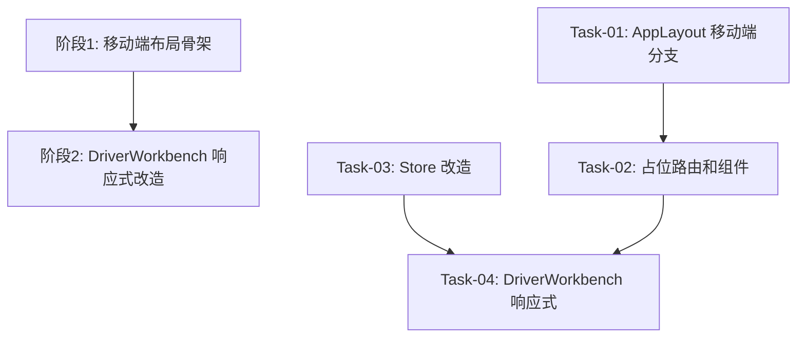

# 司机工作台移动端适配 任务规划

## 依赖关系图

## 阶段划分

### 阶段 1: 移动端布局骨架
做完后，司机在手机上打开系统，能看到底部三 Tab 导航栏，顶部精简标题栏，点击「历史」和「我的」能看到占位页面。任务列表还是桌面端样式但已能在移动端容器中显示。

### 阶段 2: DriverWorkbench 响应式改造
做完后，司机在手机上看任务列表：卡片单列全宽、按钮 44px 可点击、向下滚动自动加载更多、状态 Tab 可横向滑动。

## 任务清单

### 阶段 1 任务

#### Task-01: AppLayout.vue 移动端模板分支 + 底部 Tab 栏
- **所属切片**：阶段 1: 移动端布局骨架
- **复杂度**：M
- **Depends On**：None
- **对应 AC**：AC-001, AC-002, AC-003, AC-016, AC-017
- **通俗解释**：司机在手机上打开系统，侧边栏自动消失，变成底部三个 Tab（任务/历史/我的），顶部显示精简标题栏
- **Description**：
  1. 在 `<script setup>` 中新增 `matchMedia('(max-width: 767px)')` 监听 + `authStore.userRole === 'driver'` 双重判断，导出 `isMobile` ref
  2. 将现有桌面端模板包裹在 `<el-container v-if="!isMobile">` 中，保持原有代码完全不变
  3. 新增 `
` 移动端模板分支：
     - `.mobile-topbar`：标题"我的任务"
     - `.mobile-content`：`<router-view />` 容器（不设 overflow-y: auto，由子页面自行管理滚动）
     - `.mobile-tabbar`：三个 Tab（任务/历史/我的），图标使用已全局注册的 Element Plus Icons（`List`/`Clock`/`User`）
  4. 底部 Tab 根据 `route.path` 高亮当前激活项（`/driver` 精确匹配，「历史」「我的」用 `startsWith`）
  5. 添加移动端 CSS：`height: 100dvh` 动态视口、`flex` 纵向布局、`padding-bottom: env(safe-area-inset-bottom)` 安全区
- **Files to Modify**：`src/shared/components/AppLayout.vue`
- **验证标准**：
  - [ ] 浏览器窗口缩窄到 767px 以下，且当前登录角色为 driver → 显示底部三 Tab 栏，侧边栏和 header 用户区不显示
  - [ ] 浏览器窗口缩窄到 767px 以下，但当前登录角色为 admin → 仍显示桌面端侧边栏布局
  - [ ] 窗口宽度 > 768px → 始终显示桌面端侧边栏布局（无论角色）
  - [ ] 窗口从 800px 拖到 600px → 布局实时切换，无需刷新页面
  - [ ] 点击底部「任务」Tab → 跳转 `/driver`
  - [ ] 点击底部「历史」Tab → 跳转 `/driver/history`
  - [ ] 点击底部「我的」Tab → 跳转 `/driver/profile`
  - [ ] 当前在 `/driver` 页面 → 底部「任务」Tab 高亮（蓝色 `#409eff`），其余灰色
  - [ ] 当前在 `/driver/history` 页面 → 底部「历史」Tab 高亮
  - [ ] 底部栏固定在屏幕底部，页面内容滚动时底部栏不移动

---

#### Task-02: 新增占位路由和组件
- **所属切片**：阶段 1: 移动端布局骨架
- **复杂度**：S
- **Depends On**：Task-01（需要 AppLayout 底部 Tab 可点击跳转）
- **对应 AC**：AC-004, AC-005, AC-010
- **通俗解释**：点击底部「历史」Tab 看到"暂无历史任务"提示，点击「我的」Tab 看到自己的名字和退出登录按钮
- **Description**：
  1. 新建 `src/modules/driver/pages/DriverHistory.vue`：使用 `EmptyState` 组件，icon="Clock"，title="暂无历史任务"，description="已完成的任务将显示在这里"
  2. 新建 `src/modules/driver/pages/DriverProfile.vue`：
     - 显示司机姓名（从 `authStore.user.name || authStore.user.username` 取）
     - 显示头像占位（User 图标）
     - 「退出登录」按钮，点击调用 `authStore.logout()` + `router.push('/login')`
  3. 在 `src/router/index.ts` 中新增两个子路由（在 `/` 的 children 中）：`/driver/history` 和 `/driver/profile`
  4. 更新 `src/modules/driver/index.ts`，导出新增两个组件
- **Files to Create**：
  - `src/modules/driver/pages/DriverHistory.vue`
  - `src/modules/driver/pages/DriverProfile.vue`
- **Files to Modify**：
  - `src/router/index.ts`
  - `src/modules/driver/index.ts`
- **验证标准**：
  - [ ] 访问 `/driver/history` → 页面显示 EmptyState，图标 Clock，文字"暂无历史任务"
  - [ ] 访问 `/driver/profile` → 页面显示当前登录司机姓名、User 图标、红色"退出登录"按钮
  - [ ] 点击「退出登录」按钮 → 跳转到 `/login`，登录态清除
  - [ ] 非 driver 角色访问 `/driver/history` 或 `/driver/profile` → 被路由守卫重定向

---

### 阶段 2 任务

#### Task-03: useDriverStore 改造（追加加载 + 竞态处理）
- **所属切片**：阶段 2: DriverWorkbench 响应式改造
- **复杂度**：M
- **Depends On**：None（纯 Store 逻辑，可独立完成）
- **对应 AC**：AC-008, AC-011, AC-012, AC-013, AC-015
- **通俗解释**：任务列表向下滚动到底时会自动加载下一页，不会把已加载的数据刷掉；快速切 Tab 不会出现数据错乱
- **Description**：
  1. 新增 `loadingMore: Ref<boolean>` 状态
  2. 新增 `hasMore: ComputedRef<boolean>`：`orders.value.length < total.value`
  3. 新增 `loadMore()` 方法：
     - 防抖：如果 `loadingMore` 或 `!hasMore` 则直接 return
     - `page.value++`，调用 API，`orders.value.push(...result.items)`（追加模式）
     - 失败时 `page.value--`，设置 `error.value`，已有数据不丢失
  4. 在现有 `fetchOrders()` 中增加 `requestId` 竞态处理：
     - 模块级 `let requestId = 0`
     - 每次调用 `fetchOrders` 时 `++requestId`
     - 响应回来后检查 `requestId` 是否匹配，不匹配则丢弃结果
  5. 将 `loadingMore`、`hasMore`、`loadMore` 加入 return 导出
- **Files to Modify**：`src/modules/driver/stores/useDriverStore.ts`
- **验证标准**：
  - [ ] 当前列表有 20 条，total = 45 → `hasMore` 为 true
  - [ ] 当前列表有 45 条，total = 45 → `hasMore` 为 false
  - [ ] 调用 `loadMore()` → `page` 从 1 变为 2，新数据追加到 `orders` 尾部，原有 20 条数据保留
  - [ ] `loadingMore` 为 true 时再次调用 `loadMore()` → 不发起新请求（防抖）
  - [ ] `loadMore()` 请求失败 → `page` 回退到原值，`orders` 数据不变，`error` 设置错误信息
  - [ ] 在"待发车" Tab 快速切换到"运输中"再切回 → 列表显示最后一次"待发车"请求的结果，中间被取消的请求不污染数据
  - [ ] 调用 `setTab('transiting')` → `page` 重置为 1，`orders` 替换为新数据（非追加），`loading` 状态正常
  - [ ] `loadMore()` 追加后 → 再次调用 `fetchOrders()`（切 Tab）→ `orders` 被完全替换，不保留旧追加数据

---

#### Task-04: DriverWorkbench.vue 响应式改造
- **所属切片**：阶段 2: DriverWorkbench 响应式改造
- **复杂度**：M
- **Depends On**：Task-03（需要 store 的 loadMore/hasMore/loadingMore）
- **对应 AC**：AC-006, AC-007, AC-008, AC-009, AC-012, AC-013, AC-014
- **通俗解释**：任务卡片在手机上占满屏幕宽度，按钮变大好点击，往下滑自动加载更多，状态筛选可以左右滑动
- **Description**：
  1. 在 `<script setup>` 中加入 `matchMedia('(max-width: 767px)')` 检测，导出 `isMobile` ref
  2. 将现有 `el-pagination` 包裹在 `v-if="!isMobile"` 中（桌面端保持翻页）
  3. 新增移动端无限滚动区（`v-else`）：
     - 使用 Element Plus `v-infinite-scroll` 指令绑定到滚动容器
     - `infinite-scroll-disabled` 绑定 `store.loadingMore || !store.hasMore`
     - `infinite-scroll-distance` 设为 50
     - 加载中显示 `<LoadingSpinner text="加载中..." />`
     - 全部加载完显示 `
没有更多了
`
  4. 移动端卡片 CSS：
     - `grid-template-columns: 1fr`（单列）
     - 按钮 `min-height: 44px; min-width: 40%; font-size: 15px`
     - 状态 Tab 容器 `overflow-x: auto; white-space: nowrap; -webkit-overflow-scrolling: touch`
  5. 移动端根容器：`height: 100%; overflow-y: auto; -webkit-overflow-scrolling: touch; padding: 12px`
- **Files to Modify**：`src/modules/driver/pages/DriverWorkbench.vue`
- **验证标准**：
  - [ ] 桌面端（窗口 > 768px）→ 卡片两列网格，`el-pagination` 正常显示翻页，按钮 `size="small"`
  - [ ] 移动端（窗口 ≤ 767px）→ 卡片单列全宽，信息行纵向排列
  - [ ] 移动端 → 操作按钮高度 ≥ 44px，宽度 ≥ 卡片 40%
  - [ ] 移动端 → 状态筛选 Tab 容器支持横向滑动（4 个 Tab 在 375px 宽屏幕上不换行）
  - [ ] 移动端，列表有 25 条数据（total = 45）→ 滚动到底部自动加载下一页，新数据追加到列表尾部
  - [ ] 移动端，已加载全部 45 条 → 底部显示"没有更多了"，不再触发加载
  - [ ] 移动端，正在加载中 → 底部显示 LoadingSpinner，滚动不触发新请求
  - [ ] 移动端，切换到空数据的状态 Tab → 显示 EmptyState"暂无任务"
  - [ ] 移动端 → 点击"开始运输"或"完成任务"按钮，确认弹窗和行为与桌面端一致
  - [ ] 移动端 → 窗口从 600px 拖到 800px → `v-infinite-scroll` 消失，`el-pagination` 出现

## AC 覆盖检查

| AC 编号 | AC 描述 | 覆盖任务 | 状态 |
|---------|---------|---------|------|
| AC-001 | 司机手机浏览器自动切换移动端布局 | Task-01 | ✅ |
| AC-002 | 桌面端用户不触发移动端 | Task-01 | ✅ |
| AC-003 | 点击「任务」Tab 进入 /driver | Task-01 | ✅ |
| AC-004 | 点击「历史」Tab 显示占位 | Task-02 | ✅ |
| AC-005 | 点击「我的」Tab 显示姓名和退出 | Task-02 | ✅ |
| AC-006 | 卡片单列全宽 | Task-04 | ✅ |
| AC-007 | 按钮 ≥ 44px 触控区 | Task-04 | ✅ |
| AC-008 | 上拉自动加载更多 | Task-03, Task-04 | ✅ |
| AC-009 | 状态 Tab 横向滚动 | Task-04 | ✅ |
| AC-010 | 退出登录跳转 /login | Task-02 | ✅ |
| AC-011 | 加载失败保留已有数据 | Task-03 | ✅ |
| AC-012 | 最后一页显示"没有更多了" | Task-03, Task-04 | ✅ |
| AC-013 | 加载中防抖 | Task-03, Task-04 | ✅ |
| AC-014 | 空 Tab 显示 EmptyState | Task-04 | ✅ |
| AC-015 | 快速切 Tab 防竞态 | Task-03 | ✅ |
| AC-016 | 宽度 + 角色双重判断 | Task-01 | ✅ |
| AC-017 | 底部栏 fixed 三等分 | Task-01 | ✅ |
| AC-018 | 按钮显隐逻辑 | Task-04 | ✅ |
| AC-019 | 卡片信息字段 | Task-04 | ✅ |

## 验证计划

### 阶段 1 验证
- [ ] Task-01 验证标准全部通过（AppLayout 移动端/桌面端切换、底部 Tab 导航）
- [ ] Task-02 验证标准全部通过（占位页面、退出登录）
- [ ] 端到端：用 driver 角色登录，缩窄浏览器到 375px 宽 → 底部出现三 Tab → 点击「任务」看到列表 → 点击「历史」看到占位 → 点击「我的」看到姓名 → 点退出回到 /login

### 阶段 2 验证
- [ ] Task-03 验证标准全部通过（Store loadMore、hasMore、竞态处理）
- [ ] Task-04 验证标准全部通过（卡片单列、按钮 44px、无限滚动、Tab 横向滑动）
- [ ] 端到端：driver 角色在 375px 宽窗口 → 任务列表卡片单列全宽 → 向下滚动自动加载更多 → 底部显示"没有更多了" → 切换状态 Tab 横向滑动 → 切换 Tab 后列表重置从第一页开始 → 点击"开始运输"确认弹窗 → 按钮足够大能点中