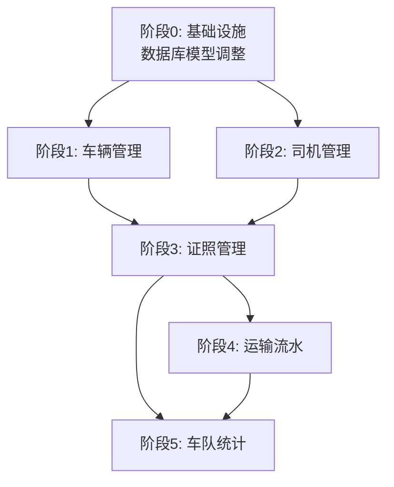

# Fleet 车队管理任务规划

> **版本**：v1.1
> **创建日期**：2026-05-06
> **更新日期**：2026-05-07
> **需求文档**：[requirements.md](./requirements.md)
> **技术方案**：[design.md](./design.md)
> **规划策略**：垂直切片，每个切片对应一个完整的用户行为

---

## 目录

- [依赖关系图](#依赖关系图)
- [阶段划分](#阶段划分)
- [任务清单](#任务清单)
  - [阶段 0: 基础设施](#阶段-0-基础设施)
  - [阶段 1: 车辆管理](#阶段-1-车辆管理)
  - [阶段 2: 司机管理](#阶段-2-司机管理)
  - [阶段 3: 证照管理](#阶段-3-证照管理)
  - [阶段 4: 运输流水](#阶段-4-运输流水)
  - [阶段 5: 车队统计](#阶段-5-车队统计)
- [AC 覆盖检查](#ac-覆盖检查)
- [验证计划](#验证计划)
- [任务统计](#任务统计)
- [关联文档](#关联文档)

---

## 依赖关系图

**关键路径**：阶段0 → 阶段1 → 阶段3 → 阶段4 → 阶段5

**可并行阶段**：阶段1（车辆管理）和阶段2（司机管理）可以并行开发

---

## 阶段划分

### 阶段 0: 基础设施
**说明**：调整数据库模型（修改现有表 + 新增表），配置定时任务调度器，为后续所有功能提供数据基础

**完成标准**：数据库迁移成功，定时任务调度器就绪，所有表结构符合技术方案设计

### 阶段 1: 车辆管理
**说明**：完成车辆的完整生命周期管理（新增、编辑、查看、筛选、停用）

**完成标准**：用户可以在车辆管理Tab中新增车辆、编辑车辆信息、查看车辆列表、按状态筛选车辆、停用有历史记录的车辆

### 阶段 2: 司机管理
**说明**：完成司机的完整生命周期管理（新增、编辑、查看、停用）

**完成标准**：用户可以在司机管理Tab中新增司机、编辑司机信息、查看司机列表、停用有历史记录的司机

### 阶段 3: 证照管理
**说明**：完成证照的完整生命周期管理（新增、编辑、查看、预警筛选）

**完成标准**：用户可以在证照管理Tab中为车辆或司机新增证照、编辑证照信息、查看证照列表、筛选30天内到期的证照

### 阶段 4: 运输流水
**说明**：完成运输流水的导入、查询、筛选、统计功能

**完成标准**：用户可以在运输流水Tab中导入Excel/txt文件、查看流水列表、按时间/车辆/司机筛选、查看每个司机/车辆的任务数量统计

### 阶段 5: 车队统计
**说明**：完成车队统计概览（证照预警数、本月任务数）

**完成标准**：用户可以在统计概览Tab中看到证照预警数量（点击可跳转证照管理）、本月任务数量

---

## 任务清单

### 阶段 0: 基础设施

#### Task-001: 修改 Vehicle 模型 🔒
- **所属切片**：阶段 0: 基础设施
- **复杂度**：S
- **Depends On**：None
- **对应 AC**：AC-019
- **通俗解释**：车辆表增加"关联司机"（可选）和"是否停用"字段，支持车辆与司机绑定和停用功能
- **Description**：
  1. 在 Vehicle 模型中新增 `bound_driver_id` 字段（外键关联 drivers.id，可为空）
  2. 在 Vehicle 模型中新增 `is_disabled` 字段（布尔值，默认 false）
  3. 添加索引 `ix_vehicles_bound_driver`
- **Files to Create/Modify**：
  - `apps/server/app/models/vehicle.py`
- **验证标准**：
  - [ ] Vehicle 模型包含 `bound_driver_id` 字段，类型为 UUID，可为空
  - [ ] Vehicle 模型包含 `is_disabled` 字段，类型为 Boolean，默认 false
  - [ ] 索引 `ix_vehicles_bound_driver` 存在

#### Task-002: 修改 Driver 模型 🔒
- **所属切片**：阶段 0: 基础设施
- **复杂度**：S
- **Depends On**：None
- **对应 AC**：AC-005, AC-021
- **通俗解释**：司机表移除用户账号关联，增加停用字段，手机号改为必填
- **Description**：
  1. 移除 Driver 模型的 `user_id` 字段
  2. 移除 Driver 模型的 `bound_vehicle_id` 字段（车辆与司机的绑定关系由 Vehicle.bound_driver_id 单向维护）
  3. 移除 Driver 模型的 `status` 字段，删除 `DriverStatus` 枚举（司机状态由关联车辆的状态间接体现）
  4. 新增 `is_disabled` 字段（布尔值，默认 false）
  5. 将 `phone` 字段改为必填（nullable=False）
- **Files to Create/Modify**：
  - `apps/server/app/models/driver.py`
- **验证标准**：
  - [ ] Driver 模型不包含 `user_id` 字段
  - [ ] Driver 模型不包含 `bound_vehicle_id` 字段
  - [ ] Driver 模型不包含 `status` 字段，`DriverStatus` 枚举已移除
  - [ ] Driver 模型包含 `is_disabled` 字段，类型为 Boolean，默认 false
  - [ ] Driver 模型的 `phone` 字段不可为空，且具有唯一约束

#### Task-003: 修改 Certificate 模型枚举 🔒
- **所属切片**：阶段 0: 基础设施
- **复杂度**：S
- **Depends On**：None
- **对应 AC**：AC-008
- **通俗解释**：证照类型增加"行驶证"，支持车辆行驶证管理
- **Description**：
  1. 在 VehicleCertType 枚举中添加 `VEHICLE_LICENSE = "vehicle_license"`
- **Files to Create/Modify**：
  - `apps/server/app/models/certificate.py`
- **验证标准**：
  - [ ] VehicleCertType 枚举包含 `VEHICLE_LICENSE` 成员
  - [ ] `VEHICLE_LICENSE` 的值为 "vehicle_license"

#### Task-004: 新增 TransportRecord 模型 🔒
- **所属切片**：阶段 0: 基础设施
- **复杂度**：M
- **Depends On**：None
- **对应 AC**：AC-012, AC-013, AC-015
- **通俗解释**：新增运输流水记录表，用于存储从调度中心导入的已完成任务
- **Description**：
  1. 创建 TransportRecord 模型
  2. 包含字段：id、order_no、customer_info、origin、destination、container_no、vehicle_id、driver_id、imported_at
  3. 添加索引：ix_transport_records_imported_at、ix_transport_records_vehicle、ix_transport_records_driver
  4. 在 `app/models/__init__.py` 中导出 TransportRecord
- **Files to Create/Modify**：
  - `apps/server/app/models/transport_record.py`（新建）
  - `apps/server/app/models/__init__.py`
- **验证标准**：
  - [ ] TransportRecord 模型包含所有必需字段
  - [ ] `vehicle_id` 和 `driver_id` 为外键
  - [ ] 三个索引全部创建
  - [ ] `__init__.py` 中导出 TransportRecord

#### Task-005: 生成并执行数据库迁移 🔒
- **所属切片**：阶段 0: 基础设施
- **复杂度**：S
- **Depends On**：Task-001, Task-002, Task-003, Task-004
- **对应 AC**：所有 AC
- **通俗解释**：将模型变更应用到数据库，创建新的表结构
- **Description**：
  1. 生成 Alembic 迁移脚本：`alembic revision --autogenerate -m "fleet_module_enhancements"`
  2. 检查生成的迁移脚本是否正确
  3. 执行迁移：`alembic upgrade head`
  4. 验证数据库表结构
- **Files to Create/Modify**：
  - `apps/server/alembic/versions/xxxx_fleet_module_enhancements.py`（自动生成）
- **验证标准**：
  - [ ] 迁移脚本生成成功，无错误
  - [ ] `alembic upgrade head` 执行成功
  - [ ] 数据库中 vehicles 表包含 `bound_driver_id` 和 `is_disabled` 字段
  - [ ] 数据库中 drivers 表包含 `is_disabled` 字段，`phone` 为 NOT NULL
  - [ ] 数据库中 certificates 表支持 cert_type='vehicle_license' 的写入和查询
  - [ ] 数据库中 transport_records 表创建成功

#### Task-006: 检查 dispatch 模块对 driver.user_id 的依赖 🔒
- **所属切片**：阶段 0: 基础设施
- **复杂度**：S
- **Depends On**：None
- **对应 AC**：AC-005, AC-007
- **通俗解释**：检查 dispatch 模块是否依赖 driver.user_id 或 driver.status 字段，如有依赖则进行适配
- **Description**：
  1. 搜索 dispatch 模块中对 `driver.user_id`、`driver.userId`、`driver.status`、`DriverStatus` 的引用
  2. 如果存在 user_id 依赖，修改为直接查询 `driver.name` 和 `driver.phone`
  3. 如果存在 status 依赖，改为通过关联车辆的状态间接判断（查询 `Vehicle.bound_driver_id == driver.id` 的车辆状态）
  4. 确认无其他模块依赖这些字段
- **Files to Create/Modify**：
  - `apps/server/app/api/v1/dispatch.py`（如有依赖）
  - `apps/server/app/services/dispatch_service.py`（如有依赖）
- **验证标准**：
  - [ ] 确认 dispatch 模块无 `driver.user_id` 依赖
  - [ ] 确认 dispatch 模块无 `driver.status` / `DriverStatus` 依赖
  - [ ] 或已将依赖改为直接查询 driver 表字段 / 通过车辆状态间接判断

#### Task-007: 配置定时任务调度器 🔒
- **所属切片**：阶段 0: 基础设施
- **复杂度**：M
- **Depends On**：Task-005, Task-008
- **对应 AC**：AC-029
- **通俗解释**：配置 APScheduler 定时任务，实现证照预警检查的自动调度（车辆超时检查归属 dispatch 模块）
- **Description**：
  1. 安装 APScheduler 依赖
  2. 创建 `apps/server/app/scheduler.py`，配置 AsyncIOScheduler
  3. 注册 check_certificate_expiry 任务（每日凌晨执行）
  4. 在 FastAPI lifespan 中初始化和关闭调度器
- **Files to Create/Modify**：
  - `apps/server/app/scheduler.py`（新建）
  - `apps/server/app/main.py`
- **验证标准**：
  - [ ] APScheduler 依赖安装成功
  - [ ] 调度器在应用启动时正确初始化
  - [ ] check_certificate_expiry 定时任务正确注册
  - [ ] 应用关闭时调度器正确停止

#### Task-008: 创建基础 fleet_service.py 🔒
- **所属切片**：阶段 0: 基础设施
- **复杂度**：M
- **Depends On**：Task-005
- **对应 AC**：AC-020, AC-027, AC-029
- **通俗解释**：创建后端服务层基础文件，包含车辆状态更新、可用性检查、证照预警函数，供定时任务调度器和后续 API 路由复用
- **Description**：
  1. 创建 `apps/server/app/services/fleet_service.py`
  2. 实现 `update_vehicle_status(db, vehicle_id, new_status)` 函数（供 dispatch 模块调用）
  3. 实现 `check_vehicle_availability(db, vehicle_id)` 函数
  4. 实现 `get_certificate_warning_count(db)` 函数
  5. 实现 `check_certificate_expiry()` 函数（定时任务入口，自行管理数据库会话，调用 get_certificate_warning_count 并记录日志；函数签名为 `async def check_certificate_expiry() -> None`，供 Task-007 调度器注册）
- **Files to Create/Modify**：
  - `apps/server/app/services/fleet_service.py`（新建）
- **验证标准**：
  - [ ] `update_vehicle_status` 正确更新车辆状态并提交
  - [ ] `check_vehicle_availability` 正确判断车辆是否空闲且未停用
  - [ ] `get_certificate_warning_count` 正确统计 30 天内到期证照（不含已过期）
  - [ ] `check_certificate_expiry` 可被定时任务调度器调用

#### Task-009: 审计已有模块 API 字段命名兼容性 🔒
- **所属切片**：阶段 0: 基础设施
- **复杂度**：M
- **Depends On**：None
- **对应 AC**：所有涉及前后端数据交互的 AC
- **通俗解释**：在实施 Axios 全局字段名转换前，先审计 auth、dashboard 等已有模块的 API 字段命名，确保转换后不会破坏现有功能
- **Description**：
  1. 列出 auth 模块所有 API 接口的请求参数和响应字段
  2. 列出 dashboard 模块所有 API 接口的请求参数和响应字段
  3. 检查每个字段在 camelCase ↔ snake_case 转换后是否与后端期望一致
  4. 识别需要添加映射例外的字段（如第三方 API 返回的非标准命名）
  5. 输出审计报告，标注兼容性结论和例外清单
- **Files to Create/Modify**：
  - `apps/frontend/src/modules/auth/`（审计，不修改）
  - `apps/frontend/src/modules/dashboard/`（审计，不修改）
- **验证标准**：
  - [ ] auth 模块所有 API 字段命名审计完成
  - [ ] dashboard 模块所有 API 字段命名审计完成
  - [ ] 审计报告明确标注兼容性结论
  - [ ] 例外字段清单已记录（如有）
- **风险与回滚**：
  - 此任务为纯审计，不修改任何代码，无回滚风险
  - 如审计发现大量不兼容字段，需重新评估 Task-010 的实施策略

#### Task-010: 配置前后端字段名自动转换 🔒
- **所属切片**：阶段 0: 基础设施
- **复杂度**：M
- **Depends On**：Task-009
- **对应 AC**：所有涉及前后端数据交互的 AC
- **通俗解释**：在 Axios 全局拦截器中配置 camelCase ↔ snake_case 自动转换，影响所有模块
- **Description**：
  1. 安装 camelcase-keys / snakecase-keys 依赖
  2. 在 `apps/frontend/src/shared/utils/axios.ts` 中配置响应拦截器（snake_case → camelCase）
  3. 配置请求拦截器（camelCase → snake_case，跳过 FormData）
  4. 验证已有模块（auth、dashboard 等）不受影响
- **Files to Create/Modify**：
  - `apps/frontend/package.json`
  - `apps/frontend/src/shared/utils/axios.ts`
- **验证标准**：
  - [ ] 依赖安装成功
  - [ ] 响应数据自动转换为 camelCase
  - [ ] 请求数据和 params 自动转换为 snake_case
  - [ ] FormData 请求不受影响
  - [ ] 已有模块功能正常
- **风险与回滚**：
  - 此变更影响所有已有模块的 API 调用，实施前需对 auth 模块的 API 请求/响应字段做完整审计
  - 如已有模块出现兼容性问题，优先修复转换逻辑（如添加字段映射例外），而非修改已有模块代码
  - 回滚方案：移除拦截器中的转换逻辑，恢复原始 axios.ts 文件

---

### 阶段 1: 车辆管理

#### Task-101: 创建车辆相关类型定义 🔒
- **所属切片**：阶段 1: 车辆管理
- **复杂度**：S
- **Depends On**：Task-005
- **对应 AC**：AC-001, AC-002, AC-003, AC-004
- **通俗解释**：定义车辆相关的 TypeScript 类型，包括 Vehicle 接口、请求/响应类型、枚举类型
- **Description**：
  1. 创建 `apps/frontend/src/modules/fleet/types/vehicle.ts`
  2. 定义 VehicleStatus 枚举（idle/transiting/overdue）
  3. 定义 Ownership 枚举（own/external）
  4. 定义 Vehicle 接口
  5. 定义 CreateVehicleRequest、UpdateVehicleRequest、VehicleListParams 接口
  6. 在 `types/index.ts` 中导出
- **Files to Create/Modify**：
  - `apps/frontend/src/modules/fleet/types/vehicle.ts`（新建）
  - `apps/frontend/src/modules/fleet/types/index.ts`（新建）
- **验证标准**：
  - [ ] VehicleStatus 枚举包含 idle/transiting/overdue
  - [ ] Ownership 枚举包含 own/external
  - [ ] Vehicle 接口包含所有必需字段
  - [ ] 类型定义通过 TypeScript 编译

#### Task-102: 创建车辆 API 服务 🔒
- **所属切片**：阶段 1: 车辆管理
- **复杂度**：M
- **Depends On**：Task-101, Task-010
- **对应 AC**：AC-001, AC-002, AC-003, AC-004, AC-018, AC-019, AC-020
- **通俗解释**：创建前端调用车辆 API 的服务函数
- **Description**：
  1. 创建 `apps/frontend/src/modules/fleet/services/fleetService.ts`
  2. 实现 getVehicles(params) 函数
  3. 实现 getVehicle(id) 函数
  4. 实现 createVehicle(data) 函数
  5. 实现 updateVehicle(id, data) 函数
  6. 实现 deleteVehicle(id) 函数
  7. 实现 disableVehicle(id) 函数
  8. 实现 bindDriverToVehicle(id, data) 函数
  9. 实现 checkVehicleAvailability(id) 函数
- **Files to Create/Modify**：
  - `apps/frontend/src/modules/fleet/services/fleetService.ts`（新建）
- **验证标准**：
  - [ ] 所有函数正确调用后端 API
  - [ ] 错误处理完善
  - [ ] 类型安全

#### Task-103: 创建车辆后端 API 路由 🔒
- **所属切片**：阶段 1: 车辆管理
- **复杂度**：M
- **Depends On**：Task-005, Task-008
- **对应 AC**：AC-001, AC-002, AC-003, AC-004, AC-018, AC-019, AC-020, AC-027, AC-030
- **通俗解释**：创建后端车辆管理的 API 路由
- **Description**：
  1. 创建 `apps/server/app/api/v1/fleet.py`
  2. 实现 GET /api/v1/fleet/vehicles（支持状态筛选、分页）
  3. 实现 GET /api/v1/fleet/vehicles/{id}
  4. 实现 POST /api/v1/fleet/vehicles（车牌号唯一性检查，关联司机可选）
  5. 实现 PUT /api/v1/fleet/vehicles/{id}
  6. 实现 DELETE /api/v1/fleet/vehicles/{id}（检查历史记录；无历史记录时允许删除，同时级联删除该车辆的所有关联证照及附件文件）
  7. 实现 PUT /api/v1/fleet/vehicles/{id}/disable
  8. 实现 POST /api/v1/fleet/vehicles/{id}/bind-driver（两步确认逻辑）
  9. 实现 GET /api/v1/fleet/vehicles/{id}/availability
  10. 在 `app/api/v1/__init__.py` 中注册路由
- **Files to Create/Modify**：
  - `apps/server/app/api/v1/fleet.py`（新建）
  - `apps/server/app/api/v1/__init__.py`
- **验证标准**：
  - [ ] 所有 API 端点正确响应
  - [ ] 车牌号唯一性检查生效
  - [ ] 有历史记录的车辆无法删除
  - [ ] 无历史记录的车辆删除时，关联证照及附件文件同步清理
  - [ ] 权限校验正确

#### Task-104: 创建车辆 Store 状态管理 🔒
- **所属切片**：阶段 1: 车辆管理
- **复杂度**：M
- **Depends On**：Task-102
- **对应 AC**：AC-003, AC-004
- **通俗解释**：创建车辆相关的 Pinia Store
- **Description**：
  1. 创建 `apps/frontend/src/modules/fleet/stores/useFleetStore.ts`
  2. 定义 vehicles 状态
  3. 定义 vehicleLoading、vehicleError 状态
  4. 实现 fetchVehicles action
  5. 实现 createVehicle action
  6. 实现 updateVehicle action
  7. 实现 disableVehicle action
  8. 实现 idleVehicles、transitingVehicles、overdueVehicles 计算属性
- **Files to Create/Modify**：
  - `apps/frontend/src/modules/fleet/stores/useFleetStore.ts`（新建）
- **验证标准**：
  - [ ] Store 正确管理车辆状态
  - [ ] loading/error 状态独立
  - [ ] 计算属性正确筛选车辆

#### Task-105: 创建车辆管理组件 🔒
- **所属切片**：阶段 1: 车辆管理
- **复杂度**：M
- **Depends On**：Task-104, Task-107
- **对应 AC**：AC-001, AC-002, AC-003, AC-004, AC-019
- **通俗解释**：创建车辆管理 Tab 组件，包含列表表格、状态筛选、新增/编辑/停用功能
- **Description**：
  1. 创建 `apps/frontend/src/modules/fleet/components/VehicleManagement.vue`
  2. 使用 el-table 组件显示车辆列表（车牌、归属性质、关联司机、状态）
  3. 状态列使用 StatusTag 组件（颜色区分）
  4. 实现状态筛选下拉框（空闲/运输中/超时）
  5. 引入 VehicleFormDialog 组件
  6. 实现新增车辆按钮
  7. 实现车辆列表加载（onMounted）
  8. 实现停用车辆功能（检查历史记录）
- **Files to Create/Modify**：
  - `apps/frontend/src/modules/fleet/components/VehicleManagement.vue`（新建）
- **验证标准**：
  - [ ] 表格正确显示车辆列表
  - [ ] 状态筛选功能正常
  - [ ] 新增车辆功能正常
  - [ ] 编辑车辆功能正常
  - [ ] 停用车辆功能正常

#### Task-106: 创建车辆表单弹窗组件 🔒
- **所属切片**：阶段 1: 车辆管理
- **复杂度**：M
- **Depends On**：Task-104
- **对应 AC**：AC-001, AC-002, AC-018, AC-030
- **通俗解释**：创建新增/编辑车辆的弹窗表单
- **Description**：
  1. 创建 `apps/frontend/src/modules/fleet/components/VehicleFormDialog.vue`
  2. 使用 el-input、el-select 组件
  3. 车牌号输入框（必填，唯一性校验）
  4. 归属性质下拉框（自有车辆/外协车辆）
  5. 关联司机下拉框（可选，冲突提示）
  6. 实现表单验证
  7. 实现提交逻辑
- **Files to Create/Modify**：
  - `apps/frontend/src/modules/fleet/components/VehicleFormDialog.vue`（新建）
- **验证标准**：
  - [ ] 表单验证正确
  - [ ] 车牌号重复时提示错误
  - [ ] 司机已关联其他车辆时提示确认
  - [ ] 提交成功后关闭弹窗

#### Task-107: 创建状态标签组件 🔒
- **所属切片**：阶段 1: 车辆管理
- **复杂度**：S
- **Depends On**：None
- **对应 AC**：AC-003
- **通俗解释**：创建状态标签组件，用颜色区分车辆状态
- **Description**：
  1. 创建 `apps/frontend/src/modules/fleet/components/StatusTag.vue`
  2. 接收 status 属性（idle/transiting/overdue）
  3. 空闲状态显示绿色标签
  4. 运输中状态显示蓝色标签
  5. 超时状态显示红色标签
- **Files to Create/Modify**：
  - `apps/frontend/src/modules/fleet/components/StatusTag.vue`（新建）
- **验证标准**：
  - [ ] 不同状态显示不同颜色
  - [ ] 标签文字正确

#### Task-108: 编写车辆管理单元测试 🔒
- **所属切片**：阶段 1: 车辆管理
- **复杂度**：M
- **Depends On**：Task-105
- **对应 AC**：AC-001, AC-002, AC-003, AC-004, AC-018, AC-019, AC-030
- **通俗解释**：编写车辆管理相关的单元测试
- **Description**：
  1. 创建 `apps/frontend/src/modules/fleet/__tests__/VehicleManagement.test.ts`
  2. 测试表格渲染
  3. 测试状态筛选
  4. 创建 `apps/frontend/src/modules/fleet/__tests__/useFleetStore.test.ts`
  5. 测试 Store 的 actions
  6. 测试计算属性
- **Files to Create/Modify**：
  - `apps/frontend/src/modules/fleet/__tests__/VehicleManagement.test.ts`（新建）
  - `apps/frontend/src/modules/fleet/__tests__/useFleetStore.test.ts`（新建）
- **验证标准**：
  - [ ] 所有测试通过
  - [ ] 测试覆盖率 ≥ 80%

#### Task-109: 编写车辆管理后端 API 测试 🔒
- **所属切片**：阶段 1: 车辆管理
- **复杂度**：M
- **Depends On**：Task-103
- **对应 AC**：AC-001, AC-002, AC-003, AC-004, AC-018, AC-019, AC-020
- **通俗解释**：编写车辆管理后端 API 的集成测试
- **Description**：
  1. 创建 `apps/server/tests/test_fleet_vehicles.py`
  2. 测试新增车辆（正常 + 车牌号重复）
  3. 测试编辑车辆
  4. 测试获取车辆列表（含状态筛选）
  5. 测试删除有历史记录的车辆（应拒绝）
  6. 测试停用车辆
  7. 测试车辆可用性检查
- **Files to Create/Modify**：
  - `apps/server/tests/test_fleet_vehicles.py`（新建）
- **验证标准**：
  - [ ] 所有测试通过
  - [ ] 覆盖所有 Happy Path 和 Edge Case

---

### 阶段 2: 司机管理

#### Task-201: 创建司机相关类型定义 🔒
- **所属切片**：阶段 2: 司机管理
- **复杂度**：S
- **Depends On**：Task-005
- **对应 AC**：AC-005, AC-006, AC-007, AC-034, AC-035
- **通俗解释**：定义司机相关的 TypeScript 类型
- **Description**：
  1. 创建 `apps/frontend/src/modules/fleet/types/driver.ts`
  2. 定义 Driver 接口
  3. 定义 CreateDriverRequest、UpdateDriverRequest 接口
  4. 在 `types/index.ts` 中导出
- **Files to Create/Modify**：
  - `apps/frontend/src/modules/fleet/types/driver.ts`（新建）
  - `apps/frontend/src/modules/fleet/types/index.ts`
- **验证标准**：
  - [ ] Driver 接口包含所有必需字段
  - [ ] 类型定义通过 TypeScript 编译

#### Task-202: 扩展 fleetService 添加司机 API 🔒
- **所属切片**：阶段 2: 司机管理
- **复杂度**：M
- **Depends On**：Task-201, Task-102
- **对应 AC**：AC-005, AC-006, AC-007, AC-021, AC-034, AC-035
- **通俗解释**：在 fleetService 中添加司机相关的 API 调用函数
- **Description**：
  1. 在 `fleetService.ts` 中添加 getDrivers() 函数
  2. 添加 getDriver(id) 函数
  3. 添加 createDriver(data) 函数
  4. 添加 updateDriver(id, data) 函数
  5. 添加 deleteDriver(id) 函数
  6. 添加 disableDriver(id) 函数
- **Files to Create/Modify**：
  - `apps/frontend/src/modules/fleet/services/fleetService.ts`
- **验证标准**：
  - [ ] 所有函数正确调用后端 API
  - [ ] 错误处理完善

#### Task-203: 扩展后端 API 添加司机路由 🔒
- **所属切片**：阶段 2: 司机管理
- **复杂度**：M
- **Depends On**：Task-005, Task-103
- **对应 AC**：AC-005, AC-006, AC-007, AC-021, AC-034, AC-035
- **通俗解释**：在后端 API 中添加司机管理的路由
- **Description**：
  1. 在 `fleet.py` 中添加 GET /api/v1/fleet/drivers
  2. 添加 GET /api/v1/fleet/drivers/{id}
  3. 添加 POST /api/v1/fleet/drivers
  4. 添加 PUT /api/v1/fleet/drivers/{id}
  5. 添加 DELETE /api/v1/fleet/drivers/{id}（检查历史记录；无历史记录时允许删除，同时级联删除该司机的所有关联证照及附件文件）
  6. 添加 PUT /api/v1/fleet/drivers/{id}/disable
- **Files to Create/Modify**：
  - `apps/server/app/api/v1/fleet.py`
- **验证标准**：
  - [ ] 所有 API 端点正确响应
  - [ ] 有历史记录的司机无法删除
  - [ ] 无历史记录的司机删除时，关联证照及附件文件同步清理

#### Task-204: 扩展 Store 添加司机状态管理 🔒
- **所属切片**：阶段 2: 司机管理
- **复杂度**：M
- **Depends On**：Task-202, Task-104
- **对应 AC**：AC-007
- **通俗解释**：在 Store 中添加司机相关的状态管理
- **Description**：
  1. 在 useFleetStore 中添加 drivers 状态
  2. 添加 driverLoading、driverError 状态
  3. 实现 fetchDrivers action
  4. 实现 createDriver action
  5. 实现 updateDriver action
  6. 实现 disableDriver action
- **Files to Create/Modify**：
  - `apps/frontend/src/modules/fleet/stores/useFleetStore.ts`
- **验证标准**：
  - [ ] Store 正确管理司机状态
  - [ ] loading/error 状态独立

#### Task-205: 创建司机管理组件 🔒
- **所属切片**：阶段 2: 司机管理
- **复杂度**：M
- **Depends On**：Task-204
- **对应 AC**：AC-005, AC-006, AC-007, AC-021
- **通俗解释**：创建司机管理 Tab 组件，包含列表表格、新增/编辑/停用功能
- **Description**：
  1. 创建 `apps/frontend/src/modules/fleet/components/DriverManagement.vue`
  2. 使用 el-table 组件显示司机列表（姓名、手机号、关联车辆）
  3. 引入 DriverFormDialog 组件
  4. 实现新增司机按钮
  5. 实现司机列表加载（onMounted）
  6. 实现停用司机功能
- **Files to Create/Modify**：
  - `apps/frontend/src/modules/fleet/components/DriverManagement.vue`（新建）
- **验证标准**：
  - [ ] 表格正确显示司机列表
  - [ ] 新增司机功能正常
  - [ ] 编辑司机功能正常
  - [ ] 停用司机功能正常

#### Task-206: 创建司机表单弹窗组件 🔒
- **所属切片**：阶段 2: 司机管理
- **复杂度**：M
- **Depends On**：Task-204
- **对应 AC**：AC-005, AC-006, AC-034, AC-035
- **通俗解释**：创建新增/编辑司机的弹窗表单
- **Description**：
  1. 创建 `apps/frontend/src/modules/fleet/components/DriverFormDialog.vue`
  2. 使用 el-input 组件
  3. 姓名输入框（必填）
  4. 手机号输入框（必填，格式校验）
  5. 实现表单验证
  6. 实现提交逻辑
- **Files to Create/Modify**：
  - `apps/frontend/src/modules/fleet/components/DriverFormDialog.vue`（新建）
- **验证标准**：
  - [ ] 表单验证正确
  - [ ] 提交成功后关闭弹窗

#### Task-207: 编写司机管理单元测试 🔒
- **所属切片**：阶段 2: 司机管理
- **复杂度**：M
- **Depends On**：Task-205
- **对应 AC**：AC-005, AC-006, AC-007, AC-021, AC-034, AC-035
- **通俗解释**：编写司机管理相关的单元测试
- **Description**：
  1. 创建 `apps/frontend/src/modules/fleet/__tests__/DriverManagement.test.ts`
  2. 测试表格渲染
  3. 测试 Store 的司机相关 actions
- **Files to Create/Modify**：
  - `apps/frontend/src/modules/fleet/__tests__/DriverManagement.test.ts`（新建）
- **验证标准**：
  - [ ] 所有测试通过
  - [ ] 测试覆盖率 ≥ 80%

#### Task-208: 编写司机管理后端 API 测试 🔒
- **所属切片**：阶段 2: 司机管理
- **复杂度**：M
- **Depends On**：Task-203
- **对应 AC**：AC-005, AC-006, AC-007, AC-021, AC-034, AC-035
- **通俗解释**：编写司机管理后端 API 的集成测试
- **Description**：
  1. 创建 `apps/server/tests/test_fleet_drivers.py`
  2. 测试新增司机
  3. 测试编辑司机
  4. 测试获取司机列表
  5. 测试删除有历史记录的司机（应拒绝）
  6. 测试停用司机
- **Files to Create/Modify**：
  - `apps/server/tests/test_fleet_drivers.py`（新建）
- **验证标准**：
  - [ ] 所有测试通过
  - [ ] 覆盖所有 Happy Path 和 Edge Case

---

### 阶段 3: 证照管理

#### Task-301: 创建证照相关类型定义 🔒
- **所属切片**：阶段 3: 证照管理
- **复杂度**：S
- **Depends On**：Task-005
- **对应 AC**：AC-008, AC-009, AC-010, AC-011
- **通俗解释**：定义证照相关的 TypeScript 类型
- **Description**：
  1. 创建 `apps/frontend/src/modules/fleet/types/certificate.ts`
  2. 定义 VehicleCertType、DriverCertType 枚举
  3. 定义 OwnerType 枚举
  4. 定义 Certificate 接口
  5. 定义 CreateCertificateRequest、CertificateListParams 接口
  6. 在 `types/index.ts` 中导出
- **Files to Create/Modify**：
  - `apps/frontend/src/modules/fleet/types/certificate.ts`（新建）
  - `apps/frontend/src/modules/fleet/types/index.ts`
- **验证标准**：
  - [ ] 所有枚举和接口定义正确
  - [ ] 类型定义通过 TypeScript 编译

#### Task-302: 扩展 fleetService 添加证照 API 🔒
- **所属切片**：阶段 3: 证照管理
- **复杂度**：M
- **Depends On**：Task-301, Task-102
- **对应 AC**：AC-008, AC-009, AC-010, AC-011, AC-023, AC-032
- **通俗解释**：在 fleetService 中添加证照相关的 API 调用函数
- **Description**：
  1. 在 `fleetService.ts` 中添加 getCertificates(params) 函数
  2. 添加 createCertificate(data) 函数（支持文件上传）
  3. 添加 updateCertificate(id, data) 函数
  4. 添加 deleteCertificate(id) 函数
  5. 添加 getCertificateWarningCount() 函数
- **Files to Create/Modify**：
  - `apps/frontend/src/modules/fleet/services/fleetService.ts`
- **验证标准**：
  - [ ] 所有函数正确调用后端 API
  - [ ] 文件上传正确处理

#### Task-303: 扩展后端 API 添加证照路由 🔒
- **所属切片**：阶段 3: 证照管理
- **复杂度**：M
- **Depends On**：Task-005, Task-103
- **对应 AC**：AC-008, AC-009, AC-010, AC-011, AC-022, AC-023, AC-029, AC-032
- **通俗解释**：在后端 API 中添加证照管理的路由
- **Description**：
  1. 在 `fleet.py` 中添加 GET /api/v1/fleet/certificates（支持预警筛选）
  2. 添加 POST /api/v1/fleet/certificates（支持文件上传）
  3. 添加 PUT /api/v1/fleet/certificates/{id}
  4. 添加 DELETE /api/v1/fleet/certificates/{id}
  5. 添加 GET /api/v1/fleet/certificates/warning-count
  6. 实现文件上传验证（大小、格式）
- **Files to Create/Modify**：
  - `apps/server/app/api/v1/fleet.py`
- **验证标准**：
  - [ ] 所有 API 端点正确响应
  - [ ] 文件上传验证正确
  - [ ] 预警筛选功能正常

#### Task-304: 扩展 Store 添加证照状态管理 🔒
- **所属切片**：阶段 3: 证照管理
- **复杂度**：M
- **Depends On**：Task-302, Task-104
- **对应 AC**：AC-010, AC-011
- **通俗解释**：在 Store 中添加证照相关的状态管理
- **Description**：
  1. 在 useFleetStore 中添加 certificates 状态
  2. 添加 certificateLoading、certificateError 状态
  3. 实现 fetchCertificates action
  4. 实现 createCertificate action
  5. 实现 updateCertificate action
  6. 实现 deleteCertificate action
- **Files to Create/Modify**：
  - `apps/frontend/src/modules/fleet/stores/useFleetStore.ts`
- **验证标准**：
  - [ ] Store 正确管理证照状态
  - [ ] loading/error 状态独立

#### Task-305: 创建证照管理组件 🔒
- **所属切片**：阶段 3: 证照管理
- **复杂度**：M
- **Depends On**：Task-304
- **对应 AC**：AC-008, AC-009, AC-010, AC-011, AC-022, AC-023, AC-029, AC-032
- **通俗解释**：创建证照管理 Tab 组件，包含列表表格、预警筛选、新增/编辑/删除功能
- **Description**：
  1. 创建 `apps/frontend/src/modules/fleet/components/CertificateManagement.vue`
  2. 使用 el-table 组件显示证照列表（类型、所属对象、有效期、状态）
  3. 引入 CertificateFormDialog 组件
  4. 实现新增证照按钮
  5. 实现证照列表加载（onMounted）
  6. 实现预警筛选按钮（30天内到期）
  7. 实现删除证照功能
- **Files to Create/Modify**：
  - `apps/frontend/src/modules/fleet/components/CertificateManagement.vue`（新建）
- **验证标准**：
  - [ ] 表格正确显示证照列表
  - [ ] 新增证照功能正常
  - [ ] 编辑证照功能正常
  - [ ] 删除证照功能正常
  - [ ] 预警筛选功能正常

#### Task-306: 创建证照表单弹窗组件 🔒
- **所属切片**：阶段 3: 证照管理
- **复杂度**：M
- **Depends On**：Task-304
- **对应 AC**：AC-008, AC-009, AC-023
- **通俗解释**：创建新增/编辑证照的弹窗表单
- **Description**：
  1. 创建 `apps/frontend/src/modules/fleet/components/CertificateFormDialog.vue`
  2. 使用 el-input、el-select、el-upload 组件
  3. 证照类型下拉框
  4. 所属对象选择（车辆或司机）
  5. 有效期日期选择器
  6. 证照照片上传（文件大小、格式验证）
  7. 备注输入框
  8. 实现表单验证
  9. 实现提交逻辑
- **Files to Create/Modify**：
  - `apps/frontend/src/modules/fleet/components/CertificateFormDialog.vue`（新建）
- **验证标准**：
  - [ ] 表单验证正确
  - [ ] 文件上传验证正确
  - [ ] 提交成功后关闭弹窗

#### Task-307: 编写证照管理单元测试 🔒
- **所属切片**：阶段 3: 证照管理
- **复杂度**：M
- **Depends On**：Task-305
- **对应 AC**：AC-008, AC-009, AC-010, AC-011, AC-023, AC-032
- **通俗解释**：编写证照管理相关的单元测试
- **Description**：
  1. 创建 `apps/frontend/src/modules/fleet/__tests__/CertificateManagement.test.ts`
  2. 测试表格渲染
  3. 测试预警筛选
  4. 测试 Store 的证照相关 actions
- **Files to Create/Modify**：
  - `apps/frontend/src/modules/fleet/__tests__/CertificateManagement.test.ts`（新建）
- **验证标准**：
  - [ ] 所有测试通过
  - [ ] 测试覆盖率 ≥ 80%

#### Task-308: 编写证照管理后端 API 测试 🔒
- **所属切片**：阶段 3: 证照管理
- **复杂度**：M
- **Depends On**：Task-303
- **对应 AC**：AC-008, AC-009, AC-010, AC-011, AC-022, AC-023, AC-032
- **通俗解释**：编写证照管理后端 API 的集成测试
- **Description**：
  1. 创建 `apps/server/tests/test_fleet_certificates.py`
  2. 测试新增证照（含文件上传）
  3. 测试编辑证照
  4. 测试获取证照列表（含预警筛选）
  5. 测试删除证照
  6. 测试证照预警数量统计
  7. 测试文件上传验证（大小、格式）
- **Files to Create/Modify**：
  - `apps/server/tests/test_fleet_certificates.py`（新建）
- **验证标准**：
  - [ ] 所有测试通过
  - [ ] 覆盖所有 Happy Path 和 Edge Case

---

### 阶段 4: 运输流水

#### Task-401: 创建运输流水相关类型定义 🔒
- **所属切片**：阶段 4: 运输流水
- **复杂度**：S
- **Depends On**：Task-005
- **对应 AC**：AC-012, AC-013, AC-014, AC-015, AC-033
- **通俗解释**：定义运输流水相关的 TypeScript 类型
- **Description**：
  1. 创建 `apps/frontend/src/modules/fleet/types/transport-record.ts`
  2. 定义 TransportRecord 接口
  3. 定义 TransportRecordListParams 接口（含分页参数）
  4. 定义 TransportRecordStatistics 接口
  5. 定义 ImportResult 接口
  6. 在 `types/index.ts` 中导出
- **Files to Create/Modify**：
  - `apps/frontend/src/modules/fleet/types/transport-record.ts`（新建）
  - `apps/frontend/src/modules/fleet/types/index.ts`
- **验证标准**：
  - [ ] 所有接口定义正确
  - [ ] 类型定义通过 TypeScript 编译

#### Task-402: 扩展 fleetService 添加运输流水 API 🔒
- **所属切片**：阶段 4: 运输流水
- **复杂度**：M
- **Depends On**：Task-401, Task-102
- **对应 AC**：AC-012, AC-013, AC-014, AC-015, AC-024, AC-025, AC-026
- **通俗解释**：在 fleetService 中添加运输流水相关的 API 调用函数
- **Description**：
  1. 在 `fleetService.ts` 中添加 getTransportRecords(params) 函数
  2. 添加 importTransportRecords(file) 函数
  3. 添加 getTransportRecordStatistics() 函数
  4. 添加 downloadTemplate() 函数
- **Files to Create/Modify**：
  - `apps/frontend/src/modules/fleet/services/fleetService.ts`
- **验证标准**：
  - [ ] 所有函数正确调用后端 API
  - [ ] 文件上传正确处理

#### Task-403: 扩展后端 API 添加运输流水路由 🔒
- **所属切片**：阶段 4: 运输流水
- **复杂度**：L
- **Depends On**：Task-005, Task-103
- **对应 AC**：AC-012, AC-013, AC-014, AC-015, AC-024, AC-025, AC-026
- **通俗解释**：在后端 API 中添加运输流水管理的路由
- **Description**：
  1. 在 `fleet.py` 中添加 GET /api/v1/fleet/transport-records（支持筛选、分页）
  2. 添加 POST /api/v1/fleet/transport-records/import（文件上传）
  3. 添加 GET /api/v1/fleet/transport-records/statistics
  4. 添加 GET /api/v1/fleet/transport-records/template（模板下载）
  5. 实现文件格式验证（Excel/txt）
  6. 实现文件列数验证
  7. 实现重复记录跳过逻辑
- **Files to Create/Modify**：
  - `apps/server/app/api/v1/fleet.py`
  - `apps/server/app/services/fleet_service.py`（扩展）
- **验证标准**：
  - [ ] 所有 API 端点正确响应
  - [ ] 文件格式验证正确
  - [ ] 重复记录跳过逻辑正确
  - [ ] 分页功能正常

#### Task-404: 扩展 Store 添加运输流水状态管理 🔒
- **所属切片**：阶段 4: 运输流水
- **复杂度**：M
- **Depends On**：Task-402, Task-104
- **对应 AC**：AC-013, AC-014, AC-015
- **通俗解释**：在 Store 中添加运输流水相关的状态管理
- **Description**：
  1. 在 useFleetStore 中添加 transportRecords 状态
  2. 添加 transportRecordLoading、transportRecordError 状态
  3. 实现 fetchTransportRecords action
  4. 实现 importTransportRecords action
  5. 实现 fetchTransportRecordStatistics action
- **Files to Create/Modify**：
  - `apps/frontend/src/modules/fleet/stores/useFleetStore.ts`
- **验证标准**：
  - [ ] Store 正确管理运输流水状态
  - [ ] loading/error 状态独立

#### Task-405: 创建运输流水管理组件 🔒
- **所属切片**：阶段 4: 运输流水
- **复杂度**：M
- **Depends On**：Task-404
- **对应 AC**：AC-012, AC-013, AC-014, AC-015, AC-033
- **通俗解释**：创建运输流水 Tab 组件，包含列表表格、筛选、分页、导入、统计功能
- **Description**：
  1. 创建 `apps/frontend/src/modules/fleet/components/TransportRecordManagement.vue`
  2. 使用 el-table 组件显示流水列表（任务编号、客户信息、起运地、目的地、箱号、执行车辆、执行司机）
  3. 实现时间范围筛选
  4. 实现车辆/司机筛选
  5. 实现分页控件
  6. 引入 ImportDialog 组件
  7. 实现导入按钮
  8. 实现流水列表加载（onMounted）
  9. 实现统计区域显示
- **Files to Create/Modify**：
  - `apps/frontend/src/modules/fleet/components/TransportRecordManagement.vue`（新建）
- **验证标准**：
  - [ ] 表格正确显示流水列表
  - [ ] 筛选功能正常
  - [ ] 分页功能正常
  - [ ] 导入功能正常
  - [ ] 统计区域正确显示

#### Task-406: 创建导入弹窗组件 🔒
- **所属切片**：阶段 4: 运输流水
- **复杂度**：M
- **Depends On**：Task-404
- **对应 AC**：AC-012, AC-024, AC-025, AC-026
- **通俗解释**：创建导入运输流水的弹窗
- **Description**：
  1. 创建 `apps/frontend/src/modules/fleet/components/ImportDialog.vue`
  2. 使用 el-upload 组件
  3. 实现文件格式验证（仅 Excel/txt）
  4. 实现模板下载链接
  5. 显示导入结果（成功/重复/错误数量）
  6. 显示错误详情（前 10 条）
- **Files to Create/Modify**：
  - `apps/frontend/src/modules/fleet/components/ImportDialog.vue`（新建）
- **验证标准**：
  - [ ] 文件格式验证正确
  - [ ] 导入结果正确显示
  - [ ] 模板下载功能正常

#### Task-407: 编写运输流水前端测试 🔒
- **所属切片**：阶段 4: 运输流水
- **复杂度**：M
- **Depends On**：Task-405
- **对应 AC**：AC-012, AC-013, AC-014, AC-015, AC-033
- **通俗解释**：编写运输流水前端单元测试
- **Description**：
  1. 创建 `apps/frontend/src/modules/fleet/__tests__/TransportRecordManagement.test.ts`
  2. 测试表格渲染、筛选功能、分页功能
  3. 测试 Store 的运输流水相关 actions
- **Files to Create/Modify**：
  - `apps/frontend/src/modules/fleet/__tests__/TransportRecordManagement.test.ts`（新建）
- **验证标准**：
  - [ ] 所有测试通过
  - [ ] 测试覆盖率 ≥ 80%

#### Task-408: 编写运输流水后端导入测试 🔒
- **所属切片**：阶段 4: 运输流水
- **复杂度**：M
- **Depends On**：Task-403
- **对应 AC**：AC-012, AC-013, AC-014, AC-024, AC-025, AC-026, AC-033
- **通俗解释**：编写运输流水后端导入逻辑及列表查询的集成测试
- **Description**：
  1. 创建 `apps/server/tests/test_fleet_import.py`
  2. 测试文件格式验证（Excel/txt）
  3. 测试文件列数验证
  4. 测试重复记录跳过逻辑
  5. 测试车辆/司机不存在时的错误处理
  6. 测试运输流水列表查询（含时间范围筛选）
  7. 测试运输流水按车辆/司机筛选
  8. 测试运输流水分页功能
- **Files to Create/Modify**：
  - `apps/server/tests/test_fleet_import.py`（新建）
- **验证标准**：
  - [ ] 所有测试通过
  - [ ] 后端导入逻辑测试覆盖所有边界情况

---

### 阶段 5: 车队统计

#### Task-501: 创建统计相关类型定义 🔒
- **所属切片**：阶段 5: 车队统计
- **复杂度**：S
- **Depends On**：Task-005
- **对应 AC**：AC-016, AC-017
- **通俗解释**：定义车队统计相关的 TypeScript 类型
- **Description**：
  1. 创建 `apps/frontend/src/modules/fleet/types/statistics.ts`
  2. 定义 FleetStatistics 接口
  3. 在 `types/index.ts` 中导出
- **Files to Create/Modify**：
  - `apps/frontend/src/modules/fleet/types/statistics.ts`（新建）
  - `apps/frontend/src/modules/fleet/types/index.ts`
- **验证标准**：
  - [ ] FleetStatistics 接口定义正确
  - [ ] 类型定义通过 TypeScript 编译

#### Task-502: 扩展 fleetService 添加统计 API 🔒
- **所属切片**：阶段 5: 车队统计
- **复杂度**：S
- **Depends On**：Task-501, Task-102
- **对应 AC**：AC-016, AC-017
- **通俗解释**：在 fleetService 中添加统计相关的 API 调用函数
- **Description**：
  1. 在 `fleetService.ts` 中添加 getStatistics() 函数
- **Files to Create/Modify**：
  - `apps/frontend/src/modules/fleet/services/fleetService.ts`
- **验证标准**：
  - [ ] 函数正确调用后端 API

#### Task-503: 扩展后端 API 添加统计路由 🔒
- **所属切片**：阶段 5: 车队统计
- **复杂度**：M
- **Depends On**：Task-005, Task-103, Task-303
- **对应 AC**：AC-016, AC-017, AC-022, AC-029
- **通俗解释**：在后端 API 中添加车队统计的路由
- **Description**：
  1. 在 `fleet.py` 中添加 GET /api/v1/fleet/statistics
  2. 实现证照预警数量统计（调用 get_certificate_warning_count）
  3. 实现本月任务数统计（查询 transport_records 表）
- **Files to Create/Modify**：
  - `apps/server/app/api/v1/fleet.py`
  - `apps/server/app/services/fleet_service.py`
- **验证标准**：
  - [ ] API 端点正确响应
  - [ ] 证照预警数量统计正确（不含已过期）
  - [ ] 本月任务数统计正确

#### Task-504: 扩展 Store 添加统计状态管理 🔒
- **所属切片**：阶段 5: 车队统计
- **复杂度**：S
- **Depends On**：Task-502, Task-104
- **对应 AC**：AC-016, AC-017
- **通俗解释**：在 Store 中添加统计相关的状态管理
- **Description**：
  1. 在 useFleetStore 中添加 statistics 状态
  2. 添加 statisticsLoading、statisticsError 状态
  3. 实现 fetchStatistics action
- **Files to Create/Modify**：
  - `apps/frontend/src/modules/fleet/stores/useFleetStore.ts`
- **验证标准**：
  - [ ] Store 正确管理统计状态
  - [ ] loading/error 状态独立

#### Task-505: 创建统计概览 Tab 页面 🔒
- **所属切片**：阶段 5: 车队统计
- **复杂度**：M
- **Depends On**：Task-504
- **对应 AC**：AC-016, AC-017, AC-022, AC-029
- **通俗解释**：创建统计概览 Tab 页面，内联实现统计卡片
- **Description**：
  1. 创建 `apps/frontend/src/modules/fleet/components/StatisticsTab.vue`
  2. 内联实现证照预警卡片（显示30天内到期数量，点击跳转证照管理Tab）
  3. 内联实现本月任务数卡片
  4. 实现统计数据加载（onMounted）
- **Files to Create/Modify**：
  - `apps/frontend/src/modules/fleet/components/StatisticsTab.vue`（新建）
- **验证标准**：
  - [ ] 页面正确显示统计卡片
  - [ ] 证照预警卡片点击跳转正常
  - [ ] 统计数据正确

#### Task-506: 创建 Fleet 主页面 🔒
- **所属切片**：阶段 5: 车队统计
- **复杂度**：M
- **Depends On**：Task-105, Task-205, Task-305, Task-405, Task-505
- **对应 AC**：所有 AC
- **通俗解释**：创建 Fleet 主页面，整合 5 个 Tab
- **Description**：
  1. 创建 `apps/frontend/src/modules/fleet/components/FleetPage.vue`
  2. 使用 el-tabs 组件
  3. 引入 StatisticsTab、VehicleManagement、DriverManagement、CertificateManagement、TransportRecordManagement
  4. 配置路由
- **Files to Create/Modify**：
  - `apps/frontend/src/modules/fleet/components/FleetPage.vue`（新建）
  - `apps/frontend/src/router/index.ts`
- **验证标准**：
  - [ ] 页面正确显示 5 个 Tab
  - [ ] Tab 切换正常
  - [ ] 路由配置正确

#### Task-507: 编写车队统计单元测试 🔒
- **所属切片**：阶段 5: 车队统计
- **复杂度**：M
- **Depends On**：Task-506
- **对应 AC**：AC-016, AC-017
- **通俗解释**：编写车队统计相关的单元测试
- **Description**：
  1. 创建 `apps/frontend/src/modules/fleet/__tests__/StatisticsTab.test.ts`
  2. 测试统计卡片渲染
  3. 测试点击跳转
  4. 测试 Store 的统计相关 actions
- **Files to Create/Modify**：
  - `apps/frontend/src/modules/fleet/__tests__/StatisticsTab.test.ts`（新建）
- **验证标准**：
  - [ ] 所有测试通过
  - [ ] 测试覆盖率 ≥ 80%

#### Task-508: 编写车队统计后端 API 测试 🔒
- **所属切片**：阶段 5: 车队统计
- **复杂度**：M
- **Depends On**：Task-503
- **对应 AC**：AC-016, AC-017, AC-022, AC-029
- **通俗解释**：编写车队统计后端 API 的集成测试
- **Description**：
  1. 创建 `apps/server/tests/test_fleet_statistics.py`
  2. 测试证照预警数量统计（含已过期证照不应计入）
  3. 测试本月任务数统计
  4. 测试无数据时的统计结果（预警数为 0，任务数为 0）
- **Files to Create/Modify**：
  - `apps/server/tests/test_fleet_statistics.py`（新建）
- **验证标准**：
  - [ ] 所有测试通过
  - [ ] 证照预警数量统计正确（30天内到期，不含已过期）
  - [ ] 本月任务数统计正确

#### Task-509: 创建模块公共 API 导出 🔒
- **所属切片**：阶段 5: 车队统计
- **复杂度**：S
- **Depends On**：Task-506
- **对应 AC**：所有 AC
- **通俗解释**：创建 fleet 模块的公共 API 导出文件，统一管理模块对外接口
- **Description**：
  1. 创建 `apps/frontend/src/modules/fleet/index.ts`
  2. 导出 FleetPage 组件
  3. 导出 useFleetStore
  4. 导出所有类型定义
- **Files to Create/Modify**：
  - `apps/frontend/src/modules/fleet/index.ts`（新建）
- **验证标准**：
  - [ ] 模块公共 API 导出正确
  - [ ] TypeScript 编译通过

---

## AC 覆盖检查

| AC 编号 | AC 描述 | 覆盖任务 | 状态 |
|---------|---------|---------|------|
| AC-001 | 新增车辆成功（关联司机可选） | Task-101, Task-103, Task-105, Task-106, Task-108, Task-109 | ✅ |
| AC-002 | 编辑车辆成功 | Task-103, Task-105, Task-106, Task-108, Task-109 | ✅ |
| AC-003 | 查看车辆列表 | Task-105, Task-107, Task-108, Task-109 | ✅ |
| AC-004 | 按状态筛选车辆 | Task-105, Task-107, Task-108, Task-109 | ✅ |
| AC-005 | 新增司机成功 | Task-201, Task-202, Task-205, Task-206, Task-207, Task-208 | ✅ |
| AC-006 | 编辑司机成功 | Task-202, Task-205, Task-206, Task-207, Task-208 | ✅ |
| AC-007 | 查看司机列表 | Task-204, Task-205, Task-207, Task-208 | ✅ |
| AC-008 | 新增证照成功 | Task-301, Task-302, Task-305, Task-306, Task-307, Task-308 | ✅ |
| AC-009 | 编辑证照成功 | Task-302, Task-305, Task-306, Task-307, Task-308 | ✅ |
| AC-010 | 查看证照列表 | Task-304, Task-305, Task-307, Task-308 | ✅ |
| AC-011 | 预警筛选证照 | Task-304, Task-305, Task-307, Task-308 | ✅ |
| AC-012 | 导入运输流水 | Task-401, Task-402, Task-405, Task-406, Task-407, Task-408 | ✅ |
| AC-013 | 查看流水列表 | Task-404, Task-405, Task-407, Task-408 | ✅ |
| AC-014 | 筛选流水记录 | Task-404, Task-405, Task-407, Task-408 | ✅ |
| AC-015 | 流水统计 | Task-401, Task-402, Task-405, Task-407 | ✅ |
| AC-016 | 证照预警卡片 | Task-501, Task-502, Task-504, Task-505, Task-507, Task-508 | ✅ |
| AC-017 | 本月任务数卡片 | Task-501, Task-502, Task-504, Task-505, Task-507, Task-508 | ✅ |
| AC-018 | 车牌号重复检查 | Task-105, Task-106, Task-108, Task-109 | ✅ |
| AC-019 | 车辆停用功能 | Task-001, Task-103, Task-105, Task-108, Task-109 | ✅ |
| AC-020 | 车辆可用性检查 | Task-008, Task-103, Task-109 | ✅ |
| AC-021 | 司机停用功能 | Task-002, Task-202, Task-205, Task-207, Task-208 | ✅ |
| AC-034 | 手机号格式校验 | Task-201, Task-202, Task-203, Task-206, Task-207, Task-208 | ✅ |
| AC-035 | 手机号重复检查 | Task-201, Task-202, Task-203, Task-206, Task-207, Task-208 | ✅ |
| AC-022 | 证照预警显示 | Task-302, Task-305, Task-307, Task-308, Task-505, Task-508 | ✅ |
| AC-023 | 证照上传验证 | Task-302, Task-305, Task-306, Task-307, Task-308 | ✅ |
| AC-024 | 文件格式验证 | Task-402, Task-405, Task-406, Task-408 | ✅ |
| AC-025 | 文件列数验证 | Task-405, Task-408 | ✅ |
| AC-026 | 重复记录跳过 | Task-405, Task-408 | ✅ |
| AC-027 | 车辆状态更新 | Task-008, Task-103（后端 API，供 dispatch 模块调用） | ✅ |
| AC-028 | 车辆超时检查 | Task-008（fleet 侧服务函数）, dispatch 模块定时任务（归属 dispatch） | ✅ |
| AC-029 | 证照预警检查 | Task-007（定时任务调度器）, Task-008（服务函数）, Task-305, Task-505, Task-508 | ✅ |
| AC-030 | 司机关联冲突 | Task-105, Task-106 | ✅ |
| AC-031 | 权限控制 | 路由守卫（已在 auth 模块实现） | ✅ |
| AC-032 | 删除证照 | Task-302, Task-305, Task-307 | ✅ |
| AC-033 | 运输流水分页 | Task-401, Task-404, Task-405, Task-407, Task-408 | ✅ |

---

## 验证计划

### 阶段 0 验证
- [ ] Task-001 至 Task-010 验证标准全部通过
- [ ] 端到端验证：数据库迁移成功，定时任务调度器就绪，所有表结构正确

### 阶段 1 验证
- [ ] Task-101 至 Task-109 验证标准全部通过
- [ ] 端到端验证：用户可以新增车辆、编辑车辆、查看列表、筛选状态、停用车辆

### 阶段 2 验证
- [ ] Task-201 至 Task-208 验证标准全部通过
- [ ] 端到端验证：用户可以新增司机、编辑司机、查看列表、停用司机

### 阶段 3 验证
- [ ] Task-301 至 Task-308 验证标准全部通过
- [ ] 端到端验证：用户可以新增证照、编辑证照、查看列表、预警筛选

### 阶段 4 验证
- [ ] Task-401 至 Task-408 验证标准全部通过
- [ ] 端到端验证：用户可以导入运输流水、查看列表、筛选、查看统计

### 阶段 5 验证
- [ ] Task-501 至 Task-509 验证标准全部通过
- [ ] 端到端验证：用户可以查看证照预警数、本月任务数，点击跳转正常

---

## 任务统计

- **总任务数**：52 个
- **基础设施任务**：10 个
- **车辆管理任务**：9 个
- **司机管理任务**：8 个
- **证照管理任务**：8 个
- **运输流水任务**：8 个
- **车队统计任务**：9 个

**复杂度分布**：
- S（简单）：14 个
- M（中等）：37 个
- L（复杂）：1 个

---

## 关联文档

- 需求文档：[requirements.md](./requirements.md)
- 技术方案：[design.md](./design.md)
- 产品概述：[../../product-overview.md](../../product-overview.md)
- 开发路线图：[../../development-roadmap.md](../../development-roadmap.md)
