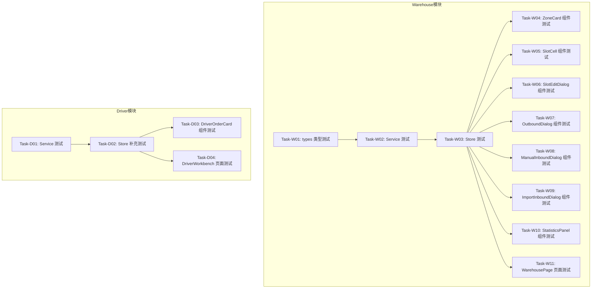

# 补充缺失测试 — 任务规划

> **版本**：v1.0
> **创建日期**：2026-05-25
> **目标**：为 warehouse 和 driver 模块补充缺失的前端测试，确保代码质量
> **策略**：按模块垂直切片，每个切片包含 Store → Service → Component 测试

---

## ⚠️ TDD 开发流程

**每个任务必须按 RED → GREEN → REFACTOR 循环执行，测试不是独立任务。**

```
┌─────────────────────────────────────────────────────────────┐
│  任务执行流程（每个任务内部）                                   │
├─────────────────────────────────────────────────────────────┤
│  1. RED 阶段：先写失败的测试                                   │
│     - 根据任务验证标准编写测试用例                               │
│     - 运行测试，确认失败                                        │
│                                                              │
│  2. GREEN 阶段：写最小实现让测试通过                            │
│     - 只写让测试通过的最小代码                                   │
│     - 不提前实现未请求的功能                                     │
│                                                              │
│  3. REFACTOR 阶段：重构优化                                    │
│     - 清理代码，保持测试通过                                     │
│     - 提取公共逻辑，消除重复                                     │
└─────────────────────────────────────────────────────────────┘
```

**禁止事项**：
- ❌ 禁止规划"编写单元测试"类独立任务
- ❌ 禁止先写实现代码后补测试
- ❌ 禁止跳过 RED 阶段直接写实现

**执行命令**：后续阶段必须通过 `/feature-implementation` Skill 执行，确保 TDD 流程。

---

## 依赖关系图



---

## 阶段划分

### 阶段 1: Warehouse 基础层测试
做完后：warehouse 模块的类型、Service、Store 都有完整的测试覆盖，为组件测试提供稳定基础。

### 阶段 2: Warehouse 组件测试
做完后：warehouse 模块的所有组件都有测试覆盖，包括 ZoneCard、SlotCell、各种弹窗等。

### 阶段 3: Warehouse 页面测试
做完后：WarehousePage 页面有集成测试，验证整体功能流程。

### 阶段 4: Driver 模块测试
做完后：driver 模块的 Service、Store、组件都有测试覆盖。

---

## 任务清单

### 阶段 1: Warehouse 基础层测试

#### Task-W01: Warehouse 类型测试 ✅
- **所属切片**：阶段 1: Warehouse 基础层测试
- **复杂度**：S
- **Depends On**：None
- **对应源文件**：`warehouse/types/index.ts`
- **通俗解释**：为 warehouse 模块的类型定义编写测试，确保类型正确导出和使用
- **Files to Create**：
  - `apps/frontend/src/modules/warehouse/__tests__/types.test.ts`
- **验证标准**：
  - [x] **TDD 测试通过**：类型测试覆盖 Slot、Zone、WarehouseStatistics 等核心类型
  - [x] Slot 类型所有字段都有类型守卫测试
  - [x] Zone 类型包含 slots 数组的类型测试
  - [x] WarehouseStatistics 类型所有字段都有测试
  - [x] ManualInboundItem、OutboundResponse 等请求/响应类型有测试

---

#### Task-W02: Warehouse Service 测试 ✅
- **所属切片**：阶段 1: Warehouse 基础层测试
- **复杂度**：M
- **Depends On**：Task-W01
- **对应源文件**：`warehouse/services/warehouseService.ts`
- **通俗解释**：为 warehouse 的 API 服务层编写测试，确保所有 API 调用正确
- **Files to Create**：
  - `apps/frontend/src/modules/warehouse/__tests__/warehouseService.test.ts`
- **验证标准**：
  - [x] **TDD 测试通过**：Service 测试覆盖所有 API 方法
  - [x] `fetchZones()` 调用 GET `/v1/warehouse/zones` 并返回 Zone 数组
  - [x] `fetchStatistics()` 调用 GET `/v1/warehouse/statistics` 并返回统计数据
  - [x] `manualInbound()` 调用 POST `/v1/warehouse/slots/manual-inbound` 并返回存储结果
  - [x] `importInbound()` 正确构造 FormData 并调用导入接口
  - [x] `outbound()` 调用 POST `/v1/warehouse/slots/outbound` 并返回出库结果
  - [x] `move()` 调用 POST `/v1/warehouse/slots/move` 并传递正确的 slotId
  - [x] `updateSlot()` 调用 PUT `/v1/warehouse/slots/{id}` 并传递正确的数据
  - [x] `searchSlots()` 调用 GET `/v1/warehouse/slots/search` 并返回搜索结果
  - [x] 所有 API 调用都 Mock 了 http 客户端

---

#### Task-W03: Warehouse Store 测试 ✅
- **所属切片**：阶段 1: Warehouse 基础层测试
- **复杂度**：L
- **Depends On**：Task-W02
- **对应源文件**：`warehouse/stores/useWarehouseStore.ts`
- **通俗解释**：为 warehouse 的状态管理编写完整测试，确保所有状态和操作都正确
- **Files to Create**：
  - `apps/frontend/src/modules/warehouse/__tests__/useWarehouseStore.test.ts`
- **验证标准**：
  - [x] **TDD 测试通过**：Store 测试覆盖所有 state、getters、actions
  - [x] 初始状态：zones 为空数组、loading 为 false、filter 为 'all'
  - [x] `fetchZones()` 成功后 zones 被正确填充、loading 状态正确切换
  - [x] `fetchStatistics()` 成功后 statistics 被正确填充
  - [x] `init()` 同时调用 fetchZones 和 fetchStatistics
  - [x] `setFilter()` 正确更新 filter 值
  - [x] `toggleSlotSelection()` 正确添加/移除选中的 slot
  - [x] `clearSelection()` 清空所有选中项
  - [x] `selectedSlots` getter 返回正确的选中 slot 数组
  - [x] `manualInbound()` 调用 service 并刷新数据
  - [x] `importInbound()` 调用 service 并刷新数据
  - [x] `outbound()` 调用 service、清空选中、刷新数据
  - [x] `toggleMoveMode()` 正确切换移动模式
  - [x] `setMoveSource()` 正确设置源 slot
  - [x] `move()` 调用 service 并重置移动状态
  - [x] `updateSlot()` 调用 service 并刷新数据
  - [x] `setSearchHighlights()` 和 `clearSearchHighlights()` 正确操作搜索高亮
  - [x] 所有异步操作都有 loading 状态测试
  - [x] 所有异步操作都有错误处理测试

---

### 阶段 2: Warehouse 组件测试 ✅

#### Task-W04: ZoneCard 组件测试 ✅
- **所属切片**：阶段 2: Warehouse 组件测试
- **复杂度**：M
- **Depends On**：Task-W03
- **对应源文件**：`warehouse/components/ZoneCard.vue`
- **通俗解释**：为区域卡片组件编写测试，确保正确显示区域信息和库位网格
- **Files to Create**：
  - `apps/frontend/src/modules/warehouse/__tests__/ZoneCard.test.ts`
- **验证标准**：
  - [x] **TDD 测试通过**：组件测试覆盖渲染、交互、状态
  - [x] 正常渲染：显示区域名称、使用率、库位网格
  - [x] 空状态：区域无库位时显示正确
  - [x] 库位状态：empty/loaded/empty_container 三种状态显示不同颜色
  - [x] 点击库位：触发 select 事件
  - [x] 双击库位：触发 open-detail 事件
  - [x] Props 变化：zone 数据变化时组件正确更新

---

#### Task-W05: SlotCell 组件测试 ✅
- **所属切片**：阶段 2: Warehouse 组件测试
- **复杂度**：S
- **Depends On**：Task-W03
- **对应源文件**：`warehouse/components/SlotCell.vue`
- **通俗解释**：为库位单元格组件编写测试，确保正确显示库位状态和信息
- **Files to Create**：
  - `apps/frontend/src/modules/warehouse/__tests__/SlotCell.test.ts`
- **验证标准**：
  - [x] **TDD 测试通过**：组件测试覆盖三种状态
  - [x] 空库位状态：显示 slotNo，背景色正确
  - [x] 已装载状态：显示 containerNo、customerName
  - [x] 空箱状态：显示 containerNo、containerStatus 标签
  - [x] 点击事件：触发 click 事件
  - [x] 选中状态：显示选中边框

---

#### Task-W06: SlotEditDialog 组件测试 ✅
- **所属切片**：阶段 2: Warehouse 组件测试
- **复杂度**：M
- **Depends On**：Task-W03
- **对应源文件**：`warehouse/components/SlotEditDialog.vue`
- **通俗解释**：为库位编辑弹窗编写测试，确保表单验证和提交正确
- **Files to Create**：
  - `apps/frontend/src/modules/warehouse/__tests__/SlotEditDialog.test.ts`
- **验证标准**：
  - [x] **TDD 测试通过**：组件测试覆盖表单渲染、验证、提交
  - [x] 弹窗打开：显示库位信息
  - [x] 表单字段：customerName、remark 字段正确渲染
  - [x] 提交成功：调用 update API 并关闭弹窗
  - [x] 取消操作：关闭弹窗不调用 API
  - [x] loading 状态：提交时按钮禁用

---

#### Task-W07: OutboundDialog 组件测试 ✅
- **所属切片**：阶段 2: Warehouse 组件测试
- **复杂度**：M
- **Depends On**：Task-W03
- **对应源文件**：`warehouse/components/OutboundDialog.vue`
- **通俗解释**：为出库弹窗编写测试，确保出库流程正确
- **Files to Create**：
  - `apps/frontend/src/modules/warehouse/__tests__/OutboundDialog.test.ts`
- **验证标准**：
  - [x] **TDD 测试通过**：组件测试覆盖出库流程
  - [x] 弹窗打开：显示选中的库位列表
  - [x] 业务类型选择：下拉框正确渲染
  - [x] 确认出库：调用 outbound API 并显示结果
  - [x] 出库成功：显示成功消息并关闭弹窗
  - [x] 出库失败：显示错误消息

---

#### Task-W08: ManualInboundDialog 组件测试 ✅
- **所属切片**：阶段 2: Warehouse 组件测试
- **复杂度**：M
- **Depends On**：Task-W03
- **对应源文件**：`warehouse/components/ManualInboundDialog.vue`
- **通俗解释**：为手工入库弹窗编写测试，确保入库表单正确
- **Files to Create**：
  - `apps/frontend/src/modules/warehouse/__tests__/ManualInboundDialog.test.ts`
- **验证标准**：
  - [x] **TDD 测试通过**：组件测试覆盖入库表单
  - [x] 表单字段：containerNo、containerStatus、customerName、sealNo 正确渲染
  - [x] 必填验证：containerNo 为空时显示错误
  - [x] 提交成功：调用 manualInbound API 并关闭弹窗
  - [x] 重置表单：关闭后表单清空

---

#### Task-W09: ImportInboundDialog 组件测试 ✅
- **所属切片**：阶段 2: Warehouse 组件测试
- **复杂度**：M
- **Depends On**：Task-W03
- **对应源文件**：`warehouse/components/ImportInboundDialog.vue`
- **通俗解释**：为导入入库弹窗编写测试，确保文件上传正确
- **Files to Create**：
  - `apps/frontend/src/modules/warehouse/__tests__/ImportInboundDialog.test.ts`
- **验证标准**：
  - [x] **TDD 测试通过**：组件测试覆盖文件上传流程
  - [x] 文件上传：选择文件后显示文件名
  - [x] 提交成功：调用 importInbound API 并显示结果
  - [x] 结果展示：显示成功数量和错误列表
  - [x] 文件类型验证：非 Excel 文件显示错误

---

#### Task-W10: StatisticsPanel 组件测试 ✅
- **所属切片**：阶段 2: Warehouse 组件测试
- **复杂度**：S
- **Depends On**：Task-W03
- **对应源文件**：`warehouse/components/StatisticsPanel.vue`
- **通俗解释**：为统计面板组件编写测试，确保统计数据正确显示
- **Files to Create**：
  - `apps/frontend/src/modules/warehouse/__tests__/StatisticsPanel.test.ts`
- **验证标准**：
  - [x] **TDD 测试通过**：组件测试覆盖统计数据展示
  - [x] 正常渲染：显示总库位数、已用数、利用率等
  - [x] 空状态：statistics 为 null 时显示加载中
  - [x] 数据变化：props 变化时组件正确更新

---

### 阶段 3: Warehouse 页面测试 ✅

#### Task-W11: WarehousePage 页面测试 ✅
- **所属切片**：阶段 3: Warehouse 页面测试
- **复杂度**：L
- **Depends On**：Task-W04, Task-W05, Task-W06, Task-W07, Task-W08, Task-W09, Task-W10
- **对应源文件**：`warehouse/pages/WarehousePage.vue`
- **通俗解释**：为仓库总览页面编写集成测试，确保整体功能流程正确
- **Files to Create**：
  - `apps/frontend/src/modules/warehouse/__tests__/WarehousePage.test.ts`
- **验证标准**：
  - [x] **TDD 测试通过**：页面测试覆盖整体流程
  - [x] 页面加载：显示统计面板和区域列表
  - [x] 加载状态：loading 时显示加载动画
  - [x] 空状态：无区域时显示空状态提示
  - [x] 筛选功能：切换 filter 时列表正确过滤
  - [x] 搜索功能：输入关键词时触发搜索
  - [x] 选择功能：点击库位时选中/取消选中
  - [x] 出库流程：选中库位后点击出库，弹窗正确打开
  - [x] 入库流程：点击入库，弹窗正确打开
  - [x] 移动功能：移动模式下点击目标库位触发移动

---

### 阶段 4: Driver 模块测试 ✅

#### Task-D01: Driver Service 测试 ✅
- **所属切片**：阶段 4: Driver 模块测试
- **复杂度**：S
- **Depends On**：None
- **对应源文件**：`driver/services/driverService.ts`
- **通俗解释**：为司机端 API 服务层编写测试
- **Files to Create**：
  - `apps/frontend/src/modules/driver/__tests__/driverService.test.ts`
- **验证标准**：
  - [x] **TDD 测试通过**：Service 测试覆盖所有 API 方法
  - [x] `getOrders()` 调用 GET `/v1/driver/orders` 并返回订单列表
  - [x] `getOrders()` 支持分页和状态筛选参数
  - [x] `startOrder()` 调用 POST `/v1/driver/orders/{id}/start`
  - [x] `completeOrder()` 调用 POST `/v1/driver/orders/{id}/complete`
  - [x] 所有 API 调用都 Mock 了 http 客户端

---

#### Task-D02: Driver Store 补充测试 ✅
- **所属切片**：阶段 4: Driver 模块测试
- **复杂度**：M
- **Depends On**：Task-D01
- **对应源文件**：`driver/stores/useDriverStore.ts`
- **通俗解释**：为司机端 Store 补充缺失的测试用例
- **Files to Modify**：
  - `apps/frontend/src/modules/driver/__tests__/useDriverStore.test.ts`
- **验证标准**：
  - [x] **TDD 测试通过**：Store 测试覆盖所有缺失场景
  - [x] 补充 `startOrder()` 的错误处理测试
  - [x] 补充 `completeOrder()` 的错误处理测试
  - [x] 补充分页加载测试
  - [x] 补充状态筛选测试
  - [x] 补充 `setPage()` 测试

---

#### Task-D03: DriverOrderCard 组件测试 ✅
- **所属切片**：阶段 4: Driver 模块测试
- **复杂度**：M
- **Depends On**：Task-D02
- **对应源文件**：`driver/components/DriverOrderCard.vue`
- **通俗解释**：为司机订单卡片组件编写测试
- **Files to Create**：
  - `apps/frontend/src/modules/driver/__tests__/DriverOrderCard.test.ts`
- **验证标准**：
  - [x] **TDD 测试通过**：组件测试覆盖渲染和交互
  - [x] 正常渲染：显示订单号、客户名、地址等信息
  - [x] 状态显示：不同订单状态显示不同标签
  - [x] 按钮状态：待开始/运输中/已完成显示不同按钮
  - [x] 点击开始运输：触发 startOrder
  - [x] 点击完成：触发 completeOrder

---

#### Task-D04: DriverWorkbench 页面测试 ✅
- **所属切片**：阶段 4: Driver 模块测试
- **复杂度**：M
- **Depends On**：Task-D03
- **对应源文件**：`driver/pages/DriverWorkbench.vue`
- **通俗解释**：为司机工作台页面编写测试
- **Files to Create**：
  - `apps/frontend/src/modules/driver/__tests__/DriverWorkbench.test.ts`
- **验证标准**：
  - [x] **TDD 测试通过**：页面测试覆盖整体流程
  - [x] 页面加载：显示订单列表
  - [x] 加载状态：loading 时显示加载动画
  - [x] 空状态：无订单时显示空状态提示
  - [x] 状态筛选：切换 Tab 时列表正确过滤
  - [x] 分页功能：切换页码正确调用 API

---

## AC 覆盖检查

| 模块 | 缺失测试 | 覆盖任务 | 状态 |
|------|---------|---------|------|
| warehouse/types | 类型测试 | Task-W01 | ✅ |
| warehouse/service | Service 测试 | Task-W02 | ✅ |
| warehouse/store | Store 测试 | Task-W03 | ✅ |
| warehouse/components | 7 个组件测试 | Task-W04~W10 | ✅ |
| warehouse/page | 页面集成测试 | Task-W11 | ✅ |
| driver/service | Service 测试 | Task-D01 | ✅ |
| driver/store | Store 补充测试 | Task-D02 | ✅ |
| driver/components | 组件测试 | Task-D03 | ✅ |
| driver/page | 页面测试 | Task-D04 | ✅ |

---

## 验证计划

### 阶段 1 验证
- [x] Task-W01 TDD 测试通过 + 验收标准全部通过
- [x] Task-W02 TDD 测试通过 + 验收标准全部通过
- [x] Task-W03 TDD 测试通过 + 验收标准全部通过
- [x] 运行 `pnpm test` 确认 warehouse 基础层测试全部通过

### 阶段 2 验证
- [x] Task-W04~W10 TDD 测试通过 + 验收标准全部通过
- [x] 运行 `pnpm test` 确认 warehouse 组件测试全部通过

### 阶段 3 验证
- [x] Task-W11 TDD 测试通过 + 验收标准全部通过
- [x] 运行 `pnpm test` 确认 warehouse 模块测试全部通过

### 阶段 4 验证
- [x] Task-D01~D04 TDD 测试通过 + 验收标准全部通过
- [x] 运行 `pnpm test` 确认 driver 模块测试全部通过

---

## 执行说明

1. **新开对话窗口**后，使用 `/feature-implementation` Skill 执行
2. 按阶段顺序执行，不要跳过
3. 每个阶段完成后运行 `pnpm test` 确认无回归
4. 所有阶段完成后运行 `pnpm test` 确认全量测试通过

---

## 参考文档

- [feature-implementation SKILL.md](../../.trae/skills/feature-implementation/SKILL.md)
- [tdd-code-examples.md](../../.trae/skills/feature-implementation/references/tdd-code-examples.md)
- [fleet 模块测试示例](../fleet/tasks.md) — 参考 TDD 声明格式
