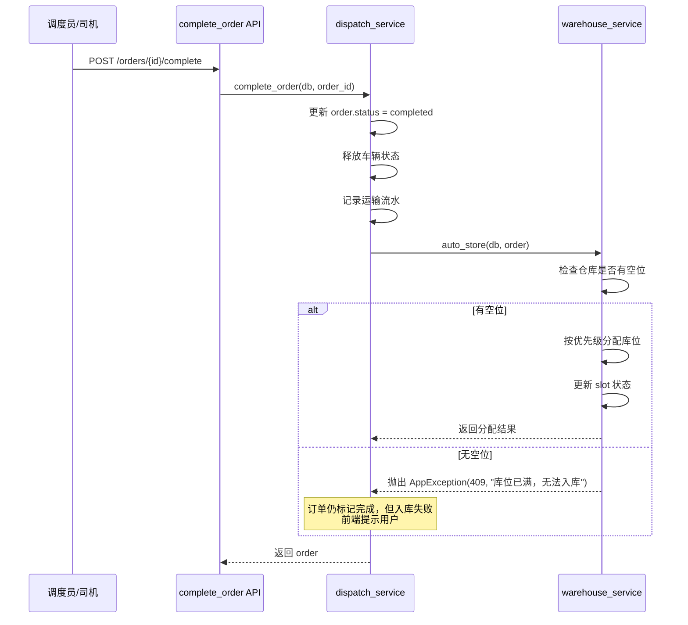
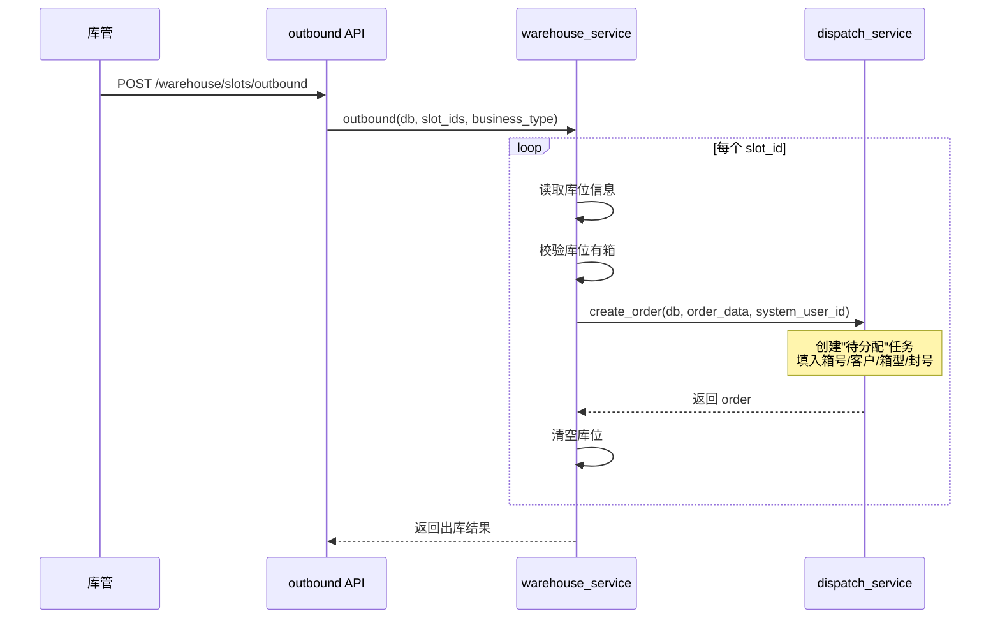

# 仓库管理 技术方案

## 一、功能概述
- **功能名称**：仓库管理
- **需求文档**：[requirements.md](./requirements.md)
- **设计目标**：实现 12 区域 144 库位的集装箱入库/出库/移动/查询管理，出库自动联动调度中心创建任务

## 二、现有代码分析

### 技术栈合规检查
- [x] 已读取 `specs/tech-stack.md`，确认本设计所有技术选型在批准范围内
- [x] UI 组件：仅使用 Element Plus（el-button、el-dialog、el-select、el-upload、el-tag、el-input 等）
- [x] 样式方案：仅使用 `<style scoped>`
- [x] 日期处理：仅使用 dayjs
- [x] 已用 Glob 工具审计 `shared/components/` 目录，确认引用的公共组件真实存在
- [x] 已用 Glob 工具审计 `shared/utils/` 目录，确认引用的工具函数真实存在

### 涉及模块
| 模块 | 文件路径 | 说明 |
|------|---------|------|
| Warehouse 模型 | `apps/server/app/models/warehouse.py` | 需修改：去掉 customer_name，total_slots 改为计算 |
| StorageSlot 模型 | `apps/server/app/models/storage_slot.py` | 需修改：增加 zone_code/row/col/container_status/customer_name/container_type/seal_no |
| User 模型 | `apps/server/app/models/user.py` | 需修改：UserRole 枚举增加 WAREHOUSE_KEEPER |
| Order 模型 | `apps/server/app/models/order.py` | 不修改，出库创建任务时复用 |
| dispatch_service | `apps/server/app/services/dispatch_service.py` | 需修改：complete_order 末尾调用自动入库 |
| 前端路由 | `apps/frontend/src/router/index.ts` | 需修改：增加 /warehouse 路由 |
| AppLayout | `apps/frontend/src/shared/components/AppLayout.vue` | 需修改：侧边栏菜单增加"仓库管理"项，按角色显示 |
| 前端权限 | `apps/frontend/src/shared/utils/permission.ts` | 不修改，已有 hasRole 机制 |

### 可复用抽象（已审计）
| 组件/工具 | 文件路径 | 验证状态 |
|-----------|---------|---------|
| AppLayout | `apps/frontend/src/shared/components/AppLayout.vue` | ✅ 已验证 |
| EmptyState | `apps/frontend/src/shared/components/EmptyState.vue` | ✅ 已验证 |
| LoadingSpinner | `apps/frontend/src/shared/components/LoadingSpinner.vue` | ✅ 已验证 |
| http client | `apps/frontend/src/shared/api/client.ts` | ✅ 已验证 |
| format utils | `apps/frontend/src/shared/utils/format.ts` | ✅ 已验证 |
| logger | `apps/frontend/src/shared/utils/logger.ts` | ✅ 已验证 |
| hasRole | `apps/frontend/src/shared/utils/permission.ts` | ✅ 已验证 |
| AppException | `apps/server/app/core/exceptions.py` | ✅ 已验证 |
| dispatch_service.create_order | `apps/server/app/services/dispatch_service.py` | ✅ 已验证 |

### 影响范围
- **dispatch_service.complete_order**：末尾新增自动入库调用
- **User.UserRole 枚举**：新增 WAREHOUSE_KEEPER，影响 auth 模块的角色校验
- **前端路由**：新增 /warehouse 路由，AppLayout 侧边栏需增加菜单项
- **数据库迁移**：StorageSlot 表结构变更、Warehouse 表去掉 customer_name、初始化 12 区域 144 库位数据

## 三、数据模型设计

### 3.1 Warehouse 表变更

**删除字段**：
- `customer_name` → 仓库没有客户概念，客户信息在库位层面 → AC-002
- `code` → 与 `zone_code` 功能重复，统一使用 `zone_code` 作为区域标识
- `total_slots` → 改为计算字段（由 storage_slots 关联查询得出），不存数据库 → AC-007

**新增字段**：
- `zone_code` String(20) → 区域编号，如 "3-5"、"6-1"，用于排序和优先级匹配 → AC-008, AC-017
- `sort_order` Integer → 区域在页面中的排列顺序（1-12）→ AC-008

**最终 Warehouse 表结构**：

| 字段 | 类型 | 约束 | 说明 |
|------|------|------|------|
| id | UUID | PK | 主键 |
| name | String(100) | NOT NULL | 仓库名称 |
| zone_code | String(20) | UNIQUE, NOT NULL | 区域编号（唯一标识） |
| sort_order | Integer | NOT NULL | 排列顺序 |
| remark | Text | NULLABLE | 备注 |
| created_at | DateTime(tz) | DEFAULT now() | 创建时间 |
| updated_at | DateTime(tz) | DEFAULT now() | 更新时间 |

**索引**：
- `ix_warehouses_zone_code` on (zone_code) → 按区域编号查询 → AC-017
- `ix_warehouses_sort_order` on (sort_order) → 页面排序 → AC-008

### 3.2 StorageSlot 表变更

**新增字段**：

| 字段 | 类型 | 约束 | 说明 |
|------|------|------|------|
| zone_code | String(20) | NOT NULL | 区域编号（冗余，避免 JOIN）→ AC-008 |
| row | Integer | NOT NULL | 行号 1-3 → AC-002, AC-008 |
| col | Integer | NOT NULL | 列号 1-4 → AC-002, AC-008 |
| container_status | String(10) | NULLABLE | heavy/empty → AC-002, AC-005 |
| customer_name | String(100) | NULLABLE | 货主名称 → AC-002, AC-006 |
| container_type | String(10) | NULLABLE | 箱型 20GP/40GP/40HQ/45HQ → AC-002 |
| seal_no | String(20) | NULLABLE | 封号 → AC-002 |

**修改字段**：
- `status` 枚举调整：EMPTY → "empty"，LOADED → "loaded"，EMPTY_CONTAINER → "empty_container"（保持现有值不变，语义对齐）

**最终 StorageSlot 表结构**：

| 字段 | 类型 | 约束 | 说明 |
|------|------|------|------|
| id | UUID | PK | 主键 |
| warehouse_id | UUID | FK→warehouses.id, NOT NULL | 所属区域 |
| zone_code | String(20) | NOT NULL | 区域编号 |
| slot_no | String(20) | NOT NULL | 库位编号（如 "3-5-1-1"） |
| row | Integer | NOT NULL | 行号 1-3 |
| col | Integer | NOT NULL | 列号 1-4 |
| status | String(20) | NOT NULL, DEFAULT "empty" | empty/loaded/empty_container |
| container_no | String(20) | NULLABLE, UNIQUE | 箱号 → AC-012 |
| container_status | String(10) | NULLABLE | heavy/empty → AC-002 |
| customer_name | String(100) | NULLABLE | 货主 → AC-002 |
| container_type | String(10) | NULLABLE | 箱型 → AC-002 |
| seal_no | String(20) | NULLABLE | 封号 → AC-002 |
| stored_at | DateTime(tz) | NULLABLE | 入库时间 |
| remark | Text | NULLABLE | 备注 |
| created_at | DateTime(tz) | DEFAULT now() | 创建时间 |
| updated_at | DateTime(tz) | DEFAULT now() | 更新时间 |

**索引**：
- `uq_slot_warehouse_no` on (warehouse_id, slot_no) → 已有，保持
- `ix_slots_warehouse` on (warehouse_id) → 已有，保持
- `ix_slots_status` on (status) → 已有，保持
- `ix_slots_zone_code` on (zone_code) → 按区域查询 → AC-005, AC-017
- `uq_container_no` on (container_no) WHERE container_no IS NOT NULL → 箱号唯一 → AC-012
  - **实现方式**：使用 SQLAlchemy `sa.Index` 而非 `sa.UniqueConstraint`，因为需要 `postgresql_where` 部分索引：
  ```python
  sa.Index('uq_container_no', 'container_no', unique=True,
           postgresql_where=sa.text('container_no IS NOT NULL'))
  ```
- `ix_slots_container_no` on (container_no) WHERE container_no IS NOT NULL → 搜索箱号 → AC-006
  - 同样使用 `sa.Index` + `postgresql_where`
- `ix_slots_customer_name` on (customer_name) → 搜索货主 → AC-006

### 3.3 User 表变更

**UserRole 枚举新增**：
- `WAREHOUSE_KEEPER = "warehouse_keeper"` → AC-020

### 3.4 初始化数据迁移

迁移脚本一次性写入 12 个 Warehouse 记录和 144 个 StorageSlot 记录：

```
Warehouse 初始化数据（sort_order 对应页面 4 行布局）：
sort_order=1:  zone_code="3-5",  name="3-5 区"
sort_order=2:  zone_code="3-7",  name="3-7 区"
sort_order=3:  zone_code="3-20", name="3-20 区"
sort_order=4:  zone_code="2-13", name="2-13 区"
sort_order=5:  zone_code="1-1",  name="1-1 区"
sort_order=6:  zone_code="1-20", name="1-20 区"
sort_order=7:  zone_code="6-1",  name="6-1 区"
sort_order=8:  zone_code="6-2",  name="6-2 区"
sort_order=9:  zone_code="6-3",  name="6-3 区"
sort_order=10: zone_code="6-4",  name="6-4 区"
sort_order=11: zone_code="6-5",  name="6-5 区"
sort_order=12: zone_code="6-6",  name="6-6 区"

每个 Warehouse 生成 12 个 StorageSlot（3行×4列）：
slot_no 格式："{zone_code}-{row}-{col}"，如 "3-5-1-1", "3-5-1-2", ..., "3-5-3-4"
```

**系统用户初始化**：

出库时需要调用 `dispatch_service.create_order`，该函数要求 `dispatcher_id` 参数。出库创建的任务是系统自动生成的，不是某个库管手动调度的，因此需要一个系统用户作为 dispatcher。

```
系统用户数据：
username: "system"
name: "系统"
role: "admin"
password: 随机生成的不可用密码（仅用于满足 NOT NULL 约束，无法登录）
status: "disabled"（禁止登录）
```

迁移脚本中创建该用户并记录其 ID，出库逻辑通过常量 `SYSTEM_USER_ID` 引用。

## 四、API 设计

### 4.1 接口列表

| 方法 | 路径 | 描述 | 权限 | 对应 AC |
|------|------|------|------|---------|
| GET | /api/v1/warehouse/zones | 获取所有区域及库位 | warehouse_keeper | → AC-007, AC-008 |
| GET | /api/v1/warehouse/statistics | 获取全局统计 | warehouse_keeper | → AC-007 |
| POST | /api/v1/warehouse/slots/manual-inbound | 手动入库（单条/批量） | warehouse_keeper | → AC-002 |
| POST | /api/v1/warehouse/slots/import-inbound | 导入入库（Excel） | warehouse_keeper | → AC-002 |
| POST | /api/v1/warehouse/slots/outbound | 出库 | warehouse_keeper | → AC-003 |
| POST | /api/v1/warehouse/slots/move | 移动 | warehouse_keeper | → AC-004 |
| PUT | /api/v1/warehouse/slots/{slot_id} | 编辑库位信息 | warehouse_keeper | → AC-016 |
| GET | /api/v1/warehouse/slots/search | 搜索库位 | warehouse_keeper | → AC-006 |

### 4.2 请求/响应类型

#### GET /api/v1/warehouse/zones

**Response**:
```python
class SlotResponse(BaseModel):
    id: str
    zone_code: str
    slot_no: str
    row: int
    col: int
    status: str              # empty / loaded / empty_container
    container_no: str | None
    container_status: str | None  # heavy / empty
    customer_name: str | None
    container_type: str | None
    seal_no: str | None
    stored_at: datetime | None
    remark: str | None

class ZoneResponse(BaseModel):
    id: str
    name: str
    zone_code: str
    sort_order: int
    used_count: int          # 已用库位数
    total_count: int         # 总库位数（固定 12）
    slots: list[SlotResponse]

class ZoneListResponse(BaseModel):
    zones: list[ZoneResponse]
```

→ AC-008: 区域卡片展示 3×4 网格和利用率
→ AC-007: 全局统计

#### GET /api/v1/warehouse/statistics

**Response**:
```python
class WarehouseStatistics(BaseModel):
    total_slots: int         # 144
    used_slots: int          # 已用
    available_slots: int     # 剩余
    heavy_count: int         # 重箱数
    empty_container_count: int  # 空箱数
    utilization_rate: float  # 利用率 0.0-1.0
```

→ AC-007: 全局统计面板

#### POST /api/v1/warehouse/slots/manual-inbound

**Request**:
```python
class ManualInboundItem(BaseModel):
    container_no: str = Field(..., pattern=r"^[A-Z]{4}\d{7}$")
    container_status: str = Field(..., pattern="^(heavy|empty)$")
    customer_name: str | None = Field(None, max_length=100)
    container_type: str | None = Field(None, pattern="^(20GP|40GP|40HQ|45HQ)$")
    seal_no: str | None = Field(None, max_length=20)

class ManualInboundRequest(BaseModel):
    zone_code: str = Field(..., max_length=20)
    items: list[ManualInboundItem] = Field(..., min_length=1)
```

**Response**:
```python
class ManualInboundResponse(BaseModel):
    stored_count: int
    slots: list[SlotResponse]
```

→ AC-002: 手动入库
→ AC-011: 箱号格式校验
→ AC-012: 箱号唯一性校验
→ AC-013: 容量校验

#### POST /api/v1/warehouse/slots/import-inbound

**Request**: `multipart/form-data`，上传 .xlsx 文件 + `zone_code` 字段

**Response**: 同 ManualInboundResponse

→ AC-002: 导入入库

#### POST /api/v1/warehouse/slots/outbound

**Request**:
```python
class OutboundItem(BaseModel):
    slot_id: str

class OutboundRequest(BaseModel):
    items: list[OutboundItem] = Field(..., min_length=1)
    business_type: str | None = Field(None, pattern="^(heavy_transport|empty_transport|short_haul)$")

class OutboundResult(BaseModel):
    slot_id: str
    order_no: str       # 创建的调度任务编号

class OutboundResponse(BaseModel):
    results: list[OutboundResult]
```

→ AC-003: 出库并创建调度任务
→ AC-021: 业务类型可选填

#### POST /api/v1/warehouse/slots/move

**Request**:
```python
class MoveRequest(BaseModel):
    source_slot_id: str
    target_slot_id: str
```

**Response**: `SlotResponse`（目标库位信息）

→ AC-004: 移动集装箱

#### PUT /api/v1/warehouse/slots/{slot_id}

**Request**:
```python
class SlotUpdateRequest(BaseModel):
    customer_name: str | None = Field(None, max_length=100)
    remark: str | None = Field(None, max_length=500)
```

**Response**: `SlotResponse`

→ AC-016: 编辑货主和备注

#### GET /api/v1/warehouse/slots/search

**Query Params**: `keyword: str`

**Response**:
```python
class SearchHighlight(BaseModel):
    slot_id: str
    zone_code: str
    match_field: str        # "container_no" | "customer_name"

class SearchResponse(BaseModel):
    highlights: list[SearchHighlight]
    zone_match_counts: dict[str, int]  # zone_code → 匹配数
```

→ AC-006: 搜索高亮

## 五、前端设计

### 5.1 组件结构

```
modules/warehouse/
├── index.ts                          # 导出
├── types/
│   └── index.ts                      # 类型定义
├── services/
│   └── warehouseService.ts           # API 调用
├── stores/
│   └── useWarehouseStore.ts          # 状态管理
├── composables/
│   └── useWarehouseSearch.ts         # 搜索防抖逻辑
├── pages/
│   └── WarehousePage.vue             # 主页面
└── components/
    ├── ZoneCard.vue                  # 区域卡片（3×4 网格）
    ├── SlotCell.vue                  # 单个库位格子
    ├── StatisticsPanel.vue           # 右侧统计面板
    ├── ManualInboundDialog.vue       # 手动录入对话框
    ├── ImportInboundDialog.vue       # 导入对话框
    ├── OutboundDialog.vue            # 出库确认对话框
    ├── MoveModeOverlay.vue           # 移动模式交互层
    └── SlotEditDialog.vue            # 编辑货主/备注对话框
```

### 5.2 页面布局

```
┌──────────────────────────────────────────────────────────────┐
│ WarehousePage                                                │
│ ┌────────────────────────────────────┐ ┌──────────────────┐ │
│ │ 区域网格区域（左侧，约 75%）        │ │ 统计面板（右侧）  │ │
│ │ ┌──────────┬──────────┬──────────┐ │ │ StatisticsPanel  │ │
│ │ │ ZoneCard │ ZoneCard │ ZoneCard │ │ │ - 总库位 144     │ │
│ │ │ 3-5      │ 3-7      │ 3-20     │ │ │ - 已用 XX        │ │
│ │ ├──────────┼──────────┼──────────┤ │ │ - 剩余 XX        │ │
│ │ │ 2-13     │ 1-1      │ 1-20     │ │ │ - 重箱 XX        │ │
│ │ ├──────────┼──────────┼──────────┤ │ │ - 空箱 XX        │ │
│ │ │ 6-1      │ 6-2      │ 6-3      │ │ │ - 利用率 ████    │ │
│ │ ├──────────┼──────────┼──────────┤ │ │                  │ │
│ │ │ 6-4      │ 6-5      │ 6-6      │ │ │                  │ │
│ │ └──────────┴──────────┴──────────┘ │ └──────────────────┘ │
│ └────────────────────────────────────┘                       │
└──────────────────────────────────────────────────────────────┘
```

→ AC-008: 4 行 × 3 列区域卡片布局

### 5.3 状态管理

```typescript
// useWarehouseStore.ts
interface WarehouseState {
  zones: Zone[]                     // 12 个区域及库位
  statistics: WarehouseStatistics   // 全局统计
  filter: 'all' | 'heavy' | 'empty' | 'empty_slot'  // 筛选状态
  searchKeyword: string             // 搜索关键词
  searchHighlights: SearchHighlight[] // 搜索高亮
  isMoveMode: boolean               // 移动模式
  moveSourceSlot: Slot | null       // 移动源库位
  selectedSlots: Slot[]             // 选中的库位（出库用）
}
```

核心 actions：
- `fetchZones()` → 加载所有区域和库位
- `fetchStatistics()` → 加载全局统计
- `manualInbound(zoneCode, items)` → 手动入库
- `importInbound(zoneCode, file)` → 导入入库
- `outbound(slotIds, businessType?)` → 出库
- `move(sourceSlotId, targetSlotId)` → 移动
- `updateSlot(slotId, data)` → 编辑库位
- `search(keyword)` → 搜索
- `setFilter(filter)` → 设置筛选
- `toggleMoveMode()` → 切换移动模式

### 5.4 交互细节

**ZoneCard.vue** → AC-008:
- 标题显示 "3-20 区 (5/12)" 格式
- 3×4 网格，每个格子用 SlotCell 渲染
- 空位灰色、重箱蓝色、空箱绿色
- 搜索匹配时格子高亮边框

**SlotCell.vue** → AC-004, AC-015:
- 点击空位 → 打开 ManualInboundDialog
- 点击有箱库位 → 选中（可多选用于出库）
- 移动模式下：源库位蓝色闪烁边框，目标空位绿色虚线边框

**筛选** → AC-005:
- 顶部 tab 切换：全部/重箱/空箱/空位
- 前端过滤 zones 中 slots 的显示状态

**搜索** → AC-006:
- 输入框 300ms 防抖，调用 search API
- 匹配的库位高亮，区域标题显示匹配数量

**移动模式** → AC-004:
- 点击"移动"按钮进入，按钮高亮
- 选中源库位（有箱）→ 蓝色闪烁
- 选中目标空位 → 绿色虚线
- 移动完成后保持移动模式，可继续移动其他集装箱
- 点击"取消移动"按钮或按 ESC 键退出移动模式

**出库** → AC-003, AC-021:
- 选中一个或多个有箱库位，点击"出库"
- 弹窗确认，业务类型下拉可选填
- 确认后调用 outbound API

**键盘快捷键** → AC-004:
- ESC 键：退出移动模式
- 在 WarehousePage.vue 中监听 keydown 事件
- 仅在移动模式下生效

### 5.5 路由配置

```typescript
// router/index.ts 新增
{
  path: 'warehouse',
  name: 'Warehouse',
  component: WarehousePage,
  meta: { requiresAuth: true, roles: ['admin', 'warehouse_keeper'] },
}
```

→ AC-020: warehouse_keeper 角色权限

**AppLayout 侧边栏菜单角色显示逻辑**：

当前 AppLayout.vue 按 `isDriver` 二分法显示菜单，新增 warehouse_keeper 角色后需调整：

| 角色 | 显示菜单 |
|------|---------|
| admin | 车队管理 + 调度中心 + 仓库管理 |
| dispatcher | 车队管理 + 调度中心 |
| warehouse_keeper | 仓库管理 |
| driver | 我的任务（移动端） |

```typescript
// AppLayout.vue 侧边栏菜单修改
const userRole = computed(() => authStore.userRole)
const showFleetAndDispatch = computed(() =>
  ['admin', 'dispatcher'].includes(userRole.value)
)
const showWarehouse = computed(() =>
  ['admin', 'warehouse_keeper'].includes(userRole.value)
)
```

## 六、核心逻辑

### 6.1 自动入库（调度任务完成触发）



**事务边界说明**：

`complete_order` 函数末尾会 `await db.commit()` 提交订单事务。自动入库必须在订单 commit **之后**执行，且使用**独立事务**，确保入库失败不影响订单完成状态。

```python
# dispatch_service.py 中 complete_order 的修改
async def complete_order(db: AsyncSession, order_id: uuid.UUID) -> Order:
    # ... 原有逻辑：更新状态、释放车辆、记录流水 ...
    
    await db.commit()
    await db.refresh(order)
    
    # 自动入库（独立事务，失败不影响订单）
    if order.container_no:
        try:
            from app.services.warehouse_service import auto_store
            async with db.begin():  # 新事务
                await auto_store(db, order)
        except AppException as e:
            logger.warning(f"自动入库失败: order_no={order.order_no}, reason={e.message}")
            # 不抛异常，订单已完成，库管需手动处理
    
    return order
```

**自动入库优先级分配算法** → AC-017:

```python
AUTO_INBOUND_PRIORITY = [
    "3-20", "1-20", "6-1", "6-2", "6-3", "6-4", "6-5", "6-6",  # 优先区域
    "3-5", "3-7", "2-13", "1-1",                                  # 剩余区域
]

async def auto_store(db: AsyncSession, order: Order) -> StorageSlot:
    """自动入库：按优先级分配库位"""
    container_no = order.container_no
    if not container_no:
        return None  # 无箱号不入库

    # 校验箱号唯一性
    existing = await db.execute(
        select(StorageSlot).where(StorageSlot.container_no == container_no)
    )
    if existing.scalar_one_or_none():
        raise AppException(code=409, message=f"箱号 {container_no} 已存在")

    # 按优先级遍历区域
    for zone_code in AUTO_INBOUND_PRIORITY:
        slot = await _find_first_empty_slot(db, zone_code)
        if slot:
            _fill_slot(slot, container_no=container_no,
                       container_status=order.container_status,
                       customer_name=order.customer_name,
                       container_type=order.container_type,
                       seal_no=order.seal_no)
            await db.flush()
            return slot

    raise AppException(code=409, message="库位已满，无法入库")

async def _find_first_empty_slot(db: AsyncSession, zone_code: str) -> StorageSlot | None:
    """在指定区域内找第一个空位（行优先从左到右）"""
    result = await db.execute(
        select(StorageSlot)
        .where(StorageSlot.zone_code == zone_code, StorageSlot.status == SlotStatus.EMPTY.value)
        .order_by(StorageSlot.row, StorageSlot.col)
        .limit(1)
    )
    return result.scalar_one_or_none()

def _fill_slot(slot: StorageSlot, **kwargs) -> None:
    """填充库位信息"""
    slot.status = SlotStatus.LOADED.value if kwargs.get("container_status") == "heavy" else SlotStatus.EMPTY_CONTAINER.value
    slot.container_no = kwargs["container_no"]
    slot.container_status = kwargs.get("container_status")
    slot.customer_name = kwargs.get("customer_name")
    slot.container_type = kwargs.get("container_type")
    slot.seal_no = kwargs.get("seal_no")
    slot.stored_at = datetime.now(timezone.utc)
```

→ AC-001: 任务完成自动入库，按优先级分配
→ AC-009: 全满拒绝
→ AC-017: 优先级分配链
→ AC-014: 入库后与调度任务解耦

### 6.2 手动入库

```python
async def manual_inbound(db: AsyncSession, zone_code: str, items: list[dict]) -> list[StorageSlot]:
    """手动入库：校验 → 分配库位 → 写入"""
    # 1. 查询目标区域空位数
    empty_count = await _count_empty_slots(db, zone_code)
    if empty_count < len(items):
        raise AppException(code=409, message=f"可用库位不足，当前可用 {empty_count} 个，需要 {len(items)} 个")

    # 2. 校验箱号唯一性
    container_nos = [item["container_no"] for item in items]
    existing = await db.execute(
        select(StorageSlot.container_no).where(StorageSlot.container_no.in_(container_nos))
    )
    existing_nos = {row[0] for row in existing.all()}
    duplicates = existing_nos & set(container_nos)
    if duplicates:
        raise AppException(code=409, message=f"箱号已存在: {', '.join(duplicates)}")

    # 3. 按行优先分配空位
    empty_slots = await _find_empty_slots(db, zone_code, len(items))
    result = []
    for slot, item in zip(empty_slots, items):
        _fill_slot(slot, **item)
        result.append(slot)

    await db.flush()
    return result
```

→ AC-002: 手动入库，行优先分配
→ AC-010: 区域已满拒绝
→ AC-011: 箱号格式（Pydantic Field pattern 校验）
→ AC-012: 箱号唯一性
→ AC-013: 容量不足提示

### 6.3 出库联动调度中心



```python
async def outbound(db: AsyncSession, slot_ids: list[uuid.UUID], business_type: str | None = None) -> list[dict]:
    """出库：清空库位 + 创建调度任务（全部成功或全部失败）"""
    # 1. 预校验：所有库位必须有箱
    slots = []
    for slot_id in slot_ids:
        result = await db.execute(
            select(StorageSlot).where(StorageSlot.id == slot_id).with_for_update()
        )
        slot = result.scalar_one_or_none()
        if not slot or slot.status == SlotStatus.EMPTY.value:
            raise AppException(code=422, message=f"库位 {slot_id} 为空，无法出库")
        slots.append(slot)

    # 2. 逐个创建任务 + 清空库位（只 flush 不 commit，统一事务）
    results = []
    for slot in slots:
        order_data = {
            "container_no": slot.container_no,
            "container_status": slot.container_status,
            "customer_name": slot.customer_name,
            "container_type": slot.container_type,
            "seal_no": slot.seal_no,
            "business_type": business_type,
        }

        # 使用系统用户作为 dispatcher_id（出库由系统创建任务）
        # SYSTEM_USER_ID 在迁移脚本中创建，见 3.4 节
        # skip_container_validation=True 跳过箱号唯一性校验（出库场景允许同一箱号多次创建任务）
        # auto_commit=False 只 flush 不 commit，由 outbound 统一 commit 保证原子性
        from app.services.dispatch_service import create_order
        from app.core.constants import SYSTEM_USER_ID
        order = await create_order(db, order_data, SYSTEM_USER_ID,
                                  skip_container_validation=True, auto_commit=False)

        # 清空库位
        _clear_slot(slot)

        results.append({"slot_id": str(slot.id), "order_no": order.order_no})

    # 3. 统一 commit：全部成功才落库
    await db.commit()
    return results

def _clear_slot(slot: StorageSlot) -> None:
    """清空库位"""
    slot.status = SlotStatus.EMPTY.value
    slot.container_no = None
    slot.container_status = None
    slot.customer_name = None
    slot.container_type = None
    slot.seal_no = None
    slot.stored_at = None
```

→ AC-003: 出库创建"待分配"任务
→ AC-021: 业务类型可选填

### 6.4 移动

```python
async def move_slot(db: AsyncSession, source_slot_id: uuid.UUID, target_slot_id: uuid.UUID) -> StorageSlot:
    """移动集装箱"""
    source = await _get_slot_or_raise(db, source_slot_id)
    target = await _get_slot_or_raise(db, target_slot_id)

    if source.status == SlotStatus.EMPTY.value:
        raise AppException(code=422, message="源库位为空，无法移动")
    if target.status != SlotStatus.EMPTY.value:
        raise AppException(code=422, message="目标库位非空，无法移动")

    # 将源库位信息复制到目标，清空源
    target.status = source.status
    target.container_no = source.container_no
    target.container_status = source.container_status
    target.customer_name = source.customer_name
    target.container_type = source.container_type
    target.seal_no = source.seal_no
    target.stored_at = source.stored_at
    target.remark = source.remark

    _clear_slot(source)
    await db.flush()
    return target
```

→ AC-004: 移动集装箱
→ AC-018: 状态和信息不变

### 6.5 搜索

```python
async def search_slots(db: AsyncSession, keyword: str) -> dict:
    """搜索库位（箱号或货主）"""
    pattern = f"%{keyword}%"
    result = await db.execute(
        select(StorageSlot).where(
            StorageSlot.container_no.ilike(pattern)
            | StorageSlot.customer_name.ilike(pattern)
        )
    )
    slots = result.scalars().all()

    highlights = []
    zone_match_counts: dict[str, int] = {}
    for slot in slots:
        match_field = "container_no" if slot.container_no and keyword.upper() in slot.container_no.upper() else "customer_name"
        highlights.append({
            "slot_id": str(slot.id),
            "zone_code": slot.zone_code,
            "match_field": match_field,
        })
        zone_match_counts[slot.zone_code] = zone_match_counts.get(slot.zone_code, 0) + 1

    return {"highlights": highlights, "zone_match_counts": zone_match_counts}
```

→ AC-006: 搜索箱号/货主，返回高亮和匹配数

### 6.6 统计实时更新 → AC-019

每次库位状态变更后（入库/出库/移动），前端重新调用 `fetchZones()` 和 `fetchStatistics()` 刷新数据。后端统计通过 SQL 聚合查询实时计算，不缓存。

### 6.7 异常处理

| 场景 | HTTP 状态码 | 错误消息 | 对应 AC |
|------|------------|---------|---------|
| 库位已满（自动入库） | 409 | "库位已满，无法入库" | → AC-009 |
| 区域已满（手动入库） | 409 | "XX 区域已满，请选择其他区域" | → AC-010 |
| 箱号格式错误 | 422 | Pydantic 校验 "箱号格式错误" | → AC-011 |
| 箱号已存在 | 409 | "箱号已存在" | → AC-012 |
| 可用库位不足 | 409 | "可用库位不足，当前可用 X 个，需要 Y 个" | → AC-013 |
| 非库管角色访问 | 403 | "Permission denied" | → AC-020 |
| 源库位为空（移动） | 422 | "源库位为空，无法移动" | → AC-004 |
| 目标库位非空（移动） | 422 | "目标库位非空，无法移动" | → AC-004 |
| 库位为空（出库） | 422 | "库位为空，无法出库" | → AC-003 |

## 七、AC 覆盖汇总表

| AC 编号 | AC 描述 | 技术实现点 | 状态 |
|---------|---------|-----------|------|
| AC-001 | 调度任务完成自动入库 | dispatch_service.complete_order 末尾调用 warehouse_service.auto_store，按优先级分配 | ⚠️ 部分覆盖（当前 Order 模型仅支持单箱号，auto_store 按单箱处理；多箱号支持需等 Order 模型扩展后同步更新） |
| AC-002 | 手动录入/导入入库 | POST /warehouse/slots/manual-inbound 和 /import-inbound，行优先分配 | ✅ 已覆盖 |
| AC-003 | 出库创建调度任务 | POST /warehouse/slots/outbound，内部调用 dispatch_service.create_order | ✅ 已覆盖 |
| AC-004 | 移动集装箱 | POST /warehouse/slots/move，前端移动模式交互 | ✅ 已覆盖 |
| AC-005 | 按状态筛选 | 前端 filter 状态 + ZoneCard/SlotCell 条件渲染 | ✅ 已覆盖 |
| AC-006 | 搜索箱号/货主 | GET /warehouse/slots/search，300ms 防抖，高亮+匹配数 | ✅ 已覆盖 |
| AC-007 | 全局统计面板 | GET /warehouse/statistics，StatisticsPanel 组件 | ✅ 已覆盖 |
| AC-008 | 12 区域 4 行布局 | ZoneCard 组件按 sort_order 排列，3×4 网格 | ✅ 已覆盖 |
| AC-009 | 全满拒绝入库 | auto_store 遍历所有区域无空位时抛 409 | ✅ 已覆盖 |
| AC-010 | 区域已满拒绝 | manual_inbound 查询空位数不足时抛 409 | ✅ 已覆盖 |
| AC-011 | 箱号格式校验 | Pydantic Field pattern `^[A-Z]{4}\d{7}$` | ✅ 已覆盖 |
| AC-012 | 箱号唯一性 | 数据库 UNIQUE 约束 + service 层查询校验 | ✅ 已覆盖 |
| AC-013 | 容量不足提示 | manual_inbound 比对空位数与条目数 | ✅ 已覆盖 |
| AC-014 | 删除任务不影响仓库 | 入库是单向写入，无反向关联 | ✅ 已覆盖 |
| AC-015 | 点击空位触发录入 | SlotCell 点击空位时打开 ManualInboundDialog | ✅ 已覆盖 |
| AC-016 | 编辑货主和备注 | PUT /warehouse/slots/{slot_id}，SlotEditDialog | ✅ 已覆盖 |
| AC-017 | 自动入库优先级 | AUTO_INBOUND_PRIORITY 常量定义优先级链 | ✅ 已覆盖 |
| AC-018 | 移动不改变状态 | move_slot 复制所有字段到目标，清空源 | ✅ 已覆盖 |
| AC-019 | 统计实时更新 | 每次操作后前端重新 fetchZones + fetchStatistics | ✅ 已覆盖 |
| AC-020 | 库管角色权限 | UserRole 新增 WAREHOUSE_KEEPER，路由 meta.roles 控制 | ✅ 已覆盖 |
| AC-021 | 业务类型可选填 | OutboundRequest.business_type 为 Optional | ✅ 已覆盖 |

## 八、设计决策记录

### 决策 1：StorageSlot 增加 zone_code/row/col 冗余字段

- **选项 A**：不冗余，通过 warehouse_id JOIN Warehouse 获取 zone_code 和 sort_order
- **选项 B**：冗余 zone_code/row/col 到 StorageSlot
- **选择**：B
- **理由**：库位查询是高频操作（每次加载页面查 144 条），冗余字段避免 JOIN，查询更简单高效。zone_code 和 row/col 是固定数据，不存在一致性问题。

### 决策 2：自动入库在 complete_order 中调用

- **选项 A**：在 complete_order 末尾调用 warehouse_service.auto_store
- **选项 B**：complete_order 完成后前端额外调用入库 API
- **选择**：A
- **理由**：复用同一个接口，保证事务一致性。前端无需额外处理。入库失败时订单仍标记完成（集装箱已到仓库），但前端需提示库管手动处理。

### 决策 3：出库在仓库 API 内调用 dispatch_service.create_order

- **选项 A**：仓库出库 API 内部调用 dispatch_service.create_order
- **选项 B**：前端出库成功后再调用调度中心创建任务 API
- **选择**：A
- **理由**：一次请求完成，数据一致性好。避免前端两次请求中间失败导致数据不一致。

### 决策 4：出库创建任务的 dispatcher_id 使用系统用户

- **选项 A**：使用当前登录的 warehouse_keeper 用户 ID
- **选项 B**：创建一个系统用户作为 dispatcher_id
- **选择**：B
- **理由**：出库创建的调度任务不是库管"调度"的，而是仓库出库自动生成的。使用系统用户区分"人工创建"和"系统创建"的任务，便于调度员识别。系统用户在迁移脚本中创建。

### 决策 5：搜索在前端防抖，后端实时查询

- **选项 A**：前端 300ms 防抖 + 后端 SQL LIKE 查询
- **选项 B**：前端防抖 + 后端缓存搜索结果
- **选择**：A
- **理由**：144 条库位数据量小，SQL LIKE 查询性能足够。无需引入缓存复杂度。

### 决策 6：筛选在前端过滤

- **选项 A**：前端拿到全部数据后按 status 过滤显示
- **选项 B**：每次筛选传参给后端重新查询
- **选择**：A
- **理由**：数据量小（144 条），前端过滤响应更快，无需额外网络请求。初始加载已拿到全部数据。

### 决策 7：自动入库失败时订单仍标记完成

- **选项 A**：入库失败回滚整个事务（订单也不标记完成）
- **选项 B**：入库失败不影响订单完成状态，单独抛出错误提示
- **选择**：B
- **理由**：集装箱已物理到达仓库，任务完成是事实。入库失败（库位满）是仓库问题，不应阻止任务完成。前端提示库管手动处理即可。

### 决策 8：出库创建任务时跳过箱号唯一性校验

- **选项 A**：出库调用 `create_order` 时传 `skip_container_validation=True` 跳过校验
- **选项 B**：出库直接创建 Order 对象，不调用 `create_order`
- **选择**：A
- **理由**：`create_order` 内部的 `validate_container_no_unique` 只检查 PENDING/ASSIGNED/TRANSITING 状态的任务。但出库场景中，同一箱号可能多次出库（入库→出库→入库→出库），上次出库创建的任务可能还未完成。跳过校验允许同一箱号创建多个任务，符合业务场景。选择 A 复用 `create_order` 的其他逻辑（生成订单号、校验起运地目的地等），改动最小。

### 决策 9：批量出库原子性

- **选项 A**：全部成功或全部失败——`create_order` 增加 `auto_commit=False` 参数，出库时传 False 只 flush 不 commit，由 `outbound` 函数统一 commit
- **选项 B**：逐个处理，部分成功也返回——返回每个 slot 的成功/失败状态，前端展示"2/3 出库成功"
- **选择**：A
- **理由**：部分出库成功会导致数据不一致（库管以为全出了，实际还有箱在库位），且前端处理部分成功逻辑复杂。`auto_commit` 参数改动最小，只在出库场景使用，不影响 `create_order` 的其他调用方。
