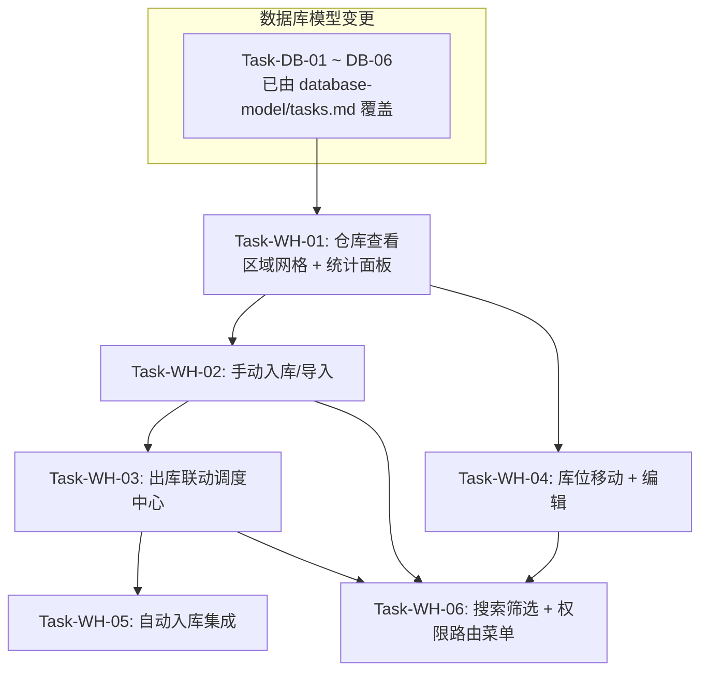

# 仓库管理 — 任务规划

> **版本**：v1.0
> **创建日期**：2026-05-25
> **设计文档**：[design.md](./design.md)
> **需求文档**：[requirements.md](./requirements.md)
> **前置依赖**：[database-model/tasks.md](../database-model/tasks.md)（Task-DB-01 ~ Task-DB-06 必须全部完成）
> **策略**：垂直切片 — 每个任务穿透 数据库/服务/API/Store/UI 全部技术层，交付可独立验证的完整用户行为

---

## 前置依赖

所有仓库任务依赖以下数据库模型变更已完成：

| 前置任务 | 内容 | 仓库任务为何依赖 |
|---------|------|-----------------|
| Task-DB-01 | UserRole 新增 WAREHOUSE_KEEPER | 库管角色权限控制（AC-020） |
| Task-DB-02 | Warehouse 模型 v1.3（zone_code/sort_order） | 区域数据查询和排序（AC-008） |
| Task-DB-03 | StorageSlot 模型 v1.3（新增 7 字段 + 部分索引） | 库位增删改查（AC-002 ~ AC-019） |
| Task-DB-04 | Alembic 迁移 + 12 区域 144 库位 seed data | 页面有数据可展示 |
| Task-DB-05 | 全量测试回归验证 | 确保模型变更无回归 |
| Task-DB-06 | constants.py + SYSTEM_USER_ID | 出库创建调度任务需要系统用户 ID（AC-003） |

---

## 依赖关系图



- **WH1 → WH2**：入库需要仓库页面已可交互（选择区域、点击空位）
- **WH2 → WH3**：出库需要页面已有库位数据（多选、确认弹窗）
- **WH1 → WH4**：移动需要仓库页面已可交互（点击库位、移动模式）
- **WH2 → WH5**：自动入库需要 dispatch_service.create_order 已在 WH-02 中增加了 skip_container_validation/auto_commit 参数；且需要 WH-03 的出库逻辑已完成（auto_store 与 outbound 共用 warehouse_service.py）
- **WH2/WH3/WH4 → WH6**：搜索筛选在核心交互完成后统一补齐

---

## 任务清单

### Task-WH-01: 仓库查看（区域网格 + 统计面板）

- **所属切片**：切片 1: 仓库查看
- **复杂度**：L
- **Depends On**：Task-DB-01 ~ DB-06（全部数据库模型变更完成）
- **对应 AC**：AC-007, AC-008
- **通俗解释**：库管登录后能看见 12 个区域按 4 行排列，每个区域里 3×4 个库位格子用颜色区分空/重箱/空箱，右侧显示全局统计数字。
- **对应设计章节**：design.md 四（GET zones + statistics）、五（页面布局、组件结构）

**后端**：

- **Files to Create**：
  - `apps/server/app/schemas/warehouse.py` — Pydantic 响应模型（SlotResponse, ZoneResponse, ZoneListResponse, WarehouseStatistics）
  - `apps/server/app/services/warehouse_service.py` — `get_zones()`, `get_statistics()` 函数
  - `apps/server/app/api/v1/warehouse.py` — FastAPI router，注册 GET `/api/v1/warehouse/zones` 和 GET `/api/v1/warehouse/statistics`

- **关键逻辑**：
  - `get_zones()`：查询所有 Warehouse 按 `sort_order` ASC 排列，LEFT JOIN storage_slots 按 `(row, col)` 排序加载
  - `get_statistics()`：SQL 聚合查询 `SUM(CASE WHEN status != 'empty' ...)` 计算 used/available/heavy/empty_container/utilization_rate
  - 权限：在 `api/v1/warehouse.py` 中定义 `_require_warehouse_role` 依赖（因项目无通用 `require_role`，现有模式是每个模块定义自己的依赖函数）

- **Files to Modify**：
  - `apps/server/app/main.py` — 注册 `warehouse_router`

- **验证标准**：
  - [ ] GET `/api/v1/warehouse/zones` 返回 12 个 ZoneResponse，每个含 12 个 SlotResponse，按 sort_order 排列
  - [ ] GET `/api/v1/warehouse/statistics` 返回 `total_slots=144`, `used_slots/available_slots` 正确，`utilization_rate ∈ [0, 1]`
  - [ ] 非 warehouse_keeper 角色访问返回 403
  - [ ] warehouse_keeper 角色可正常访问

**前端**：

- **Files to Create**：
  - `apps/frontend/src/modules/warehouse/index.ts`
  - `apps/frontend/src/modules/warehouse/types/index.ts` — Zone, Slot, WarehouseStatistics 类型定义
  - `apps/frontend/src/modules/warehouse/services/warehouseService.ts` — `fetchZones()`, `fetchStatistics()` API 调用
  - `apps/frontend/src/modules/warehouse/stores/useWarehouseStore.ts` — 状态管理（zones, statistics, filter 状态）
  - `apps/frontend/src/modules/warehouse/pages/WarehousePage.vue` — 主页面布局（左侧 75% 区域网格 + 右侧 25% 统计面板）
  - `apps/frontend/src/modules/warehouse/components/ZoneCard.vue` — 区域卡片（标题行 + 3×4 网格）
  - `apps/frontend/src/modules/warehouse/components/SlotCell.vue` — 单个库位格子（按 status 显示颜色：空位灰色/重箱蓝色/空箱绿色）
  - `apps/frontend/src/modules/warehouse/components/StatisticsPanel.vue` — 右侧统计面板（总数/已用/剩余/重箱/空箱/利用率进度条）

- **关键逻辑**：
  - `useWarehouseStore.fetchZones()` onMounted 调用
  - ZoneCard 用 CSS Grid `grid-template-columns: repeat(4, 1fr)` 渲染 3×4 库位
  - SlotCell 根据 `status` 动态 class：`slot--empty` / `slot--loaded` / `slot--empty-container`

- **验证标准**：
  - [ ] 页面加载后显示 12 个区域卡片，按 4 行 × 3 列排列
  - [ ] 第 1 行：3-5/3-7/3-20，第 2 行：2-13/1-1/1-20，第 3 行：6-1/6-2/6-3，第 4 行：6-4/6-5/6-6
  - [ ] 每个区域标题显示 "zone_code 区 (X/12)" 格式
  - [ ] 空库位灰色、重箱蓝色、空箱绿色
  - [ ] 右侧统计面板数字与后端返回值一致
  - [ ] 页面在 1920×1080 分辨率下无水平滚动条

---

### Task-WH-02: 手动入库 / 导入入库

- **所属切片**：切片 2: 入库
- **复杂度**：L
- **Depends On**：Task-WH-01（仓库页面已可交互）
- **对应 AC**：AC-002, AC-010, AC-011, AC-012, AC-013, AC-015
- **通俗解释**：库管点击一个空库位弹出录入框，填箱号/重箱或空箱状态/可选客户名/箱型/封号，保存后格子变色。也可以上传 Excel 批量导入。
- **对应设计章节**：design.md 四（POST manual-inbound, POST import-inbound）、六.2（手动入库核心逻辑）、六.7（异常处理）

**后端**：

- **Files to Modify**：
  - `apps/server/app/services/warehouse_service.py` — 新增 `manual_inbound()`, `import_inbound()`, `_count_empty_slots()`, `_find_empty_slots()`, `_fill_slot()` 函数
  - `apps/server/app/schemas/warehouse.py` — 新增 `ManualInboundItem`, `ManualInboundRequest`, `ManualInboundResponse`
  - `apps/server/app/api/v1/warehouse.py` — 新增 POST `/slots/manual-inbound` 和 POST `/slots/import-inbound`
  - `apps/server/app/services/dispatch_service.py` — `create_order` 新增 `skip_container_validation` 和 `auto_commit` 可选参数（为 WH-03 出库做准备，避免同一文件两次修改）

- **关键逻辑**：
  - `manual_inbound(zone_code, items)`：校验容量 → 校验箱号唯一性 → 行优先分配空位 → fill → flush
  - `import_inbound(file, zone_code)`：用 openpyxl 解析 .xlsx → 复用 `manual_inbound` 逻辑
  - 箱号格式校验：Pydantic `Field(pattern=r"^[A-Z]{4}\d{7}$")`
  - dispatch_service.create_order 参数变更（为 WH-03 准备）：
    ```python
    async def create_order(
        db: AsyncSession,
        data: dict,
        dispatcher_id: uuid.UUID,
        skip_container_validation: bool = False,
        auto_commit: bool = True,
    ) -> Order:
        # skip_container_validation=True: 跳过箱号唯一性校验（出库场景允许重复）
        # auto_commit=False: 只 flush 不 commit（出库场景由 outbound 统一 commit）
    ```
  - 现有调用方 `api/v1/dispatch.py:create_order_api` 不传新参数，默认行为不变

- **验证标准**：
  - [ ] POST manual-inbound 成功入库后库位状态变为 loaded/empty_container
  - [ ] 箱号格式不合法返回 422 "箱号格式错误"
  - [ ] 箱号已存在返回 409 "箱号已存在"
  - [ ] 容量不足返回 409 "可用库位不足，当前可用 X 个，需要 Y 个"
  - [ ] POST import-inbound 上传有效 .xlsx 成功写入
  - [ ] 上传非 .xlsx 文件返回 422
  - [ ] `create_order` 默认参数不传时现有行为不变

**前端**：

- **Files to Create**：
  - `apps/frontend/src/modules/warehouse/components/ManualInboundDialog.vue` — 手动录入对话框（el-dialog + el-form）
  - `apps/frontend/src/modules/warehouse/components/ImportInboundDialog.vue` — 导入对话框（el-upload + 模板下载）

- **Files to Modify**：
  - `apps/frontend/src/modules/warehouse/services/warehouseService.ts` — 新增 `manualInbound()`, `importInbound()`
  - `apps/frontend/src/modules/warehouse/stores/useWarehouseStore.ts` — 新增 `manualInbound()` action
  - `apps/frontend/src/modules/warehouse/components/SlotCell.vue` — 点击空位触发手动录入（AC-015）
  - `apps/frontend/src/modules/warehouse/pages/WarehousePage.vue` — 添加"手动录入"和"导入"按钮 + 区域选择下拉

- **关键逻辑**：
  - ManualInboundDialog 表单：箱号（必填，校验格式）、container_status（必填，el-select heavy/empty）、customer_name/container_type/seal_no（选填）
  - ImportInboundDialog：el-upload 接受 .xlsx，附带 zone_code 选择，提供模板下载链接
  - 入库成功后：调用 `fetchZones()` + `fetchStatistics()` 刷新数据

- **验证标准**：
  - [ ] 点击空库位弹出 ManualInboundDialog，字段与设计一致
  - [ ] 箱号输入框校验格式（4 大写字母 + 7 数字）
  - [ ] 提交成功后对话框关闭，库位变色，统计更新
  - [ ] 导入 .xlsx 后对话框中显示解析预览
  - [ ] 容量不足时显示具体差值
  - [ ] 提交中按钮显示 loading 状态

---

### Task-WH-03: 出库联动调度中心

- **所属切片**：切片 3: 出库
- **复杂度**：M
- **Depends On**：Task-WH-02（手动入库后的数据存在 + create_order 已增加参数）
- **对应 AC**：AC-003, AC-021
- **通俗解释**：库管选中一个或多个有箱库位，点"出库"，弹窗确认（可选填业务类型），确认后库位清空，调度中心自动生成一个"待分配"任务。
- **对应设计章节**：design.md 四（POST outbound）、六.3（出库联动调度中心）、六.7（异常处理）

**后端**：

- **Files to Modify**：
  - `apps/server/app/services/warehouse_service.py` — 新增 `outbound()`, `_clear_slot()` 函数
  - `apps/server/app/schemas/warehouse.py` — 新增 `OutboundItem`, `OutboundRequest`, `OutboundResult`, `OutboundResponse`
  - `apps/server/app/api/v1/warehouse.py` — 新增 POST `/slots/outbound`

- **关键逻辑**：
  - `outbound(slot_ids, business_type)`：
    1. 用 `with_for_update()` 锁行，预校验所有库位有箱
    2. 逐个调用 `create_order(..., skip_container_validation=True, auto_commit=False)` 创建"待分配"任务
    3. 清空库位
    4. 统一 `await db.commit()` — 全部成功或全部失败
  - 出库创建的 order_data 只传 `container_no/container_status/customer_name/container_type/seal_no/business_type`，不传起运地/目的地（调度员后续补充）
  - 调用 `create_order` 时使用 `SYSTEM_USER_ID` 作为 dispatcher_id
  - `import app.core.constants.SYSTEM_USER_ID`

- **验证标准**：
  - [ ] 出库单个有箱库位：库位清空 + 调度中心新增一条 status=pending 的任务
  - [ ] 出库多个有箱库位：全部清空 + 调度中心对应条数的任务
  - [ ] 出库空位返回 422 "库位为空，无法出库"
  - [ ] 其中一个为空时原子性失败：好的库位也不出库
  - [ ] 创建的任务 dispatcher_id 为 SYSTEM_USER_ID
  - [ ] business_type 不填时任务该字段为空
  - [ ] 调度中心 order_no 格式正确

**前端**：

- **Files to Create**：
  - `apps/frontend/src/modules/warehouse/components/OutboundDialog.vue` — 出库确认对话框

- **Files to Modify**：
  - `apps/frontend/src/modules/warehouse/services/warehouseService.ts` — 新增 `outbound()`
  - `apps/frontend/src/modules/warehouse/stores/useWarehouseStore.ts` — 新增 `selectedSlots` 状态 + `outbound()` action + `toggleSlotSelection()`
  - `apps/frontend/src/modules/warehouse/components/SlotCell.vue` — 点击有箱库位切换选中状态（非移动模式下），选中态显示蓝色边框
  - `apps/frontend/src/modules/warehouse/pages/WarehousePage.vue` — 添加"出库"按钮（至少选中一个时可用），显示已选数量

- **关键逻辑**：
  - SlotCell 非移动模式：点击空位 → ManualInboundDialog；点击有箱库位 → 切换选中
  - 选中态：蓝色边框 + 右上角对勾图标
  - OutboundDialog：列出选中库位（zone_code + slot_no + container_no），业务类型下拉（heavy_transport/empty_transport/short_haul，可选），确认按钮
  - 出库成功后：清空选中状态，刷新数据

- **验证标准**：
  - [ ] 点击有箱库位选中，再点击取消选中
  - [ ] 未选中任何库位时"出库"按钮 disabled
  - [ ] 出库确认对话框显示选中的库位列表和集装箱信息
  - [ ] 业务类型下拉可选，不选可提交
  - [ ] 确认后库位变空、统计数据更新
  - [ ] 出库成功后选中状态清空

---

### Task-WH-04: 库位移动 + 编辑

- **所属切片**：切片 4: 移动 + 编辑
- **复杂度**：M
- **Depends On**：Task-WH-01（仓库页面可交互）
- **对应 AC**：AC-004, AC-016, AC-018
- **通俗解释**：库管点"移动"进入移动模式，选源库位（蓝色闪烁）再选目标空位（绿色虚线），箱子移过去。也可以编辑已入库库位的货主和备注。
- **对应设计章节**：design.md 四（POST move, PUT slots/{id}）、六.4（移动核心逻辑）、五.4（移动模式交互）

**后端**：

- **Files to Modify**：
  - `apps/server/app/services/warehouse_service.py` — 新增 `move_slot()`, `update_slot()`, `_get_slot_or_raise()` 函数
  - `apps/server/app/schemas/warehouse.py` — 新增 `MoveRequest`, `SlotUpdateRequest`
  - `apps/server/app/api/v1/warehouse.py` — 新增 POST `/slots/move` 和 PUT `/slots/{slot_id}`

- **关键逻辑**：
  - `move_slot(source_slot_id, target_slot_id)`：锁行 → 校验源非空且目标为空 → 复制所有字段到目标 → 清空源 → flush
  - `update_slot(slot_id, data)`：只允许修改 `customer_name` 和 `remark`（不改箱号/箱型/状态）

- **验证标准**：
  - [ ] 移动后源库位状态为 empty，所有字段清空
  - [ ] 目标库位继承源库位的全部信息（container_no/status/customer_name 等不变）
  - [ ] 源为空时返回 422
  - [ ] 目标非空时返回 422
  - [ ] PUT 编辑只修改 customer_name 和 remark，其他字段不受影响

**前端**：

- **Files to Create**：
  - `apps/frontend/src/modules/warehouse/components/MoveModeOverlay.vue` — 移动模式交互层
  - `apps/frontend/src/modules/warehouse/components/SlotEditDialog.vue` — 编辑对话框

- **Files to Modify**：
  - `apps/frontend/src/modules/warehouse/services/warehouseService.ts` — 新增 `move()`, `updateSlot()`
  - `apps/frontend/src/modules/warehouse/stores/useWarehouseStore.ts` — 新增 `isMoveMode`, `moveSourceSlot` 状态 + `toggleMoveMode()`, `move()`, `updateSlot()` actions
  - `apps/frontend/src/modules/warehouse/pages/WarehousePage.vue` — 添加"移动"按钮 + "编辑"按钮

- **关键逻辑**：
  - "移动"按钮切换移动模式：按钮高亮，SlotCell 切换为移动交互（源库位蓝闪、目标空位绿虚线）
  - 移动流程：选源（有箱）→ 选目标（空位）→ 确认 → 退出模式
  - 源库位 CSS：蓝色闪烁 `animation: blink 0.5s infinite`
  - 目标空位 CSS：绿色虚线边框 `border: 2px dashed green`
  - SlotEditDialog：el-form 含 customer_name 和 remark 两个字段

- **验证标准**：
  - [ ] 点击"移动"按钮进入移动模式，按钮高亮
  - [ ] 选源库位后蓝色闪烁，选目标空位后绿色虚线
  - [ ] 移动完成后自动退出移动模式
  - [ ] 再次点击"移动"按钮可退出（未完成时）
  - [ ] 编辑对话框可修改货主和备注，保存后库位信息更新

---

### Task-WH-05: 自动入库集成

- **所属切片**：切片 5: 自动入库
- **复杂度**：M
- **Depends On**：Task-WH-03（create_order 参数已在 WH-02 中修改，无需重复）
- **对应 AC**：AC-001, AC-009, AC-014, AC-017
- **通俗解释**：调度员或司机在调度中心点"完成"任务时，如果任务有箱号且仓库有空位，系统自动把箱子入库。按优先级 3-20→1-20→6-1→... 找空位。
- **范围限制**：当前 Order 模型仅支持单 `container_no`，auto_store 按单箱处理。多箱号自动入库（AC-001 要求的"每个箱号各占一个库位"）需等 Order 模型支持多箱号后同步更新。详见 design.md AC-001 标注。
- **对应设计章节**：design.md 六.1（自动入库时序和算法）、二（影响范围 — dispatch_service.complete_order）、六.7（异常处理）

**后端**：

- **Files to Modify**：
  - `apps/server/app/services/warehouse_service.py` — 新增 `auto_store()`, `_find_first_empty_slot()` 函数 + `AUTO_INBOUND_PRIORITY` 常量
  - `apps/server/app/services/dispatch_service.py` — 修改 `complete_order()`，在 `await db.commit()` 之后新增自动入库逻辑

- **关键逻辑**：
  - `complete_order` 修改（design.md 六.1 原方案使用 `async with db.begin()` 嵌套事务，但 AsyncSession 的 `begin()` 是 SAVEPOINT 而非独立事务，入库失败可能影响已 commit 的订单 session 状态。修正为使用独立 session）：
    ```python
    await db.commit()
    await db.refresh(order)

    # 自动入库（独立 session + 独立事务，失败不影响订单）
    if order.container_no:
        try:
            from app.core.database import AsyncSessionLocal
            from app.services.warehouse_service import auto_store
            async with AsyncSessionLocal() as inbound_db:
                await auto_store(inbound_db, order)
                await inbound_db.commit()
        except AppException as e:
            logger.warning(f"自动入库失败: order_no={order.order_no}, reason={e.message}")
    return order
    ```
    - **注意**：使用 `AsyncSessionLocal()` 创建独立 session，入库事务与订单事务完全隔离。`AsyncSessionLocal` 已存在于 `app/core/database.py`。
  - `AUTO_INBOUND_PRIORITY` 列表按 design.md 六.1 定义
  - `auto_store(order)`：校验箱号唯一 → 按优先级遍历区域 → `_find_first_empty_slot` → `_fill_slot` → flush
  - 全满时抛 `AppException(code=409)`，被 complete_order 捕获 log warning

- **验证标准**：
  - [ ] complete_order 后集装箱成功入库（对应库位状态变更、字段填充）
  - [ ] 入库库位优先级符合：3-20 → 1-20 → 6-1 → ... → 1-1
  - [ ] 每个区域内按行优先（row ASC, col ASC）分配
  - [ ] 全部 12 区域满时，订单仍标记完成，日志输出 warning，入库失败不抛异常
  - [ ] 箱号已存在时入库失败，订单不影响
  - [ ] 入库失败时订单状态不受影响（独立事务验证）
  - [ ] 删除已完成任务（dispatch delete_order）不影响仓库数据（AC-014）
  - [ ] 无 container_no 的订单 complete 时不触发入库

---

### Task-WH-06: 搜索筛选 + 权限路由菜单

- **所属切片**：切片 6: 搜索筛选 + 权限
- **复杂度**：M
- **Depends On**：Task-WH-02（入库数据存在）, Task-WH-03（出库多选逻辑存在）, Task-WH-04（编辑逻辑存在）
- **对应 AC**：AC-005, AC-006, AC-019, AC-020
- **通俗解释**：库管可以按"全部/重箱/空箱/空位"筛选库位，搜索框输入箱号或货主名称实时高亮匹配的库位。非库管角色看不到仓库入口。
- **对应设计章节**：design.md 四（GET search）、五.3（filter/searchHighlight 状态）、五.4（筛选和搜索交互）、五.5（路由权限）、六.5（搜索核心逻辑）

**后端**：

- **Files to Modify**：
  - `apps/server/app/services/warehouse_service.py` — 新增 `search_slots()` 函数
  - `apps/server/app/schemas/warehouse.py` — 新增 `SearchHighlight`, `SearchResponse`
  - `apps/server/app/api/v1/warehouse.py` — 新增 GET `/slots/search?keyword=xxx`

- **关键逻辑**：
  - `search_slots(keyword)`：`WHERE container_no ILIKE %keyword% OR customer_name ILIKE %keyword%`
  - 返回匹配库位 ID + 匹配字段 + 按区域分组的匹配数

- **验证标准**：
  - [ ] 搜索箱号成功返回匹配结果和高亮信息
  - [ ] 搜索货主名称成功返回匹配结果
  - [ ] 无匹配时返回空数组，不报错
  - [ ] 空 keyword 返回 422

**前端**：

- **Files to Create**：
  - `apps/frontend/src/modules/warehouse/composables/useWarehouseSearch.ts` — 搜索防抖 300ms

- **Files to Modify**：
  - `apps/frontend/src/modules/warehouse/services/warehouseService.ts` — 新增 `searchSlots()`
  - `apps/frontend/src/modules/warehouse/stores/useWarehouseStore.ts` — 新增 `searchKeyword`, `searchHighlights` 状态 + `search()`, `setFilter()` actions
  - `apps/frontend/src/modules/warehouse/components/ZoneCard.vue` — 匹配区域标题显示匹配数（如 "3-20 区 (5/12) 匹配 2"）
  - `apps/frontend/src/modules/warehouse/components/SlotCell.vue` — 筛选过滤 + 搜索高亮样式
  - `apps/frontend/src/modules/warehouse/pages/WarehousePage.vue` — 添加搜索框 + 筛选 tab（全部/重箱/空箱/空位）+ "匹配 X 个区域" 提示
  - `apps/frontend/src/shared/components/AppLayout.vue` — 侧边栏菜单按角色显示：admin 看到车队管理+调度中心+仓库管理；dispatcher 看到车队管理+调度中心；warehouse_keeper 只看到仓库管理
  - `apps/frontend/src/router/index.ts` — 新增 `/warehouse` 路由，`meta: { roles: ['admin', 'warehouse_keeper'] }`

- **关键逻辑**：
  - 搜索：el-input 输入 → `useWarehouseSearch` 300ms 防抖 → 调用 search API → 高亮匹配格子（橙色边框）
  - 筛选：el-tabs "全部/重箱/空箱/空位" → store.setFilter() → SlotCell 按 status 条件渲染
  - AppLayout 菜单调整（design.md 五.5 已给出代码）：
    ```typescript
    const showFleetAndDispatch = computed(() =>
      ['admin', 'dispatcher'].includes(userRole.value)
    )
    const showWarehouse = computed(() =>
      ['admin', 'warehouse_keeper'].includes(userRole.value)
    )
    ```
  - 统计面板实时更新：每次操作（入库/出库/移动/编辑）成功后调用 `fetchZones()` + `fetchStatistics()`（各切片已实现）

- **验证标准**：
  - [ ] 筛选 tab 切换即时过滤，不发送网络请求
  - [ ] 搜索输入停止 300ms 后高亮匹配库位
  - [ ] 区域标题显示匹配数量
  - [ ] 清空搜索后高亮消失
  - [ ] admin 登录看到车队管理+调度中心+仓库管理三个菜单
  - [ ] warehouse_keeper 登录只看到仓库管理菜单
  - [ ] dispatcher 登录看不到仓库管理菜单
  - [ ] driver 登录看不到任何管理端菜单
  - [ ] 直接访问 /warehouse URL，非 admin/warehouse_keeper 被路由守卫拦截

---

## 验证标准汇总

| AC | 描述 | 覆盖任务 |
|----|------|---------|
| AC-001 | 调度任务完成自动入库 | Task-WH-05 |
| AC-002 | 手动录入/导入入库 | Task-WH-02 |
| AC-003 | 出库创建调度任务 | Task-WH-03 |
| AC-004 | 移动集装箱 | Task-WH-04 |
| AC-005 | 按状态筛选 | Task-WH-06 |
| AC-006 | 搜索箱号/货主 | Task-WH-06 |
| AC-007 | 全局统计面板 | Task-WH-01 |
| AC-008 | 12 区域 4 行布局 | Task-WH-01 |
| AC-009 | 全满拒绝入库 | Task-WH-05 |
| AC-010 | 区域已满拒绝 | Task-WH-02 |
| AC-011 | 箱号格式校验 | Task-WH-02 |
| AC-012 | 箱号唯一性 | Task-WH-02 |
| AC-013 | 容量不足提示 | Task-WH-02 |
| AC-014 | 删除任务不影响仓库 | Task-WH-05 |
| AC-015 | 点击空位触发录入 | Task-WH-02 |
| AC-016 | 编辑货主和备注 | Task-WH-04 |
| AC-017 | 自动入库优先级 | Task-WH-05 |
| AC-018 | 移动不改变状态 | Task-WH-04 |
| AC-019 | 统计实时更新 | Task-WH-06（各切片操作后刷新） |
| AC-020 | 库管角色权限 | Task-WH-06 |
| AC-021 | 业务类型可选填 | Task-WH-03 |